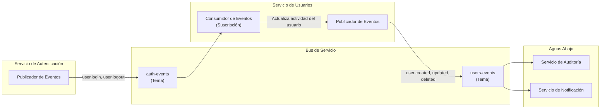

# Eventos

## Descripción General

El Servicio de Usuarios **consume** eventos de autenticación del Servicio de Autenticación y **publica** eventos del ciclo de vida del usuario. Toda la comunicación es asíncrona a través de Azure Service Bus.

## Flujo de Eventos



## Eventos Consumidos (del Servicio de Autenticación)

**Fuente:** Servicio de Autenticación → tema `auth-events` → suscripción `users-service`

### `user.login`

**Acción:** Actualiza `last_login_at` en el perfil del usuario.

```json
{
  "type": "user.login",
  "data": {
    "userId": "a1b2c3d4-e5f6-7890-abcd-ef1234567890",
    "timestamp": "2026-07-26T10:30:00Z"
  }
}
```

**Idempotencia:** Desduplicado por `eventId` en la tabla `event_deduplication`.

### `user.logout`

**Acción:** Actualiza `last_logout_at` y calcula la duración de la sesión.

```json
{
  "type": "user.logout",
  "data": {
    "userId": "a1b2c3d4-e5f6-7890-abcd-ef1234567890",
    "sessionDuration": 14400,
    "timestamp": "2026-07-26T13:00:00Z"
  }
}
```

### `token.revoked`

**Acción:** Registra la revocación del token en el registro de auditoría del usuario.

```json
{
  "type": "token.revoked",
  "data": {
    "userId": "a1b2c3d4-e5f6-7890-abcd-ef1234567890",
    "revocationReason": "user_logout",
    "timestamp": "2026-07-26T13:00:00Z"
  }
}
```

## Eventos Publicados (del Servicio de Usuarios)

**Destino:** tema `users-events`

### `user.created`

Publicado después de que se crea un nuevo perfil de usuario.

```json
{
  "type": "user.created",
  "source": "users-service",
  "data": {
    "userId": "a1b2c3d4-e5f6-7890-abcd-ef1234567890",
    "username": "john.doe",
    "email": "john.doe@contoso.com",
    "tenantId": "tid_...",
    "actorId": "admin-uuid"
  }
}
```

### `user.updated`

Publicado después de que se actualiza un perfil de usuario. Incluye los nombres de los campos modificados para un procesamiento eficiente en etapas posteriores.

```json
{
  "type": "user.updated",
  "source": "users-service",
  "data": {
    "userId": "a1b2c3d4-e5f6-7890-abcd-ef1234567890",
    "changedFields": ["email", "department"],
    "tenantId": "tid_...",
    "actorId": "admin-uuid"
  }
}
```

### `user.deleted`

Publicado después de que un usuario es eliminado lógicamente.

```json
{
  "type": "user.deleted",
  "source": "users-service",
  "data": {
    "userId": "a1b2c3d4-e5f6-7890-abcd-ef1234567890",
    "tenantId": "tid_...",
    "actorId": "admin-uuid"
  }
}
```

## Garantías de Procesamiento

| Garantía | Mecanismo |
|---|---|
| **Entrega al menos una vez** | Service Bus PeekLock + renovación automática (máx. 5 min) |
| **En orden por usuario** | Tema habilitado para sesiones (ID de sesión = `userId`) |
| **Idempotencia** | Tabla de desduplicación: `event_deduplication(event_id)` |
| **Cartas muertas** | Después de 10 fallos de entrega → cola de cartas muertas |
| **Monitoreo** | Contador de Prometheus `users_events_processed_total` |

## Retraso de Procesamiento

Métrica: `users_event_processing_lag_seconds`

Alerta: Si el retraso > 60 segundos durante 5 minutos → advertencia de PagerDuty.

## Documentos Relacionados

- [API de Usuarios](users-api.md)
- [Contexto del Sistema](../architecture/context.md)
- [Dependencias](../decisions/dependencies.md)
