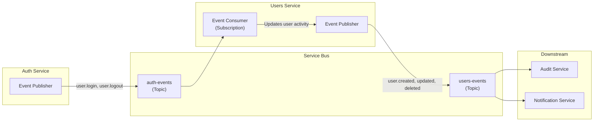

# Events

## Overview

The Users Service **consumes** authentication events from the Auth Service and **publishes** user lifecycle events. All communication is asynchronous via Azure Service Bus.

## Event Flow



## Consumed Events (from Auth Service)

**Source:** Auth Service → `auth-events` topic → `users-service` subscription

### `user.login`

**Action:** Updates `last_login_at` on the user's profile.

```json
{
  "type": "user.login",
  "data": {
    "userId": "a1b2c3d4-e5f6-7890-abcd-ef1234567890",
    "timestamp": "2026-07-26T10:30:00Z"
  }
}
```

**Idempotency:** Deduplicated by `eventId` in `event_deduplication` table.

### `user.logout`

**Action:** Updates `last_logout_at` and computes session duration.

```json
{
  "type": "user.logout",
  "data": {
    "userId": "a1b2c3d4-e5f6-7890-abcd-ef1234567890",
    "sessionDuration": 14400,
    "timestamp": "2026-07-26T13:00:00Z"
  }
}
```

### `token.revoked`

**Action:** Records token revocation in the user's audit trail.

```json
{
  "type": "token.revoked",
  "data": {
    "userId": "a1b2c3d4-e5f6-7890-abcd-ef1234567890",
    "revocationReason": "user_logout",
    "timestamp": "2026-07-26T13:00:00Z"
  }
}
```

## Published Events (from Users Service)

**Destination:** `users-events` topic

### `user.created`

Published after a new user profile is created.

```json
{
  "type": "user.created",
  "source": "users-service",
  "data": {
    "userId": "a1b2c3d4-e5f6-7890-abcd-ef1234567890",
    "username": "john.doe",
    "email": "john.doe@contoso.com",
    "tenantId": "tid_...",
    "actorId": "admin-uuid"
  }
}
```

### `user.updated`

Published after a user profile is updated. Includes changed field names for efficient downstream processing.

```json
{
  "type": "user.updated",
  "source": "users-service",
  "data": {
    "userId": "a1b2c3d4-e5f6-7890-abcd-ef1234567890",
    "changedFields": ["email", "department"],
    "tenantId": "tid_...",
    "actorId": "admin-uuid"
  }
}
```

### `user.deleted`

Published after a user is soft-deleted.

```json
{
  "type": "user.deleted",
  "source": "users-service",
  "data": {
    "userId": "a1b2c3d4-e5f6-7890-abcd-ef1234567890",
    "tenantId": "tid_...",
    "actorId": "admin-uuid"
  }
}
```

## Processing Guarantees

| Guarantee | Mechanism |
|---|---|
| **At-least-once delivery** | Service Bus PeekLock + auto-renewal (max 5 min) |
| **In-order per user** | Session-enabled topic (session ID = `userId`) |
| **Idempotency** | Deduplication table: `event_deduplication(event_id)` |
| **Dead-letter** | After 10 delivery failures → dead-letter queue |
| **Monitoring** | `users_events_processed_total` Prometheus counter |

## Processing Lag

Metric: `users_event_processing_lag_seconds`

Alert: If lag > 60 seconds for 5 minutes → PagerDuty warning.

## Related Documents

- [Users API](users-api.md)
- [System Context](../architecture/context.md)
- [Dependencies](../decisions/dependencies.md)
