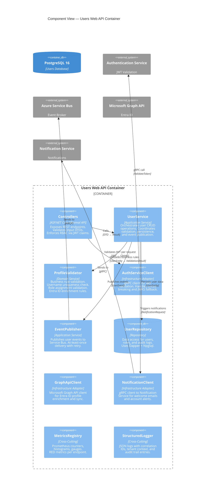
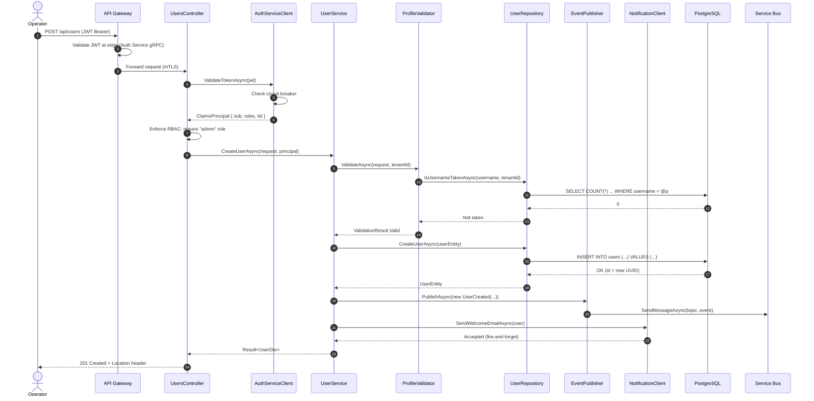

# Component View

## Scope

This document describes the **internal component structure** of the Users Service Web API container (C4 Model Level 3), following the Hexagonal Architecture pattern.

## C4 Model — Level 3: Component Diagram



## Component Descriptions

### 1. Controllers (`UsersController`, `HealthController`)

**Technology:** ASP.NET Core Minimal APIs

**JWT Validation Middleware (per request):**

```csharp
// Simplified middleware flow
app.Use(async (context, next) =>
{
    if (IsPublicEndpoint(context)) { await next(); return; }

    var jwt = ExtractBearerToken(context);
    var claims = await authClient.ValidateTokenAsync(jwt);
    context.Items["UserClaims"] = claims;
    context.Items["TenantId"] = claims["tid"];
    await next();
});
```

**RBAC Enforcement:**

| Role | GET /users | GET /users/{id} | POST | PUT | DELETE |
|---|---|---|---|---|---|
| `admin` | ✅ All | ✅ Any | ✅ | ✅ Any | ✅ |
| `operator` | ✅ All | ✅ Any | ❌ | ✅ Limited | ❌ |
| `user` | ❌ | ✅ Self only | ❌ | ✅ Self only | ❌ |

### 2. UserService (`IUserService` / `UserService`)

**Technology:** .NET 10 Application Service

**Methods:**

```csharp
public interface IUserService
{
    Task<Result<PaginatedList<UserDto>>> GetUsersAsync(
        UserQuery query, ClaimsPrincipal principal, CancellationToken ct);

    Task<Result<UserDto>> GetUserByIdAsync(
        Guid userId, ClaimsPrincipal principal, CancellationToken ct);

    Task<Result<UserDto>> CreateUserAsync(
        CreateUserRequest request, ClaimsPrincipal principal, CancellationToken ct);

    Task<Result<UserDto>> UpdateUserAsync(
        Guid userId, UpdateUserRequest request, ClaimsPrincipal principal, CancellationToken ct);

    Task<Result> DeleteUserAsync(
        Guid userId, ClaimsPrincipal principal, CancellationToken ct);
}
```

**Design Rules:**
- Every method receives `ClaimsPrincipal` for audit (`actor_id`)
- Tenant isolation: `tenant_id` is extracted from JWT claims, not user input
- Soft-delete: `DELETE` sets `deleted_at`, does not remove the row
- Idempotency: `POST` checks for duplicate usernames within the tenant

### 3. ProfileValidator (`IProfileValidator` / `ProfileValidator`)

**Business Rules:**

| Rule | Validation | Error |
|---|---|---|
| Username format | `^[a-z][a-z0-9._-]{2,99}$` | `INVALID_USERNAME` |
| Email format | RFC 5322 | `INVALID_EMAIL` |
| Username uniqueness | Within tenant, excluding soft-deleted | `USERNAME_TAKEN` |
| Role validity | Must be from predefined list | `INVALID_ROLE` |
| Entra ID link | `entra_id` must resolve to valid Entra ID user | `ENTRA_ID_NOT_FOUND` |

### 4. AuthServiceClient (`IAuthServiceClient` / `AuthServiceClient`)

**Technology:** .NET gRPC client with Polly resilience policies

```csharp
// Resilience pipeline
var pipeline = new ResiliencePipelineBuilder()
    .AddCircuitBreaker(new CircuitBreakerStrategyOptions
    {
        FailureRatio = 0.5,
        MinimumThroughput = 10,
        BreakDuration = TimeSpan.FromSeconds(30)
    })
    .AddTimeout(TimeSpan.FromMilliseconds(500))
    .Build();
```

**Fallback Strategy:**

```
1. Call Auth Service gRPC ValidateToken
2. If success → cache JWKS in memory (5 min TTL)
3. If failure → validate locally using cached JWKS
4. If cache miss + failure → 503 Service Unavailable
```

### 5. EventPublisher (`IEventPublisher` / `EventPublisher`)

**Published Events:**

| Event Type | Topic | Trigger | Payload |
|---|---|---|---|
| `user.created` | `users-events` | POST /api/users success | `{ userId, username, email, tenantId, actorId }` |
| `user.updated` | `users-events` | PUT /api/users/{id} success | `{ userId, changedFields[], actorId }` |
| `user.deleted` | `users-events` | DELETE /api/users/{id} success | `{ userId, actorId }` |

### 6. UserRepository (`IUserRepository` / `UserRepository`)

**Technology:** Dapper + Npgsql

```csharp
public interface IUserRepository
{
    Task<PaginatedList<UserEntity>> GetUsersAsync(
        Guid tenantId, UserQuery query, CancellationToken ct);

    Task<UserEntity?> GetUserByIdAsync(Guid userId, Guid tenantId, CancellationToken ct);

    Task<UserEntity> CreateUserAsync(UserEntity user, CancellationToken ct);

    Task<UserEntity> UpdateUserAsync(UserEntity user, CancellationToken ct);

    Task SoftDeleteUserAsync(Guid userId, Guid tenantId, CancellationToken ct);

    Task<bool> IsUsernameTakenAsync(
        string username, Guid tenantId, Guid? excludeUserId, CancellationToken ct);

    Task InsertAuditLogAsync(AuditLogEntry entry, CancellationToken ct);
}
```

### 7. Infrastructure Adapters

#### GraphApiClient

- Wraps `Microsoft.Graph` SDK
- Enriches profiles with: `displayName`, `department`, `jobTitle`, `manager`, `officeLocation`
- Caches responses with 1-hour TTL
- Implements retry with exponential backoff for 429 (Too Many Requests)

#### NotificationClient

- gRPC client to Notification Service
- Templates: `welcome_email`, `profile_updated`, `account_suspended`
- Non-blocking fire-and-forget delivery

### 8. Cross-Cutting

#### MetricsRegistry

| Metric | Type | Labels |
|---|---|---|
| `users_requests_total` | Counter | `method`, `status_code` |
| `users_operation_duration_seconds` | Histogram | `operation` (get/create/update/delete) |
| `users_active_count` | Gauge | `tenant_id` |
| `users_events_processed_total` | Counter | `event_type`, `result` |
| `users_event_processing_lag_seconds` | Gauge | `event_type` |
| `users_auth_validation_duration_seconds` | Histogram | `result` (success/cache/error) |

## Component Interaction — Create User Sequence



## Related Documents

- [Container View](containers.md)
- [Security Architecture](security.md)
- [Users API](../api/users-api.md)
