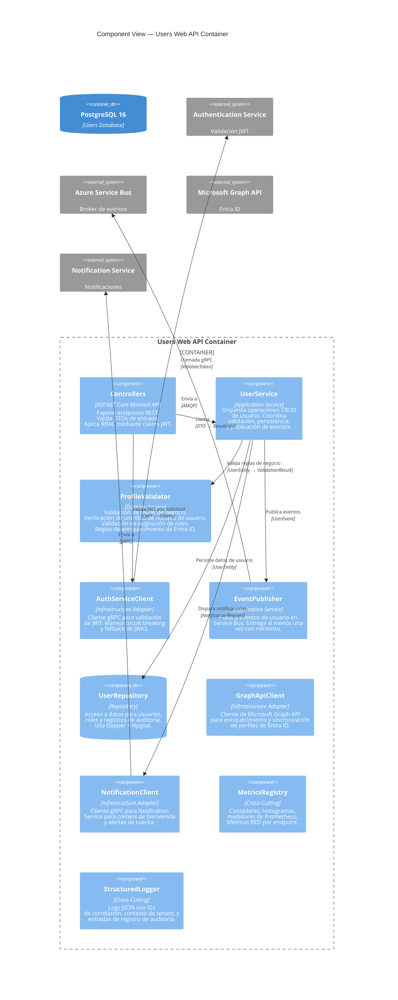
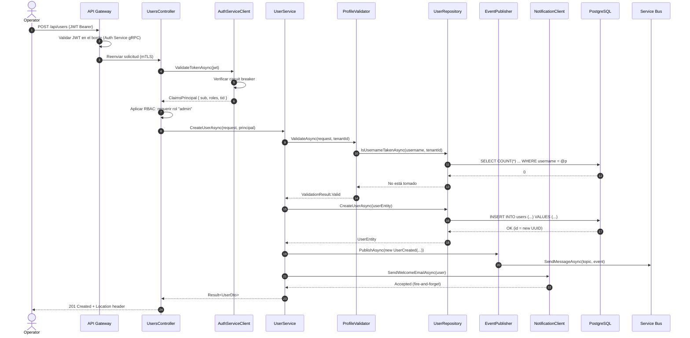

# Vista de Componentes

## Alcance

Este documento describe la **estructura interna de componentes** del contenedor Users Service Web API (Modelo C4 Nivel 3), siguiendo el patrón de Arquitectura Hexagonal.

## Modelo C4 — Nivel 3: Diagrama de Componentes



## Descripciones de Componentes

### 1. Controllers (`UsersController`, `HealthController`)

**Tecnología:** ASP.NET Core Minimal APIs

**Middleware de Validación JWT (por solicitud):**

```csharp
// Simplified middleware flow
app.Use(async (context, next) =>
{
    if (IsPublicEndpoint(context)) { await next(); return; }

    var jwt = ExtractBearerToken(context);
    var claims = await authClient.ValidateTokenAsync(jwt);
    context.Items["UserClaims"] = claims;
    context.Items["TenantId"] = claims["tid"];
    await next();
});
```

**Aplicación de RBAC:**

| Rol | GET /users | GET /users/{id} | POST | PUT | DELETE |
|---|---|---|---|---|---|
| `admin` | ✅ Todos | ✅ Cualquiera | ✅ | ✅ Cualquiera | ✅ |
| `operator` | ✅ Todos | ✅ Cualquiera | ❌ | ✅ Limitado | ❌ |
| `user` | ❌ | ✅ Solo propio | ❌ | ✅ Solo propio | ❌ |

### 2. UserService (`IUserService` / `UserService`)

**Tecnología:** .NET 10 Application Service

**Métodos:**

```csharp
public interface IUserService
{
    Task<Result<PaginatedList<UserDto>>> GetUsersAsync(
        UserQuery query, ClaimsPrincipal principal, CancellationToken ct);

    Task<Result<UserDto>> GetUserByIdAsync(
        Guid userId, ClaimsPrincipal principal, CancellationToken ct);

    Task<Result<UserDto>> CreateUserAsync(
        CreateUserRequest request, ClaimsPrincipal principal, CancellationToken ct);

    Task<Result<UserDto>> UpdateUserAsync(
        Guid userId, UpdateUserRequest request, ClaimsPrincipal principal, CancellationToken ct);

    Task<Result> DeleteUserAsync(
        Guid userId, ClaimsPrincipal principal, CancellationToken ct);
}
```

**Reglas de Diseño:**
- Cada método recibe `ClaimsPrincipal` para auditoría (`actor_id`)
- Aislamiento de tenant: `tenant_id` se extrae de los claims del JWT, no de la entrada del usuario
- Soft-delete: `DELETE` establece `deleted_at`, no elimina la fila
- Idempotencia: `POST` verifica duplicados de nombre de usuario dentro del tenant

### 3. ProfileValidator (`IProfileValidator` / `ProfileValidator`)

**Reglas de Negocio:**

| Regla | Validación | Error |
|---|---|---|
| Formato de nombre de usuario | `^[a-z][a-z0-9._-]{2,99}$` | `INVALID_USERNAME` |
| Formato de correo electrónico | RFC 5322 | `INVALID_EMAIL` |
| Unicidad de nombre de usuario | Dentro del tenant, excluyendo soft-deleted | `USERNAME_TAKEN` |
| Validez del rol | Debe ser de una lista predefinida | `INVALID_ROLE` |
| Vínculo con Entra ID | `entra_id` debe resolverse a un usuario válido de Entra ID | `ENTRA_ID_NOT_FOUND` |

### 4. AuthServiceClient (`IAuthServiceClient` / `AuthServiceClient`)

**Tecnología:** Cliente gRPC de .NET con políticas de resiliencia Polly

```csharp
// Resilience pipeline
var pipeline = new ResiliencePipelineBuilder()
    .AddCircuitBreaker(new CircuitBreakerStrategyOptions
    {
        FailureRatio = 0.5,
        MinimumThroughput = 10,
        BreakDuration = TimeSpan.FromSeconds(30)
    })
    .AddTimeout(TimeSpan.FromMilliseconds(500))
    .Build();
```

**Estrategia de Fallback:**

```
1. Llamar a Auth Service gRPC ValidateToken
2. Si éxito → almacenar en caché JWKS en memoria (TTL 5 min)
3. Si fallo → validar localmente usando JWKS en caché
4. Si fallo + sin caché → 503 Service Unavailable
```

### 5. EventPublisher (`IEventPublisher` / `EventPublisher`)

**Eventos Publicados:**

| Tipo de Evento | Tópico | Disparador | Payload |
|---|---|---|---|
| `user.created` | `users-events` | POST /api/users exitoso | `{ userId, username, email, tenantId, actorId }` |
| `user.updated` | `users-events` | PUT /api/users/{id} exitoso | `{ userId, changedFields[], actorId }` |
| `user.deleted` | `users-events` | DELETE /api/users/{id} exitoso | `{ userId, actorId }` |

### 6. UserRepository (`IUserRepository` / `UserRepository`)

**Tecnología:** Dapper + Npgsql

```csharp
public interface IUserRepository
{
    Task<PaginatedList<UserEntity>> GetUsersAsync(
        Guid tenantId, UserQuery query, CancellationToken ct);

    Task<UserEntity?> GetUserByIdAsync(Guid userId, Guid tenantId, CancellationToken ct);

    Task<UserEntity> CreateUserAsync(UserEntity user, CancellationToken ct);

    Task<UserEntity> UpdateUserAsync(UserEntity user, CancellationToken ct);

    Task SoftDeleteUserAsync(Guid userId, Guid tenantId, CancellationToken ct);

    Task<bool> IsUsernameTakenAsync(
        string username, Guid tenantId, Guid? excludeUserId, CancellationToken ct);

    Task InsertAuditLogAsync(AuditLogEntry entry, CancellationToken ct);
}
```

### 7. Adaptadores de Infraestructura

#### GraphApiClient

- Envuelve el SDK `Microsoft.Graph`
- Enriquece perfiles con: `displayName`, `department`, `jobTitle`, `manager`, `officeLocation`
- Almacena en caché respuestas con TTL de 1 hora
- Implementa reintento con retroceso exponencial para 429 (Too Many Requests)

#### NotificationClient

- Cliente gRPC para Notification Service
- Plantillas: `welcome_email`, `profile_updated`, `account_suspended`
- Entrega no bloqueante del tipo fire-and-forget

### 8. Transversal (Cross-Cutting)

#### MetricsRegistry

| Métrica | Tipo | Etiquetas |
|---|---|---|
| `users_requests_total` | Contador | `method`, `status_code` |
| `users_operation_duration_seconds` | Histograma | `operation` (get/create/update/delete) |
| `users_active_count` | Medidor | `tenant_id` |
| `users_events_processed_total` | Contador | `event_type`, `result` |
| `users_event_processing_lag_seconds` | Medidor | `event_type` |
| `users_auth_validation_duration_seconds` | Histograma | `result` (success/cache/error) |

## Interacción de Componentes — Secuencia de Creación de Usuario



## Documentos Relacionados

- [Vista de Contenedores](containers.md)
- [Arquitectura de Seguridad](security.md)
- [API de Usuarios](../api/users-api.md)
