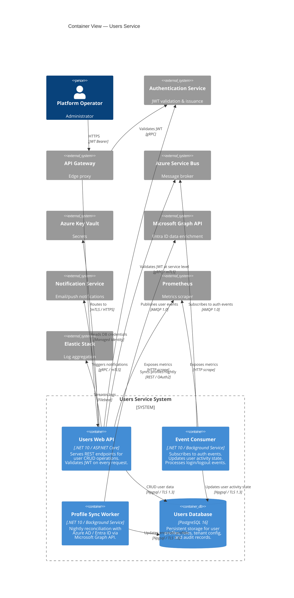

# Container View

## Scope

This document describes the **runtime containers** that compose the Users Service and its supporting infrastructure (C4 Model Level 2).

## C4 Model — Level 2: Container Diagram



## Container Descriptions

### 1. Users Web API (`web_api`)

| Attribute | Detail |
|---|---|
| **Technology** | .NET 10, ASP.NET Core Minimal APIs |
| **Port** | 7201 (HTTP), 7203 (HTTPS) |
| **Responsibilities** | User CRUD operations, JWT validation at service level, user event publication |
| **Authentication** | JWT Bearer token, validated via Auth Service gRPC |
| **Authorization** | Role-based (RBAC): `admin` (full CRUD), `operator` (read+update), `user` (read self only) |
| **Pagination** | Cursor-based pagination (`pageSize` + `continuationToken`) |
| **Scaling** | Horizontal. Target: 4-8 instances |

**Endpoints:**

| Method | Path | Auth | Roles |
|---|---|---|---|
| `GET` | `/api/users` | JWT | admin, operator |
| `GET` | `/api/users/{id}` | JWT | admin, operator, user (self only) |
| `POST` | `/api/users` | JWT | admin |
| `PUT` | `/api/users/{id}` | JWT | admin, operator, user (self only, limited fields) |
| `DELETE` | `/api/users/{id}` | JWT | admin |
| `GET` | `/api/health` | None | — |

### 2. Event Consumer (`event_consumer`)

| Attribute | Detail |
|---|---|
| **Technology** | .NET 10, `Azure.Messaging.ServiceBus` processor |
| **Concurrency** | Max 10 concurrent message handlers per instance |
| **Responsibilities** | Subscribe to `auth-events` topic; process `user.login`, `user.logout`, `token.revoked` events; update user activity timestamps |
| **Error Handling** | Dead-letter after 10 delivery attempts; exponential backoff (10s → 5 min max) |

**Processed Events:**

| Event | Action | Idempotency Key |
|---|---|---|
| `user.login` | `UPDATE users SET last_login_at = @timestamp WHERE id = @userId` | `eventId` (deduplication table) |
| `user.logout` | `UPDATE users SET last_logout_at = @timestamp WHERE id = @userId` | `eventId` |
| `token.revoked` | `INSERT INTO token_revocations (user_id, event_id, revoked_at)` | `eventId` |

### 3. Profile Sync Worker (`sync_worker`)

| Attribute | Detail |
|---|---|
| **Technology** | .NET 10, `BackgroundService` |
| **Schedule** | Nightly at 02:00 UTC |
| **Responsibilities** | Sync user profiles with Azure AD / Entra ID via Microsoft Graph API; enrich platform profiles with corporate data (department, title, manager); detect and flag orphaned accounts (in AD but not in platform, and vice versa) |
| **Batch Size** | 100 users per Graph API request |
| **Dry Run** | `--dry-run` flag for preview mode |

### 4. Users Database (`postgres`)

| Attribute | Detail |
|---|---|
| **Technology** | PostgreSQL 16 (Azure Database for PostgreSQL — Flexible Server) |
| **SKU** | General Purpose, 4 vCores, 16 GB RAM, 256 GB storage |
| **HA** | Same-zone standby, automatic failover |
| **Encryption** | At rest (AES-256) + in transit (TLS 1.3) |

**Schema (simplified):**

```sql
CREATE TABLE users (
    id              UUID PRIMARY KEY DEFAULT gen_random_uuid(),
    tenant_id       UUID NOT NULL,
    username        VARCHAR(100) NOT NULL,
    email           VARCHAR(255) NOT NULL,
    display_name    VARCHAR(200),
    department      VARCHAR(100),
    job_title       VARCHAR(150),
    roles           JSONB NOT NULL DEFAULT '[]',
    last_login_at   TIMESTAMPTZ,
    last_logout_at  TIMESTAMPTZ,
    deleted_at      TIMESTAMPTZ,
    created_at      TIMESTAMPTZ NOT NULL DEFAULT NOW(),
    updated_at      TIMESTAMPTZ NOT NULL DEFAULT NOW(),
    UNIQUE (tenant_id, username),
    UNIQUE (tenant_id, email)
);

CREATE TABLE event_deduplication (
    event_id    UUID PRIMARY KEY,
    processed_at TIMESTAMPTZ NOT NULL DEFAULT NOW()
);

CREATE TABLE audit_log (
    id          UUID PRIMARY KEY DEFAULT gen_random_uuid(),
    user_id     UUID,
    action      VARCHAR(50) NOT NULL,
    changes     JSONB,
    actor_id    UUID NOT NULL,
    performed_at TIMESTAMPTZ NOT NULL DEFAULT NOW()
);
```

## Inter-Container Communication Matrix

| From | To | Protocol | Auth | Latency Target |
|---|---|---|---|---|
| API Gateway | Web API | HTTPS | mTLS | p99 < 50ms |
| Web API | Auth Service | gRPC | mTLS | p99 < 10ms |
| Web API | PostgreSQL | Npgsql | SCRAM | p99 < 5ms |
| Web API | Service Bus | AMQP | SAS | p99 < 100ms |
| Web API | Key Vault | HTTPS | Managed Identity | p99 < 50ms |
| Web API | Notification Service | gRPC | mTLS | p99 < 100ms |
| Event Consumer | Service Bus | AMQP | SAS | — (async) |
| Event Consumer | PostgreSQL | Npgsql | SCRAM | p99 < 5ms |
| Sync Worker | Graph API | REST | OAuth2 | p99 < 2000ms |

## Related Documents

- [Component View](components.md) — internal structure of each container
- [Deployment View](deployment-view.md) — deployment topology
- [Technology Stack](technology-stack.md)
