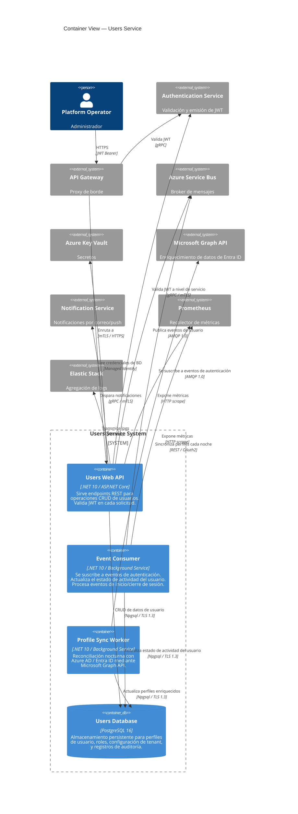

# Vista de Contenedores

## Alcance

Este documento describe los **contenedores en tiempo de ejecución** que componen el Users Service y su infraestructura de soporte (Modelo C4 Nivel 2).

## Modelo C4 — Nivel 2: Diagrama de Contenedores



## Descripciones de Contenedores

### 1. Users Web API (`web_api`)

| Atributo | Detalle |
|---|---|
| **Tecnología** | .NET 10, ASP.NET Core Minimal APIs |
| **Puerto** | 7201 (HTTP), 7203 (HTTPS) |
| **Responsabilidades** | Operaciones CRUD de usuarios, validación JWT a nivel de servicio, publicación de eventos de usuario |
| **Autenticación** | Token JWT Bearer, validado mediante gRPC del Auth Service |
| **Autorización** | Basada en roles (RBAC): `admin` (CRUD completo), `operator` (lectura+actualización), `user` (solo lectura propia) |
| **Paginación** | Paginación basada en cursor (`pageSize` + `continuationToken`) |
| **Escalado** | Horizontal. Objetivo: 4-8 instancias |

**Endpoints:**

| Método | Ruta | Autenticación | Roles |
|---|---|---|---|
| `GET` | `/api/users` | JWT | admin, operator |
| `GET` | `/api/users/{id}` | JWT | admin, operator, user (solo propio) |
| `POST` | `/api/users` | JWT | admin |
| `PUT` | `/api/users/{id}` | JWT | admin, operator, user (solo propio, campos limitados) |
| `DELETE` | `/api/users/{id}` | JWT | admin |
| `GET` | `/api/health` | Ninguno | — |

### 2. Event Consumer (`event_consumer`)

| Atributo | Detalle |
|---|---|
| **Tecnología** | .NET 10, procesador `Azure.Messaging.ServiceBus` |
| **Concurrencia** | Máx. 10 manejadores de mensajes concurrentes por instancia |
| **Responsabilidades** | Suscribirse al tópico `auth-events`; procesar eventos `user.login`, `user.logout`, `token.revoked`; actualizar marcas de tiempo de actividad del usuario |
| **Manejo de Errores** | Dead-letter después de 10 intentos de entrega; retroceso exponencial (10s → 5 min máximo) |

**Eventos Procesados:**

| Evento | Acción | Clave de Idempotencia |
|---|---|---|
| `user.login` | `UPDATE users SET last_login_at = @timestamp WHERE id = @userId` | `eventId` (tabla de deduplicación) |
| `user.logout` | `UPDATE users SET last_logout_at = @timestamp WHERE id = @userId` | `eventId` |
| `token.revoked` | `INSERT INTO token_revocations (user_id, event_id, revoked_at)` | `eventId` |

### 3. Profile Sync Worker (`sync_worker`)

| Atributo | Detalle |
|---|---|
| **Tecnología** | .NET 10, `BackgroundService` |
| **Programación** | Cada noche a las 02:00 UTC |
| **Responsabilidades** | Sincronizar perfiles de usuario con Azure AD / Entra ID mediante Microsoft Graph API; enriquecer perfiles de la plataforma con datos corporativos (departamento, cargo, gerente); detectar y marcar cuentas huérfanas (en AD pero no en la plataforma, y viceversa) |
| **Tamaño de Lote** | 100 usuarios por solicitud a Graph API |
| **Simulación** | Bandera `--dry-run` para modo de previsualización |

### 4. Users Database (`postgres`)

| Atributo | Detalle |
|---|---|
| **Tecnología** | PostgreSQL 16 (Azure Database for PostgreSQL — Flexible Server) |
| **SKU** | Propósito General, 4 vCores, 16 GB RAM, 256 GB almacenamiento |
| **HA** | Réplica en la misma zona, conmutación automática por error |
| **Cifrado** | En reposo (AES-256) + en tránsito (TLS 1.3) |

**Esquema (simplificado):**

```sql
CREATE TABLE users (
    id              UUID PRIMARY KEY DEFAULT gen_random_uuid(),
    tenant_id       UUID NOT NULL,
    username        VARCHAR(100) NOT NULL,
    email           VARCHAR(255) NOT NULL,
    display_name    VARCHAR(200),
    department      VARCHAR(100),
    job_title       VARCHAR(150),
    roles           JSONB NOT NULL DEFAULT '[]',
    last_login_at   TIMESTAMPTZ,
    last_logout_at  TIMESTAMPTZ,
    deleted_at      TIMESTAMPTZ,
    created_at      TIMESTAMPTZ NOT NULL DEFAULT NOW(),
    updated_at      TIMESTAMPTZ NOT NULL DEFAULT NOW(),
    UNIQUE (tenant_id, username),
    UNIQUE (tenant_id, email)
);

CREATE TABLE event_deduplication (
    event_id    UUID PRIMARY KEY,
    processed_at TIMESTAMPTZ NOT NULL DEFAULT NOW()
);

CREATE TABLE audit_log (
    id          UUID PRIMARY KEY DEFAULT gen_random_uuid(),
    user_id     UUID,
    action      VARCHAR(50) NOT NULL,
    changes     JSONB,
    actor_id    UUID NOT NULL,
    performed_at TIMESTAMPTZ NOT NULL DEFAULT NOW()
);
```

## Matriz de Comunicación entre Contenedores

| Desde | Hacia | Protocolo | Autenticación | Objetivo de Latencia |
|---|---|---|---|---|
| API Gateway | Web API | HTTPS | mTLS | p99 < 50ms |
| Web API | Auth Service | gRPC | mTLS | p99 < 10ms |
| Web API | PostgreSQL | Npgsql | SCRAM | p99 < 5ms |
| Web API | Service Bus | AMQP | SAS | p99 < 100ms |
| Web API | Key Vault | HTTPS | Managed Identity | p99 < 50ms |
| Web API | Notification Service | gRPC | mTLS | p99 < 100ms |
| Event Consumer | Service Bus | AMQP | SAS | — (asíncrono) |
| Event Consumer | PostgreSQL | Npgsql | SCRAM | p99 < 5ms |
| Sync Worker | Graph API | REST | OAuth2 | p99 < 2000ms |

## Documentos Relacionados

- [Vista de Componentes](components.md) — estructura interna de cada contenedor
- [Vista de Despliegue](deployment-view.md) — topología de despliegue
- [Stack Tecnológico](technology-stack.md)
