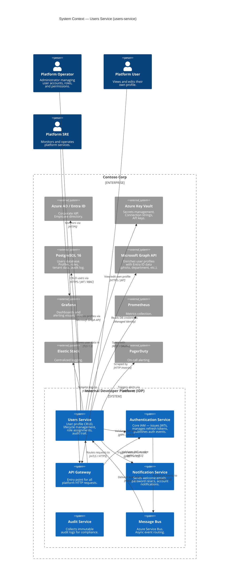

# System Context

## Scope

This document defines the **system context** of the Users Service — its boundaries, external dependencies, and the nature of its interactions with users, the Authentication Service, and other platform systems.

## C4 Model — Level 1: System Context Diagram



## External System Interactions

### 1. Authentication Service (Internal — Platform)

| Aspect | Detail |
|---|---|
| **Direction** | Outbound (depends on) |
| **Protocol** | gRPC with mTLS |
| **Purpose** | **JWT Validation:** Every authenticated request to the Users Service requires a valid JWT. The service calls `TokenValidator.ValidateToken()` via gRPC to verify the token signature, expiry, and claims |
| **Fallback** | Local JWKS cache (5 min TTL). If Auth Service is unreachable > 5 min, service returns `503 Service Unavailable` for authenticated endpoints |
| **Circuit Breaker** | 5 consecutive failures → circuit open for 30s → half-open probe → close or reopen |
| **SLA** | Auth Service must respond within p99 < 10ms for token validation |

### 2. Azure Service Bus (Internal — Messaging)

| Aspect | Detail |
|---|---|
| **Direction** | Inbound (subscriber) + Outbound (publisher) |
| **Protocol** | AMQP 1.0 |
| **Subscriptions** | `user.login`, `user.logout`, `token.revoked` from the `auth-events` topic |
| **Publications** | `user.created`, `user.updated`, `user.deleted` to the `users-events` topic |
| **Session Support** | Enabled — events for the same user are processed in order |

**Event Processing:**

| Event | Action |
|---|---|
| `user.login` | Update `last_login_at` timestamp on the user's profile |
| `user.logout` | Update `last_logout_at` timestamp |
| `token.revoked` | Record token revocation in user's audit trail |

### 3. Microsoft Graph API (External — Microsoft)

| Aspect | Detail |
|---|---|
| **Direction** | Outbound |
| **Protocol** | REST with OAuth 2.0 (delegated permission) |
| **Purpose** | Enrich user profiles with Entra ID data: display name, department, job title, manager, profile photo URL |
| **Sync Frequency** | On profile creation + nightly reconciliation job |
| **Rate Limit** | Microsoft Graph: 10,000 requests per 10 minutes. Service implements exponential backoff |

### 4. PostgreSQL 16 (Internal — Data Store)

| Aspect | Detail |
|---|---|
| **Direction** | Outbound |
| **Protocol** | Npgsql with TLS 1.3 |
| **Purpose** | Persistent storage for user profiles, role assignments, tenant configurations, and audit logs |
| **Multi-Tenancy** | `tenant_id` column on every table; Row-Level Security (RLS) policies enforce isolation |
| **Soft-Delete** | `deleted_at` timestamp column; queries default to `WHERE deleted_at IS NULL` |
| **Connection Pool** | Min 5, Max 30 connections per instance |

### 5. Notification Service (Internal — Platform)

| Aspect | Detail |
|---|---|
| **Direction** | Outbound |
| **Protocol** | gRPC with mTLS |
| **Purpose** | Trigger email notifications for: welcome email (on user creation), profile update confirmation, account suspension notice |

### 6. Observability Stack

| System | Protocol | Purpose |
|---|---|---|
| **Prometheus** | HTTP scrape (`/metrics`) | REQ metrics: user CRUD operations, event processing, JWT validation latency |
| **Elastic Stack** | Filebeat / JSON | Structured logs with correlation ID propagated from API Gateway |
| **Grafana** | Prometheus source | Dashboards: User Operations Overview, Event Processing Lag, Error Rates |
| **PagerDuty** | Webhook | Alerts: service down, DB connection failure, event processing backlog > 1000, p99 latency > 500ms |

## User Personas

| Persona | Description | Typical Actions |
|---|---|---|
| **Platform Operator** | IT admin managing the platform | Create/update/delete users, assign roles, view audit logs |
| **Platform User** | End user of the platform | View own profile, edit contact info, view teams |
| **Platform SRE** | Site Reliability Engineer | Monitor dashboards, respond to alerts, execute runbooks |

## Data Flow — User Creation (with JWT Validation)

```
Operator ──POST /api/users──▶ API Gateway ──Validate JWT──▶ Auth Service
                                   │                          │
                                   │ Valid                    │ OK
                                   ▼                          │
                              Users Service ◄─────────────────┘
                                   │
                    ┌──────────────┼──────────────┐
                    ▼              ▼              ▼
              PostgreSQL    Service Bus     Notification
              (INSERT)      (user.created)  (welcome email)
```

## Related Documents

- [Container View](containers.md) — runtime decomposition
- [Security Architecture](security.md) — JWT validation flow and authorization model
- [Dependencies](../decisions/dependencies.md) — full dependency inventory
