# Contexto del Sistema

## Alcance

Este documento define el **contexto del sistema** del Users Service — sus límites, dependencias externas y la naturaleza de sus interacciones con los usuarios, el Authentication Service y otros sistemas de la plataforma.

## Modelo C4 — Nivel 1: Diagrama de Contexto del Sistema

```mermaid
C4Context
    title System Context — Users Service (users-service)

    Person(platform_operator, "Platform Operator", "Administrador que gestiona<br/>cuentas de usuario, roles,<br/>y permisos.")
    Person(platform_user, "Platform User", "Ve y edita su<br/>propio perfil.")
    Person(sre, "Platform SRE", "Monitorea y opera<br/>los servicios de la plataforma.")

    Enterprise_Boundary(enterprise, "Contoso Corp") {
        System_Boundary(idp, "Internal Developer Platform (IDP)") {
            System(users_service, "Users Service", "CRUD de perfiles de usuario,<br/>gestión del ciclo de vida,<br/>asignación de roles,<br/>registro de auditoría.")

            System(auth_service, "Authentication Service", "IAM central — emite JWTs,<br/>gestiona tokens de actualización,<br/>publica eventos de autenticación.")
            System(api_gateway, "API Gateway", "Punto de entrada para todas<br/>las solicitudes HTTP de la plataforma.")
            System(notification_service, "Notification Service", "Envía correos de bienvenida,<br/>restablecimientos de contraseña, notificaciones<br/>de cuenta.")
            System(audit_service, "Audit Service", "Recopila registros de auditoría<br/>inmutables para cumplimiento normativo.")
            System(message_bus, "Message Bus", "Azure Service Bus.<br/>Enrutamiento asíncrono de eventos.")
        }

        System_Ext(entra_id, "Azure AD / Entra ID", "IdP corporativo.<br/>Directorio de empleados.")
        System_Ext(key_vault, "Azure Key Vault", "Gestión de secretos.<br/>Cadenas de conexión,<br/>claves de API.")
        System_Ext(postgres, "PostgreSQL 16", "Base de datos de usuarios.<br/>Perfiles, roles,<br/>datos de tenant, registro de auditoría.")
        System_Ext(graph_api, "Microsoft Graph API", "Enriquece perfiles de usuario<br/>con datos de Entra ID<br/>(foto, departamento, etc.).")

        System_Ext(grafana, "Grafana", "Visualización de paneles<br/>y alertas.")
        System_Ext(prometheus, "Prometheus", "Recolección de métricas.")
        System_Ext(elastic, "Elastic Stack", "Registro centralizado de logs.")
        System_Ext(pagerduty, "PagerDuty", "Alertas de guardia.")
    }

    Rel(platform_operator, api_gateway, "CRUD de usuarios mediante", "HTTPS / JWT / RBAC")
    Rel(platform_user, api_gateway, "Ver/editar perfil propio", "HTTPS / JWT")
    Rel(sre, grafana, "Monitorea mediante", "HTTPS")

    Rel(api_gateway, users_service, "Enruta solicitudes a", "mTLS / HTTPS")
    Rel(api_gateway, auth_service, "Valida JWT en el borde", "gRPC / mTLS")

    Rel(users_service, auth_service, "Valida JWT con", "gRPC / mTLS")
    Rel(users_service, key_vault, "Lee credenciales de BD", "Managed Identity")
    Rel(users_service, postgres, "Almacena datos de usuario en", "TLS 1.3")
    Rel(users_service, entra_id, "Enriquece perfiles mediante", "Microsoft Graph API")
    Rel(users_service, graph_api, "Sincroniza con", "REST / OAuth2")

    Rel(auth_service, message_bus, "Publica eventos en", "AMQP 1.0")
    Rel(message_bus, users_service, "Entrega eventos de autenticación", "AMQP 1.0")
    Rel(users_service, notification_service, "Dispara bienvenida/restablecimiento", "gRPC / mTLS")

    Rel(users_service, prometheus, "Recolectado por", "HTTP /metrics")
    Rel(users_service, elastic, "Transmite logs a", "Filebeat")
    Rel(users_service, pagerduty, "Dispara alertas mediante", "Webhook")

    UpdateLayoutConfig($c4ShapeInRow="4", $c4BoundaryInRow="2")
```



## Interacciones con Sistemas Externos

### 1. Authentication Service (Interno — Plataforma)

| Aspecto | Detalle |
|---|---|
| **Dirección** | Saliente (depende de) |
| **Protocolo** | gRPC con mTLS |
| **Propósito** | **Validación JWT:** Cada solicitud autenticada al Users Service requiere un JWT válido. El servicio llama a `TokenValidator.ValidateToken()` mediante gRPC para verificar la firma, expiración y claims del token |
| **Plan de Contingencia** | Caché JWKS local (TTL de 5 min). Si el Auth Service no está disponible > 5 min, el servicio devuelve `503 Service Unavailable` para endpoints autenticados |
| **Circuit Breaker** | 5 fallos consecutivos → circuito abierto por 30s → sonda half-open → cierre o reapertura |
| **SLA** | El Auth Service debe responder dentro de p99 < 10ms para la validación de tokens |

### 2. Azure Service Bus (Interno — Mensajería)

| Aspecto | Detalle |
|---|---|
| **Dirección** | Entrante (suscriptor) + Saliente (publicador) |
| **Protocolo** | AMQP 1.0 |
| **Suscripciones** | `user.login`, `user.logout`, `token.revoked` del tópico `auth-events` |
| **Publicaciones** | `user.created`, `user.updated`, `user.deleted` en el tópico `users-events` |
| **Soporte de Sesiones** | Habilitado — los eventos del mismo usuario se procesan en orden |

**Procesamiento de Eventos:**

| Evento | Acción |
|---|---|
| `user.login` | Actualizar la marca de tiempo `last_login_at` en el perfil del usuario |
| `user.logout` | Actualizar la marca de tiempo `last_logout_at` |
| `token.revoked` | Registrar la revocación del token en el registro de auditoría del usuario |

### 3. Microsoft Graph API (Externo — Microsoft)

| Aspecto | Detalle |
|---|---|
| **Dirección** | Saliente |
| **Protocolo** | REST con OAuth 2.0 (permiso delegado) |
| **Propósito** | Enriquecer perfiles de usuario con datos de Entra ID: nombre para mostrar, departamento, puesto de trabajo, gerente, URL de foto de perfil |
| **Frecuencia de Sincronización** | En la creación del perfil + trabajo de reconciliación nocturno |
| **Límite de Tasa** | Microsoft Graph: 10,000 solicitudes por cada 10 minutos. El servicio implementa retroceso exponencial |

### 4. PostgreSQL 16 (Interno — Almacén de Datos)

| Aspecto | Detalle |
|---|---|
| **Dirección** | Saliente |
| **Protocolo** | Npgsql con TLS 1.3 |
| **Propósito** | Almacenamiento persistente para perfiles de usuario, asignaciones de roles, configuraciones de tenant y registros de auditoría |
| **Multi-Tenancy** | Columna `tenant_id` en cada tabla; políticas de Seguridad a Nivel de Fila (RLS) aplican aislamiento |
| **Soft-Delete** | Columna de marca de tiempo `deleted_at`; las consultas por defecto incluyen `WHERE deleted_at IS NULL` |
| **Pool de Conexiones** | Mín. 5, Máx. 30 conexiones por instancia |

### 5. Notification Service (Interno — Plataforma)

| Aspecto | Detalle |
|---|---|
| **Dirección** | Saliente |
| **Protocolo** | gRPC con mTLS |
| **Propósito** | Disparar notificaciones por correo electrónico para: correo de bienvenida (en la creación del usuario), confirmación de actualización de perfil, aviso de suspensión de cuenta |

### 6. Stack de Observabilidad

| Sistema | Protocolo | Propósito |
|---|---|---|
| **Prometheus** | HTTP scrape (`/metrics`) | Métricas de solicitudes: operaciones CRUD de usuarios, procesamiento de eventos, latencia de validación JWT |
| **Elastic Stack** | Filebeat / JSON | Logs estructurados con ID de correlación propagado desde el API Gateway |
| **Grafana** | Fuente Prometheus | Paneles: Resumen de Operaciones de Usuario, Retraso en Procesamiento de Eventos, Tasas de Error |
| **PagerDuty** | Webhook | Alertas: servicio caído, fallo de conexión a BD, acumulación de procesamiento de eventos > 1000, latencia p99 > 500ms |

## Personas de Usuario

| Persona | Descripción | Acciones Típicas |
|---|---|---|
| **Platform Operator** | Administrador de TI que gestiona la plataforma | Crear/actualizar/eliminar usuarios, asignar roles, ver registros de auditoría |
| **Platform User** | Usuario final de la plataforma | Ver perfil propio, editar información de contacto, ver equipos |
| **Platform SRE** | Ingeniero de Confiabilidad del Sitio | Monitorear paneles, responder a alertas, ejecutar runbooks |

## Flujo de Datos — Creación de Usuario (con Validación JWT)

```
Operator ──POST /api/users──▶ API Gateway ──Validate JWT──▶ Auth Service
                                   │                          │
                                   │ Válido                    │ OK
                                   ▼                          │
                              Users Service ◄─────────────────┘
                                   │
                    ┌──────────────┼──────────────┐
                    ▼              ▼              ▼
              PostgreSQL    Service Bus     Notification
              (INSERT)      (user.created)  (correo de bienvenida)
```

## Documentos Relacionados

- [Vista de Contenedores](containers.md) — descomposición en tiempo de ejecución
- [Arquitectura de Seguridad](security.md) — flujo de validación JWT y modelo de autorización
- [Dependencias](../decisions/dependencies.md) — inventario completo de dependencias
