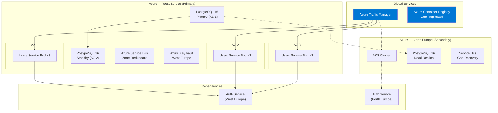

# Deployment View

## Scope

This document describes the **deployment topology** of the Users Service across Azure regions and the CI/CD pipeline that delivers changes safely to production.

## High-Level Deployment Topology



## Infrastructure Components

### AKS Configuration

| Attribute | Detail |
|---|---|
| **Kubernetes Version** | 1.31 |
| **Node Pools** | 3 AZs × 3 nodes (`Standard_D4s_v5`) |
| **Autoscaling** | HPA: CPU 70%. Cluster Autoscaler: 3-8 nodes per zone |
| **Pod Anti-Affinity** | Prefer spread across AZs and nodes |
| **Service Mesh** | Istio (mTLS, retries, circuit breaking) |

**Pod Configuration:**

```yaml
apiVersion: apps/v1
kind: Deployment
metadata:
  name: users-service
spec:
  replicas: 3
  template:
    spec:
      containers:
        - name: users-api
          image: acrplatform.azurecr.io/users-service:2.1.0
          resources:
            requests: { cpu: "250m", memory: "256Mi" }
            limits:   { cpu: "1000m", memory: "1Gi" }
          env:
            - name: AuthService__Endpoint
              value: "https://auth-service.platform.svc.cluster.local:5103"
            - name: ConnectionStrings__UsersDb
              valueFrom:
                secretKeyRef:
                  name: users-db-connection
                  key: value
          readinessProbe:
            httpGet:
              path: /api/health/ready
              port: 7201
            initialDelaySeconds: 15
            periodSeconds: 10
          livenessProbe:
            httpGet:
              path: /api/health/live
              port: 7201
            initialDelaySeconds: 30
            periodSeconds: 15
```

### Critical Dependency: Auth Service

The Users Service has a **hard runtime dependency** on the Authentication Service. The deployment topology ensures regional affinity:

| Users Service Instance | Auth Service Endpoint | Rationale |
|---|---|---|
| West Europe pods | `auth-service.we.platform.svc.cluster.local` | Same-region, low latency (p99 < 10ms) |
| North Europe pods | `auth-service.ne.platform.svc.cluster.local` | Regional failover only |

**Degradation Path:**

```
Auth Service healthy → gRPC validation (p99 < 10ms)
Auth Service degraded → local JWKS cache (p99 < 1ms, 5 min TTL)
Auth Service down < 5 min → JWKS cache still valid
Auth Service down > 5 min → 503 Service Unavailable for authenticated endpoints
                            (public health endpoint still works)
```

### Database Topology

| Component | Configuration |
|---|---|
| **Primary** | West Europe, AZ-1, 4 vCores, 16 GB, 256 GB |
| **Standby** | West Europe, AZ-2, synchronous replication |
| **Read Replica** | North Europe, async (< 1 sec lag) |
| **Tenant Isolation** | Row-Level Security (RLS) policies on `tenant_id` |

### Event Consumer Configuration

```yaml
# Subscription: users-service on auth-events topic
rules:
  - name: UserLogin
    filter: "event_type = 'user.login'"
  - name: UserLogout
    filter: "event_type = 'user.logout'"
  - name: TokenRevoked
    filter: "event_type = 'token.revoked'"
```

**Scaling considerations:**
- Max 10 concurrent message handlers per pod
- Sessions enabled for ordered processing per user
- Prefetch count: 20 messages

## Environment Strategy

| Environment | Region | Replicas | Purpose |
|---|---|---|---|
| `dev` | West Europe | 1 | Developer sandbox |
| `qa` | West Europe | 2 | Integration testing |
| `staging` | West Europe | 3 | Pre-production validation |
| `production` | West Europe + North Europe | 9 (3 × 3 zones) | Live traffic |

## Health Checks

### Readiness Probe (`GET /api/health/ready`)

Returns 200 only when:
- PostgreSQL connection pool has ≥ 1 available connection
- Auth Service gRPC is reachable (or JWKS cache is valid)
- Service Bus connection is alive (event publisher)

### Liveness Probe (`GET /api/health/live`)

Returns 200 while the process is alive — no dependency checks.

## Observability

Each pod emits:
- **Metrics** → Prometheus (scraped every 15s)
- **Traces** → OpenTelemetry Collector sidecar (10% sampling in production)
- **Logs** → stdout (JSON), aggregated by Filebeat → Elastic

## Related Documents

- [Container View](containers.md)
- [Deployment Runbook](../runbooks/deployment.md)
- [Rollback Runbook](../runbooks/rollback.md)
- [Dependencies](../decisions/dependencies.md)
