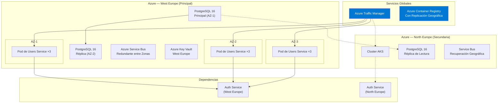

# Vista de Despliegue

## Alcance

Este documento describe la **topología de despliegue** del Users Service en las regiones de Azure y el pipeline CI/CD que entrega cambios de forma segura a producción.

## Topología de Despliegue de Alto Nivel



## Componentes de Infraestructura

### Configuración de AKS

| Atributo | Detalle |
|---|---|
| **Versión de Kubernetes** | 1.31 |
| **Pools de Nodos** | 3 AZs × 3 nodos (`Standard_D4s_v5`) |
| **Autoescalado** | HPA: CPU 70%. Cluster Autoscaler: 3-8 nodos por zona |
| **Anti-Afinidad de Pods** | Preferir distribución entre AZs y nodos |
| **Service Mesh** | Istio (mTLS, reintentos, circuit breaking) |

**Configuración del Pod:**

```yaml
apiVersion: apps/v1
kind: Deployment
metadata:
  name: users-service
spec:
  replicas: 3
  template:
    spec:
      containers:
        - name: users-api
          image: acrplatform.azurecr.io/users-service:2.1.0
          resources:
            requests: { cpu: "250m", memory: "256Mi" }
            limits:   { cpu: "1000m", memory: "1Gi" }
          env:
            - name: AuthService__Endpoint
              value: "https://auth-service.platform.svc.cluster.local:5103"
            - name: ConnectionStrings__UsersDb
              valueFrom:
                secretKeyRef:
                  name: users-db-connection
                  key: value
          readinessProbe:
            httpGet:
              path: /api/health/ready
              port: 7201
            initialDelaySeconds: 15
            periodSeconds: 10
          livenessProbe:
            httpGet:
              path: /api/health/live
              port: 7201
            initialDelaySeconds: 30
            periodSeconds: 15
```

### Dependencia Crítica: Auth Service

El Users Service tiene una **dependencia crítica en tiempo de ejecución** del Authentication Service. La topología de despliegue garantiza afinidad regional:

| Instancia de Users Service | Endpoint de Auth Service | Justificación |
|---|---|---|
| Pods de West Europe | `auth-service.we.platform.svc.cluster.local` | Misma región, baja latencia (p99 < 10ms) |
| Pods de North Europe | `auth-service.ne.platform.svc.cluster.local` | Solo para conmutación por error regional |

**Ruta de Degradación:**

```
Auth Service saludable → validación gRPC (p99 < 10ms)
Auth Service degradado → caché JWKS local (p99 < 1ms, TTL 5 min)
Auth Service caído < 5 min → caché JWKS aún válida
Auth Service caído > 5 min → 503 Service Unavailable para endpoints autenticados
                            (el endpoint público de salud sigue funcionando)
```

### Topología de Base de Datos

| Componente | Configuración |
|---|---|
| **Principal** | West Europe, AZ-1, 4 vCores, 16 GB, 256 GB |
| **Réplica** | West Europe, AZ-2, replicación síncrona |
| **Réplica de Lectura** | North Europe, asíncrona (< 1 seg de retraso) |
| **Aislamiento de Tenant** | Políticas de Seguridad a Nivel de Fila (RLS) en `tenant_id` |

### Configuración del Event Consumer

```yaml
# Suscripción: users-service en el tópico auth-events
rules:
  - name: UserLogin
    filter: "event_type = 'user.login'"
  - name: UserLogout
    filter: "event_type = 'user.logout'"
  - name: TokenRevoked
    filter: "event_type = 'token.revoked'"
```

**Consideraciones de escalado:**
- Máx. 10 manejadores de mensajes concurrentes por pod
- Sesiones habilitadas para procesamiento ordenado por usuario
- Recuento de precarga: 20 mensajes

## Estrategia de Entornos

| Entorno | Región | Réplicas | Propósito |
|---|---|---|---|
| `dev` | West Europe | 1 | Sandbox para desarrolladores |
| `qa` | West Europe | 2 | Pruebas de integración |
| `staging` | West Europe | 3 | Validación pre-producción |
| `production` | West Europe + North Europe | 9 (3 × 3 zonas) | Tráfico en vivo |

## Health Checks

### Sonda de Preparación (Readiness Probe) (`GET /api/health/ready`)

Devuelve 200 solo cuando:
- El pool de conexiones de PostgreSQL tiene ≥ 1 conexión disponible
- El Auth Service gRPC es accesible (o la caché JWKS es válida)
- La conexión a Service Bus está activa (publicador de eventos)

### Sonda de Vida (Liveness Probe) (`GET /api/health/live`)

Devuelve 200 mientras el proceso esté activo — sin verificaciones de dependencias.

## Observabilidad

Cada pod emite:
- **Métricas** → Prometheus (recolectado cada 15s)
- **Trazas** → OpenTelemetry Collector sidecar (muestreo del 10% en producción)
- **Logs** → stdout (JSON), agregados por Filebeat → Elastic

## Documentos Relacionados

- [Vista de Contenedores](containers.md)
- [Runbook de Despliegue](../runbooks/deployment.md)
- [Runbook de Rollback](../runbooks/rollback.md)
- [Dependencias](../decisions/dependencies.md)
