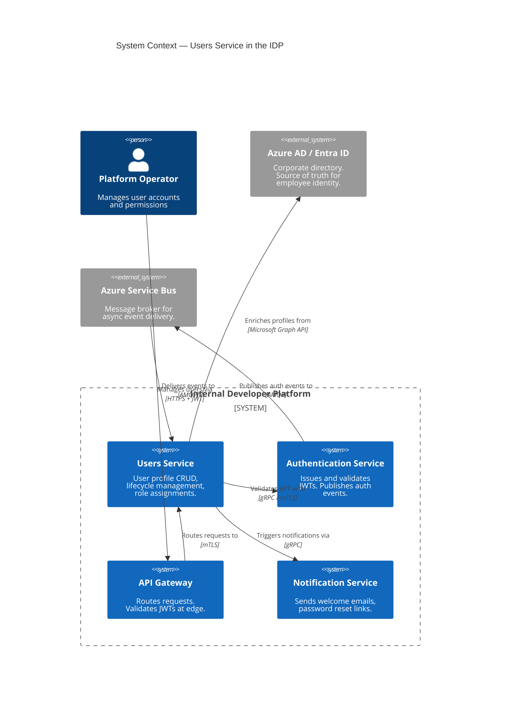

# Architecture Overview

## Executive Summary

The **Users Service** (`users-service`) manages the complete user lifecycle for the Internal Developer Platform (IDP). It provides CRUD operations for user profiles, enforces role-based access control via JWT validation against the [Authentication Service](https://backstage.internal/platform/component/auth-service), and consumes authentication events to maintain real-time user activity state.

## Platform Position



## Design Principles

| Principle | Implementation |
|---|---|
| **API-First Design** | OpenAPI specification is the source of truth; code is generated from spec |
| **Defense in Depth** | JWT validated at API Gateway AND at service level |
| **Stateless Compute** | Any instance can serve any request; session affinity not required |
| **Eventual Consistency** | User state synchronized across services via domain events |
| **Soft-Delete by Default** | Users are never hard-deleted; `deleted_at` flag preserves referential integrity |
| **Multi-Tenancy** | All queries include `tenant_id` discriminator for data isolation |

## Architecture Style

The service follows a **microservice architecture** with:

- **Hexagonal Architecture** (Ports & Adapters) pattern
- **Repository Pattern** with Dapper for data access
- **Event-Driven** consumer for Auth Service events (login/logout)
- **API-First** design — OpenAPI 3.1 specification drives implementation

## Dependency on Authentication Service

The Users Service has a **hard runtime dependency** on the Authentication Service:

```
Users Service ──DependsOn──▶ Authentication Service
     │                              │
     │  JWT Validation              │  JWT Issuance
     │  (every request)             │  (on login)
     │                              │
     │  Event Consumption           │  Event Publication
     │  (user.login, user.logout)   │  (to Service Bus)
```

**Failure mode:** If the Auth Service is unreachable, JWT validation falls back to a local JWKS cache (5-minute TTL). After the cache expires, all authenticated requests fail with `503 Service Unavailable`.

Full details: [System Context](context.md) and [Dependencies](../decisions/dependencies.md).

## Technology Stack Summary

| Layer | Technology | Version |
|---|---|---|
| Runtime | .NET | 10.0 |
| Language | C# | 13 |
| API Framework | ASP.NET Core Minimal APIs | 10.0 |
| Database | PostgreSQL | 16 |
| Messaging | Azure Service Bus | — |
| Auth Integration | gRPC client to Auth Service | — |
| Observability | OpenTelemetry + Prometheus + Grafana | — |
| Secrets | Azure Key Vault | — |

Full details: [Technology Stack](technology-stack.md)

## Related Documents

- [System Context](context.md) — detailed external system interactions
- [Container View](containers.md) — runtime containers and data stores
- [Component View](components.md) — internal component design
- [Security Architecture](security.md) — threat model and JWT validation flow
- [ADR-002 — JWT Validation at Gateway vs. Service Level](../adr/ADR-002.md)
