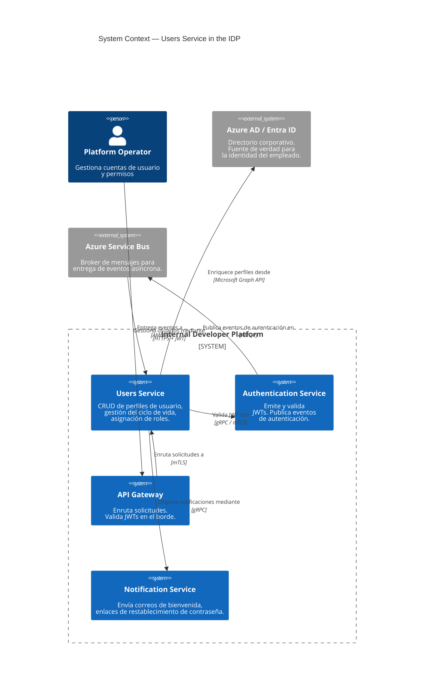

# Visión General de la Arquitectura

## Resumen Ejecutivo

El **Users Service** (`users-service`) gestiona el ciclo de vida completo de los usuarios para la Plataforma Interna para Desarrolladores (IDP, por sus siglas en inglés). Proporciona operaciones CRUD para perfiles de usuario, aplica control de acceso basado en roles mediante validación JWT contra el [Authentication Service](https://backstage.internal/platform/component/auth-service), y consume eventos de autenticación para mantener el estado de actividad del usuario en tiempo real.

## Posición en la Plataforma



## Principios de Diseño

| Principio | Implementación |
|---|---|
| **API-First Design** | La especificación OpenAPI es la fuente de verdad; el código se genera a partir de la especificación |
| **Defense in Depth** | JWT validado en el API Gateway Y a nivel de servicio |
| **Stateless Compute** | Cualquier instancia puede atender cualquier solicitud; no se requiere afinidad de sesión |
| **Eventual Consistency** | El estado del usuario se sincroniza entre servicios mediante eventos de dominio |
| **Soft-Delete por Defecto** | Los usuarios nunca se eliminan físicamente; la marca `deleted_at` preserva la integridad referencial |
| **Multi-Tenancy** | Todas las consultas incluyen el discriminador `tenant_id` para el aislamiento de datos |

## Estilo Arquitectónico

El servicio sigue una **arquitectura de microservicios** con:

- **Arquitectura Hexagonal** (Puertos y Adaptadores)
- **Patrón Repositorio** con Dapper para acceso a datos
- **Consumidor basado en Eventos** para eventos del Auth Service (inicio/cierre de sesión)
- **Diseño API-First** — la especificación OpenAPI 3.1 guía la implementación

## Dependencia del Authentication Service

El Users Service tiene una **dependencia crítica en tiempo de ejecución** del Authentication Service:

```
Users Service ──DependsOn──▶ Authentication Service
     │                              │
     │  Validación JWT              │  Emisión de JWT
     │  (cada solicitud)            │  (al iniciar sesión)
     │                              │
     │  Consumo de Eventos          │  Publicación de Eventos
     │  (user.login, user.logout)   │  (en Service Bus)
```

**Modo de fallo:** Si el Auth Service no está disponible, la validación JWT recurre a una caché JWKS local (TTL de 5 minutos). Después de que expire la caché, todas las solicitudes autenticadas fallarán con `503 Service Unavailable`.

Detalles completos: [Contexto del Sistema](context.md) y [Dependencias](../decisions/dependencies.md).

## Resumen del Stack Tecnológico

| Capa | Tecnología | Versión |
|---|---|---|
| Runtime | .NET | 10.0 |
| Lenguaje | C# | 13 |
| Framework API | ASP.NET Core Minimal APIs | 10.0 |
| Base de datos | PostgreSQL | 16 |
| Mensajería | Azure Service Bus | — |
| Integración de Autenticación | Cliente gRPC para Auth Service | — |
| Observabilidad | OpenTelemetry + Prometheus + Grafana | — |
| Secretos | Azure Key Vault | — |

Detalles completos: [Stack Tecnológico](technology-stack.md)

## Documentos Relacionados

- [Contexto del Sistema](context.md) — interacciones detalladas con sistemas externos
- [Vista de Contenedores](containers.md) — contenedores en tiempo de ejecución y almacenes de datos
- [Vista de Componentes](components.md) — diseño interno de componentes
- [Arquitectura de Seguridad](security.md) — modelo de amenazas y flujo de validación JWT
- [ADR-002 — Validación JWT a Nivel de Gateway vs. Servicio](../adr/ADR-002.md)
