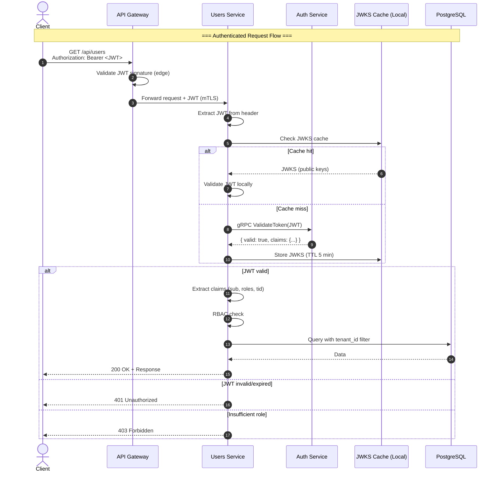
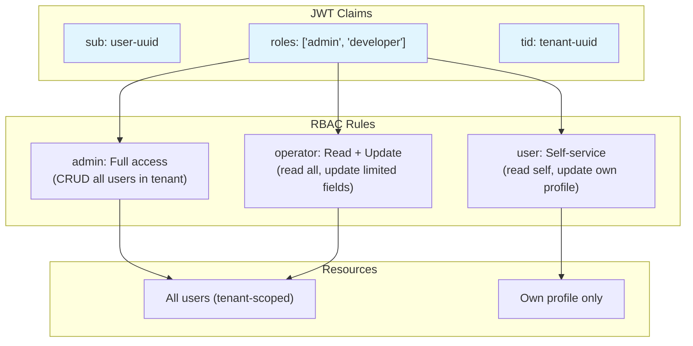

# Security Architecture

## Scope

This document describes the **security architecture** of the Users Service — how it authenticates requests via the Authentication Service, its authorization model, data protection controls, and threat model.

## Authentication Flow

The Users Service is a **JWT-consuming service**. It does not issue tokens. Every authenticated request must include a valid JWT issued by the Authentication Service.



## Defense in Depth: Dual Validation

JWT validation occurs at **two independent layers**:

| Layer | Validator | Purpose |
|---|---|---|
| **API Gateway** (Edge) | Envoy OAuth2 filter | First line of defense — rejects invalid tokens before they reach any service |
| **Users Service** (Service) | Auth Service gRPC + local JWKS | Second line — zero-trust; the service never assumes the gateway has validated the token |

This dual validation ensures that even if the API Gateway is misconfigured or compromised, the Users Service independently verifies every token.

## Authorization Model (RBAC)

The Users Service implements **Role-Based Access Control** using claims from the JWT:



**Role Matrix:**

| Action | `admin` | `operator` | `user` |
|---|---|---|---|
| List all users | ✅ | ✅ | ❌ |
| Get any user | ✅ | ✅ | ❌ |
| Get own profile | ✅ | ✅ | ✅ |
| Create user | ✅ | ❌ | ❌ |
| Update any user | ✅ | ❌ | ❌ |
| Update own profile | ✅ | ✅ | ✅ (limited fields) |
| Delete user | ✅ | ❌ | ❌ |

## Tenancy Isolation

The platform is **multi-tenant**. Every query is scoped to the `tenant_id` extracted from the JWT:

```sql
-- All queries include tenant_id filter
SELECT * FROM users WHERE tenant_id = @tenantId AND id = @userId;

-- Row-Level Security (RLS) as defense-in-depth
CREATE POLICY tenant_isolation ON users
    USING (tenant_id = current_setting('app.current_tenant_id')::UUID);
```

**Tenant ID source:** The `tid` claim in the JWT, set by the Auth Service at login time. It CANNOT be overridden by the client.

## Threat Model Summary

| # | Threat | Category | Severity | Mitigation |
|---|---|---|---|---|
| T1 | Unauthorized user data access | Elevation of Privilege | **Critical** | Dual JWT validation, RLS on database, RBAC per endpoint |
| T2 | Cross-tenant data leakage | Information Disclosure | **Critical** | `tenant_id` on every query, RLS policies, integration tests per tenant |
| T3 | JWT replay attack | Spoofing | **Low** | Short TTL (15 min), JWT ID (`jti`) check via Auth Service |
| T4 | SQL injection | Tampering | **Medium** | Parameterized queries (Dapper), input validation (FluentValidation) |
| T5 | Mass assignment (overposting) | Tampering | **Medium** | DTO validation — only whitelisted fields are accepted in requests |
| T6 | Enumeration of users | Information Disclosure | **Medium** | Consistent 404 for non-existent and unauthorized users; rate limiting |
| T7 | Stale data after soft-delete | Information Disclosure | **Low** | All queries default to `WHERE deleted_at IS NULL` |
| T8 | Auth Service impersonation | Spoofing | **High** | mTLS for gRPC; only Auth Service's certificate is trusted |
| T9 | Event injection on Service Bus | Tampering | **High** | Event schema validation; deduplication by `eventId` |
| T10 | Privilege escalation via role editing | Elevation of Privilege | **High** | Role field change requires `admin` role; audited |

## Data Protection

| Data | Storage | Protection |
|---|---|---|
| User profiles | PostgreSQL | Encryption at rest (AES-256), TLS 1.3 in transit |
| PII (email, name) | PostgreSQL | Encrypted at rest; field-level encryption planned for GDPR compliance |
| Audit logs | PostgreSQL + Elasticsearch | Immutable append-only; encrypted at rest |
| JWT (in transit) | HTTP headers | TLS 1.3; never logged |
| Database credentials | Azure Key Vault | Managed Identity + RBAC |

## PII Handling

The Users Service processes Personally Identifiable Information (PII):

| Field | PII Level | Retention | Deletion |
|---|---|---|---|
| `email` | **High** | Active account + 30 days post-deletion | Anonymized by nightly cleanup job |
| `display_name` | **Medium** | Active account + 30 days post-deletion | Anonymized |
| `username` | **Low** | Active account + 30 days post-deletion | Anonymized |
| IP addresses (audit) | **Medium** | 90 days | Automatic purge via partition rotation |
| `department`, `job_title` | **Low** | Retained for org chart history | Retained |

**GDPR Compliance:**
- Data export API: `GET /api/users/{id}/export` (returns all user data in JSON)
- Data deletion API: `POST /api/users/{id}/purge` (hard-delete + anonymize audit trail)
- Both require `admin` role + additional approval workflow (planned)

## Incident Response

See [Incident Response Runbook](../runbooks/incident-response.md).

**Security contact:** `infosec@internal.platform` / Slack: `#infosec`

## Related Documents

- [Architecture Overview](overview.md)
- [Component View](components.md)
- [Users API](../api/users-api.md)
- [Security Guidelines](../decisions/security-guidelines.md)
- [ADR-002 — JWT Validation at Gateway vs. Service Level](../adr/ADR-002.md)
