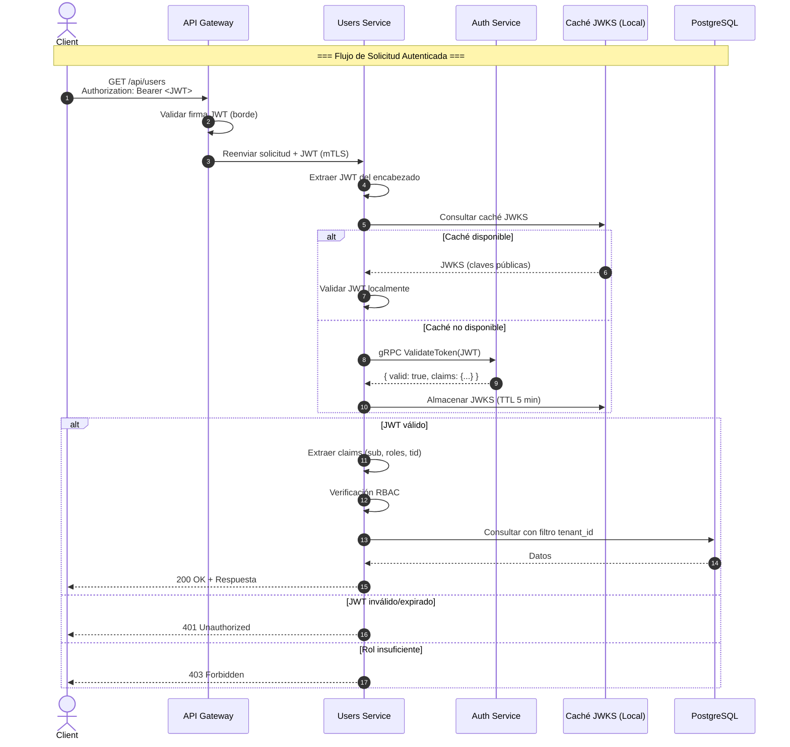
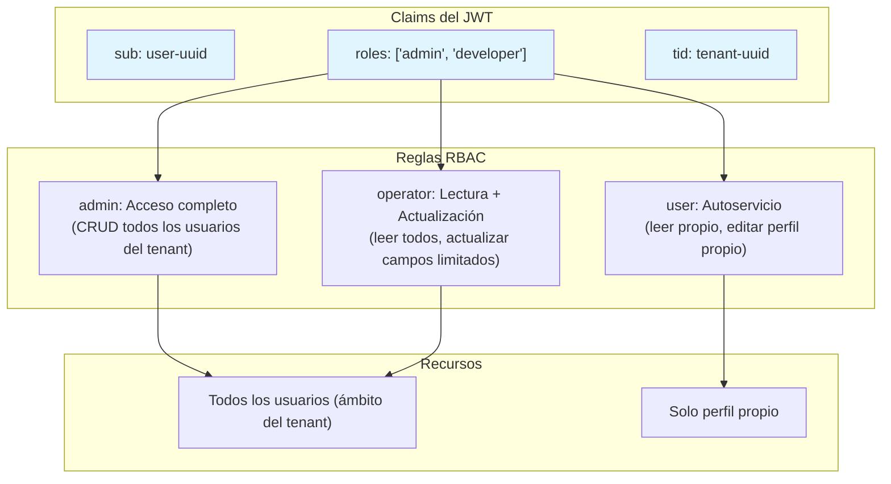

# Arquitectura de Seguridad

## Alcance

Este documento describe la **arquitectura de seguridad** del Users Service — cómo autentica las solicitudes a través del Authentication Service, su modelo de autorización, controles de protección de datos y modelo de amenazas.

## Flujo de Autenticación

El Users Service es un **servicio consumidor de JWT**. No emite tokens. Cada solicitud autenticada debe incluir un JWT válido emitido por el Authentication Service.



## Defensa en Profundidad: Validación Dual

La validación JWT ocurre en **dos capas independientes**:

| Capa | Validador | Propósito |
|---|---|---|
| **API Gateway** (Borde) | Filtro Envoy OAuth2 | Primera línea de defensa — rechaza tokens inválidos antes de que lleguen a cualquier servicio |
| **Users Service** (Servicio) | Auth Service gRPC + JWKS local | Segunda línea — confianza cero; el servicio nunca asume que el gateway ha validado el token |

Esta validación dual garantiza que incluso si el API Gateway está mal configurado o comprometido, el Users Service verifica cada token de forma independiente.

## Modelo de Autorización (RBAC)

El Users Service implementa **Control de Acceso Basado en Roles** utilizando claims del JWT:



**Matriz de Roles:**

| Acción | `admin` | `operator` | `user` |
|---|---|---|---|
| Listar todos los usuarios | ✅ | ✅ | ❌ |
| Obtener cualquier usuario | ✅ | ✅ | ❌ |
| Obtener perfil propio | ✅ | ✅ | ✅ |
| Crear usuario | ✅ | ❌ | ❌ |
| Actualizar cualquier usuario | ✅ | ❌ | ❌ |
| Actualizar perfil propio | ✅ | ✅ | ✅ (campos limitados) |
| Eliminar usuario | ✅ | ❌ | ❌ |

## Aislamiento de Tenant

La plataforma es **multi-tenant**. Cada consulta está limitada al `tenant_id` extraído del JWT:

```sql
-- Todas las consultas incluyen filtro tenant_id
SELECT * FROM users WHERE tenant_id = @tenantId AND id = @userId;

-- Seguridad a Nivel de Fila (RLS) como defensa en profundidad
CREATE POLICY tenant_isolation ON users
    USING (tenant_id = current_setting('app.current_tenant_id')::UUID);
```

**Origen del Tenant ID:** El claim `tid` en el JWT, establecido por el Auth Service al iniciar sesión. NO puede ser sobrescrito por el cliente.

## Resumen del Modelo de Amenazas

| # | Amenaza | Categoría | Severidad | Mitigación |
|---|---|---|---|---|
| T1 | Acceso no autorizado a datos de usuario | Elevación de Privilegio | **Crítica** | Validación JWT dual, RLS en la base de datos, RBAC por endpoint |
| T2 | Fuga de datos entre tenants | Divulgación de Información | **Crítica** | `tenant_id` en cada consulta, políticas RLS, pruebas de integración por tenant |
| T3 | Ataque de repetición de JWT | Suplantación | **Baja** | TTL corto (15 min), verificación de JWT ID (`jti`) mediante Auth Service |
| T4 | Inyección SQL | Manipulación | **Media** | Consultas parametrizadas (Dapper), validación de entrada (FluentValidation) |
| T5 | Asignación masiva (overposting) | Manipulación | **Media** | Validación de DTO — solo los campos permitidos son aceptados en las solicitudes |
| T6 | Enumeración de usuarios | Divulgación de Información | **Media** | 404 consistente para usuarios inexistentes y no autorizados; limitación de tasa |
| T7 | Datos obsoletos después de soft-delete | Divulgación de Información | **Baja** | Todas las consultas por defecto incluyen `WHERE deleted_at IS NULL` |
| T8 | Suplantación del Auth Service | Suplantación | **Alta** | mTLS para gRPC; solo se confía en el certificado del Auth Service |
| T9 | Inyección de eventos en Service Bus | Manipulación | **Alta** | Validación de esquema de eventos; deduplicación por `eventId` |
| T10 | Escalada de privilegios mediante edición de roles | Elevación de Privilegio | **Alta** | El cambio del campo de rol requiere rol `admin`; auditado |

## Protección de Datos

| Dato | Almacenamiento | Protección |
|---|---|---|
| Perfiles de usuario | PostgreSQL | Cifrado en reposo (AES-256), TLS 1.3 en tránsito |
| PII (correo electrónico, nombre) | PostgreSQL | Cifrado en reposo; cifrado a nivel de campo planificado para cumplimiento GDPR |
| Registros de auditoría | PostgreSQL + Elasticsearch | Solo anexión, inmutable; cifrado en reposo |
| JWT (en tránsito) | Encabezados HTTP | TLS 1.3; nunca se registran |
| Credenciales de base de datos | Azure Key Vault | Managed Identity + RBAC |

## Manejo de PII

El Users Service procesa Información de Identificación Personal (PII):

| Campo | Nivel de PII | Retención | Eliminación |
|---|---|---|---|
| `email` | **Alto** | Cuenta activa + 30 días después de la eliminación | Anonimizado por trabajo de limpieza nocturno |
| `display_name` | **Medio** | Cuenta activa + 30 días después de la eliminación | Anonimizado |
| `username` | **Bajo** | Cuenta activa + 30 días después de la eliminación | Anonimizado |
| Direcciones IP (auditoría) | **Medio** | 90 días | Purga automática mediante rotación de particiones |
| `department`, `job_title` | **Bajo** | Retenido para historial de organigrama | Retenido |

**Cumplimiento GDPR:**
- API de exportación de datos: `GET /api/users/{id}/export` (devuelve todos los datos del usuario en JSON)
- API de eliminación de datos: `POST /api/users/{id}/purge` (eliminación física + anonimización del registro de auditoría)
- Ambas requieren rol `admin` + flujo de aprobación adicional (planificado)

## Respuesta a Incidentes

Ver [Runbook de Respuesta a Incidentes](../runbooks/incident-response.md).

**Contacto de seguridad:** `infosec@internal.platform` / Slack: `#infosec`

## Documentos Relacionados

- [Visión General de la Arquitectura](overview.md)
- [Vista de Componentes](components.md)
- [API de Usuarios](../api/users-api.md)
- [Directrices de Seguridad](../decisions/security-guidelines.md)
- [ADR-002 — Validación JWT a Nivel de Gateway vs. Servicio](../adr/ADR-002.md)
