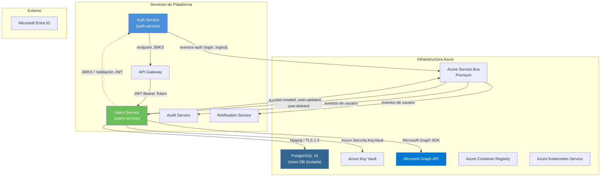

# Inventario de Dependencias — Users Service

- **Estado:** Aprobado
- **Propietario:** Equipo de Platform Engineering
- **Última actualización:** 2026-07-20

## Diagrama General de Dependencias

El Users Service depende del Auth Service para la validación de JWT y consume eventos del Auth Service. Mantiene su propia base de datos PostgreSQL aislada y publica eventos de usuario para consumidores posteriores.

### Dependencia del Users Service al Auth Service

La dependencia crítica del Users Service hacia el Auth Service:

| Dirección | Mecanismo | Descripción |
|---|---|---|
| Users Service -> Auth Service | Endpoint JWKS (`.well-known/jwks.json`) | Users Service obtiene y almacena en caché las claves públicas del Auth Service para la verificación local de firmas JWT. No existe una llamada HTTP síncrona directa; el endpoint JWKS se consulta periódicamente (TTL de caché: 5 minutos). |
| Users Service <- Auth Service | Eventos mediante tema de Service Bus `auth-events` | Users Service consume eventos `user.login`, `user.logout` y `token.revoked` para actualizar el estado de sesión del usuario y desencadenar acciones de perfil. |

**Impacto de la indisponibilidad del Auth Service:** Si el Auth Service no está disponible:
- No se pueden obtener nuevas claves JWKS (las claves en caché continúan funcionando hasta por 5 minutos).
- Después de la expiración de la caché, la validación JWT falla y todas las solicitudes al Users Service son rechazadas.
- No se reciben eventos de auth (el estado de sesión del usuario se vuelve obsoleto).
- Las operaciones CRUD de usuario que no requieren validación de token fresco continúan funcionando (JWKS en caché).

---

## 1. Dependencias en Tiempo de Ejecución

### 1.1 Base de Datos de Usuarios (PostgreSQL 16) — Aislada

| Atributo | Detalle |
|---|---|
| **Servicio** | Azure Database for PostgreSQL — Flexible Server |
| **SKU** | Propósito General, 4 vCores, 32 GB RAM, 512 GB SSD |
| **Versión** | 16.x |
| **Propósito** | Almacenamiento persistente para perfiles de usuario, datos de inquilino, asignaciones RBAC, seguimiento de soft-delete |
| **Aislamiento** | Esta base de datos es EXCLUSIVA del Users Service. Ningún otro servicio tiene acceso directo. Auth Service utiliza una instancia de base de datos separada. |
| **Conexión** | Npgsql 9.x, TLS 1.3, autenticación SCRAM-SHA-256 |
| **Pool** | Mín 10, Máx 50 conexiones por instancia |
| **Alta Disponibilidad** | Standby redundante por zona (West Europe), réplica de lectura en North Europe |
| **Respaldo** | Restauración puntual de 35 días, geo-redundante |
| **Modo Degradado** | Si la base de datos no está disponible, todas las operaciones de usuario fallan. Las operaciones de solo lectura pueden usar la réplica de lectura si está configurada. |

### 1.2 Azure Service Bus

| Atributo | Detalle |
|---|---|
| **Servicio** | Azure Service Bus Premium |
| **Temas consumidos** | `auth-events` (suscripción: `users-service-auth-events`) |
| **Temas publicados** | `user-events` (para consumidores: servicios de auditoría, notificación) |
| **Eventos consumidos** | `user.login`, `user.logout`, `token.revoked` |
| **Eventos publicados** | `user.created`, `user.updated`, `user.deleted`, `user.restored` |
| **Retención** | 7 días |
| **Dead-Letter** | Después de 10 intentos de entrega fallidos, los eventos se mueven a DLQ |
| **Modo Degradado** | Si Service Bus no está disponible, los eventos consumidos se ponen en cola por Azure (hasta 7 días). Los eventos publicados se descartan con una advertencia. |

### 1.3 Microsoft Graph API

| Atributo | Detalle |
|---|---|
| **Servicio** | Microsoft Graph API v1.0 |
| **Propósito** | Enriquecimiento de perfil: obtener foto de usuario, departamento, gerente y datos de organización desde Entra ID |
| **Permisos** | `User.Read.All` (leer perfiles), `User.ReadWrite.All` (actualizar perfiles) |
| **Autenticación** | Concesión de credenciales de cliente OAuth 2.0 con secreto de cliente (almacenado en Key Vault) |
| **Límites de tasa** | Microsoft Graph: 10,000 solicitudes por cada 10 minutos por inquilino |
| **Caché** | Respuestas de Graph API almacenadas en caché por 1 hora para reducir llamadas a la API |
| **Modo Degradado** | Si Graph API no está disponible, el enriquecimiento de perfil se omite. Los perfiles de usuario aún se sirven con datos almacenados localmente. |

### 1.4 Azure Key Vault

| Atributo | Detalle |
|---|---|
| **Propósito** | Almacena cadena de conexión de base de datos, cadena de conexión de Service Bus, secreto de cliente de Graph API |
| **Acceso** | Azure Managed Identity |
| **Modo Degradado** | Los secretos en caché continúan funcionando; el servicio no puede iniciar si Key Vault no está accesible al inicio |

### 1.5 Auth Service (Dependencia Indirecta)

| Atributo | Detalle |
|---|---|
| **Propósito** | Validación de token JWT mediante endpoint JWKS |
| **Conexión** | HTTP GET a `https://auth.example.com/.well-known/jwks.json` (consultado cada 5 minutos) |
| **Caché** | Documento JWKS almacenado en caché en memoria con TTL de 5 minutos |
| **Modo Degradado** | Las claves JWKS en caché funcionan hasta por 5 minutos. Después de la expiración de la caché, todas las solicitudes fallan en autenticación. |
| **Alternativa** | Ninguna — el Auth Service es la única fuente de identidad |

---

## 2. Dependencias de Compilación (Paquetes NuGet)

### 2.1 Paquetes NuGet en Tiempo de Ejecución

| Paquete | Versión | Propósito |
|---|---|---|
| Npgsql | 9.* | Proveedor de datos PostgreSQL |
| Npgsql.EntityFrameworkCore.PostgreSQL | 9.* | Proveedor EF Core para PostgreSQL |
| Microsoft.EntityFrameworkCore | 10.* | ORM para acceso a datos |
| Azure.Messaging.ServiceBus | 7.* | Publicación y consumo de eventos |
| Azure.Security.KeyVault.Secrets | 4.* | Recuperación de secretos |
| Azure.Identity | 1.* | Autenticación Managed Identity |
| Microsoft.Graph | 5.* | Cliente de Microsoft Graph API |
| Microsoft.Graph.Core | 3.* | Infraestructura HTTP base de Graph API |
| FluentValidation | 11.* | Validación de DTOs de solicitud |
| FluentValidation.DependencyInjectionExtensions | 11.* | Integración con DI |
| Serilog.AspNetCore | 8.* | Logs estructurados |
| OpenTelemetry.Exporter.Prometheus.AspNetCore | 1.* | Métricas Prometheus |
| OpenTelemetry.Extensions.Hosting | 1.* | Integración OTEL |

### 2.2 Paquetes de Prueba

| Paquete | Propósito |
|---|---|
| xunit | Framework de pruebas |
| NSubstitute | Simulación (mocking) |
| FluentAssertions | Aserciones legibles |
| Testcontainers.PostgreSql | PostgreSQL efímero para pruebas de integración |
| WireMock.Net | Simulación de endpoints HTTP (para JWKS y Graph API) |

---

## 3. Dependencias de Despliegue

| Recurso | Configuración |
|---|---|
| AKS | Nodos Standard_D4s_v5, 3 zonas, 4 réplicas por zona |
| ACR | `acrplatform.azurecr.io/users-service:{tag}` |
| Helm | Despliegue: 4 réplicas, solicitudes 500m CPU / 512 MiB, límites 2000m CPU / 2 GiB |
| HPA | CPU objetivo 70%, mínimo 4, máximo 10 por zona |
| PDB | Mínimo disponible: 2 por zona |

---

## 4. Resumen de Dependencias

| Dependencia | Tipo | ¿Crítica? | Modo Degradado |
|---|---|---|---|
| PostgreSQL (Users DB) | Tiempo de ejecución | Sí | No — todas las operaciones bloqueadas |
| Auth Service (JWKS) | Tiempo de ejecución (indirecta) | Sí | Ventana de gracia de 5 minutos con JWKS en caché |
| Service Bus | Tiempo de ejecución | No | Eventos en cola (consumo) o descartados (publicación) |
| Microsoft Graph API | Tiempo de ejecución | No | Enriquecimiento de perfil omitido |
| Azure Key Vault | Tiempo de ejecución | Crítico al inicio | Secretos en caché |
| Paquetes NuGet | Compilación | — | Versiones fijadas con archivo de bloqueo |
| AKS / ACR | Despliegue | — | Despliegue Blue/Green |
