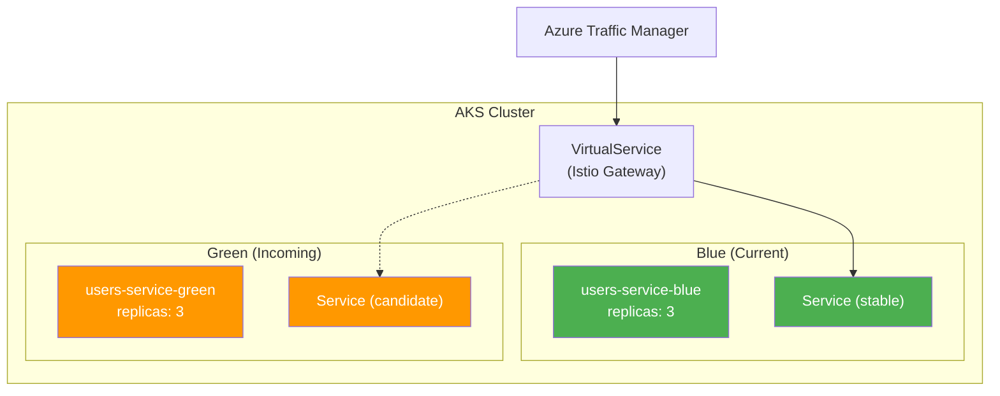

# Deployment Runbook — Users Service

**Document owner:** Platform Engineering Team  
**Service:** `users-service`  
**Last updated:** 2026-07-26  
**Primary contact:** `#platform-eng`  
**Escalation:** `#platform-sre`

---

## Table of Contents

1. [Objective](#1-objective)
2. [CI/CD Pipeline Overview](#2-cicd-pipeline-overview)
3. [Blue/Green Deployment Strategy](#3-bluegreen-deployment-strategy)
4. [Pre-Deployment Checklist](#4-pre-deployment-checklist)
5. [Deployment Steps](#5-deployment-steps)
6. [Smoke Tests](#6-smoke-tests)
7. [Monitoring During Deployment](#7-monitoring-during-deployment)
8. [Rollback Criteria and Procedure](#8-rollback-criteria-and-procedure)
9. [Post-Deployment Validation](#9-post-deployment-validation)
10. [References](#10-references)

---

## 1. Objective

This runbook defines the **repeatable, auditable process** for deploying the Users Service to production. Every deployment follows the same pipeline, gate checks, and rollback criteria. The runbook is the single source of truth for deployment execution; deviations require documented exception and an on-call SRE approval.

**Key principles:**

- **Immutable artifacts** -- Every deployable artifact is built once and promoted through environments without recompilation.
- **Zero-trust delivery** -- Every step is verified: image signature, vulnerability scan, integration tests, and smoke tests.
- **Observability-driven** -- Deployment progress is tracked via dashboards, not guesswork.
- **Automated rollback** -- Rollback must be triggerable within 5 minutes of detecting a bad deployment.

---

## 2. CI/CD Pipeline Overview

The pipeline is orchestrated by **Azure DevOps Pipelines** (definition ID `101`). Source code, pipeline YAML, and Kubernetes manifests live in the same repository at `dev.azure.com/platform/_git/users-service`.

### Pipeline Stages

```mermaid
graph LR
    subgraph "Commit & Build"
        A[Push to main] --> B[Restore + Build]
        B --> C[Unit Tests]
        C --> D[SonarQube Analysis]
        D --> E[Container Build & Sign]
    end

    subgraph "Validation"
        E --> F[Vulnerability Scan]
        F --> G[Integration Tests]
        G --> H[Push to ACR]
    end

    subgraph "Environments"
        H --> I[Deploy dev]
        I --> J[Dev Smoke Tests]
        J --> K[Deploy qa]
        K --> L[QA Smoke Tests]
        L --> M[Deploy staging]
        M --> N[Staging Smoke Tests]
    end

    subgraph "Production Gate"
        N --> O[Get-Approval]
        O --> P[Deploy production<br/>blue-green]
        P --> Q[Production Smoke Tests]
    end
```



### Stage Details

| Stage | Trigger | Approvals | Estimated Duration | Failure Action |
|---|---|---|---|---|
| **Build** | Push to `main`, PR merge | None | 4 min | Fix and recommit |
| **Security Scan** | Build complete | None | 2 min | Block promotion |
| **Integration Tests** | Scan passes | None | 6 min | Block promotion |
| **Deploy: dev** | Tests pass | None | 2 min | Fix and recommit |
| **Deploy: qa** | Dev smoke tests pass | None | 2 min | Fix and recommit |
| **Deploy: staging** | QA smoke tests pass | Env. owner | 3 min | Fix and recommit |
| **Deploy: production** | Staging smoke tests pass | Tech lead + SRE | 5 min | Rollback |
| **Deploy: DR (NE)** | Production smoke tests pass | SRE | 3 min | Rollback DR |

### Build Artifacts

Each successful build produces:

| Artifact | Location | Retention |
|---|---|---|
| Container image | `acrplatform.azurecr.io/users-service:{semver}` | 90 days |
| Signed digest (Cosign) | Same ACR repository | 90 days |
| SBOM (CycloneDX) | ACR + pipeline artifact | 90 days |
| Kubernetes manifests | Pipeline artifact `k8s-manifests` | 90 days |
| OpenAPI spec | Pipeline artifact `openapi-spec` | 90 days |
| Test results | Pipeline artifact `test-results` | 30 days |

**Image naming convention:**

```
acrplatform.azurecr.io/users-service:<major>.<minor>.<patch>[-prerelease]
acrplatform.azurecr.io/users-service:2.1.0
acrplatform.azurecr.io/users-service:2.1.1-rc.1
```

The `latest` tag is never used in production deployments -- every deploy references an immutable semver tag.

### Pipeline YAML (Simplified)

```yaml
# azure-pipelines.yml (conceptual structure)
trigger:
  branches:
    include:
      - main
      - release/*

variables:
  - group: users-service-vars
  - name: dockerRegistry
    value: acrplatform.azurecr.io

stages:
  - stage: Build
    jobs:
      - job: BuildAndTest
        steps:
          - task: DotNetCoreCLI@2
            displayName: Restore
            inputs: { command: restore }
          - task: DotNetCoreCLI@2
            displayName: Build
            inputs: { command: build }
          - task: DotNetCoreCLI@2
            displayName: Unit Tests
            inputs:
              command: test
              arguments: --configuration Release --collect:"Code Coverage"
  - stage: SecurityScan
    dependsOn: Build
    jobs:
      - job: TrivyScan
        steps:
          - task: CmdLine@2
            displayName: Trivy Scan
            inputs:
              script: trivy image --severity CRITICAL,HIGH --exit-code 1 ...
  - stage: BuildImage
    dependsOn: SecurityScan
    jobs:
      - job: DockerBuild
        steps:
          - task: Docker@2
            displayName: Build and Push
            inputs:
              command: buildAndPush
              tags: $(Build.BuildNumber)
          - script: cosign sign ...
  - stage: DeployDev
    dependsOn: BuildImage
    # ...
```

---

## 3. Blue/Green Deployment Strategy

### Rationale

The Users Service runs on **Azure Kubernetes Service (AKS)** with **Istio** service mesh. Blue/green deployment eliminates downtime and provides instant rollback by switching traffic between two identical environments.

### Architecture



### Traffic Switch

| Phase | Blue | Green | Traffic Split |
|---|---|---|---|
| **Steady state** | Serving `v1` (stable) | Idle (previous version) | 100% Blue |
| **Deploy starts** | Serving `v1` (stable) | Deploying `v2` | 100% Blue |
| **Green ready** | Serving `v1` (stable) | Serving `v2` (candidate) | 100% Blue |
| **Smoke tests** | Serving `v1` (stable) | Serving `v2` (candidate) | 100% Blue; smoke tests target Green directly via header |
| **Cutover** | Serving `v1` (stable) | Serving `v2` (stable) | 100% Green |
| **Observation** | Idle (kept for rollback) | Serving `v2` (stable) | 100% Green |
| **Finalize** | Scaled to 0 | Serving `v2` (stable) | 100% Green |

### Istio VirtualService Configuration

```yaml
apiVersion: networking.istio.io/v1beta1
kind: VirtualService
metadata:
  name: users-service-vs
  namespace: platform
spec:
  hosts:
    - users-service
  http:
    - match:
        - headers:
            x-deploy-canary:
              exact: "true"
      route:
        - destination:
            host: users-service-green
            port:
              number: 7201
    - route:
        - destination:
            host: users-service-green   # after cutover: primary becomes green
            weight: 100
          # previous primary (blue) stays available but receives 0 weight
```

### Key Design Decisions

1. **Canary header routing** -- Smoke tests and monitoring probes use `x-deploy-canary: true` to hit the green environment before any production traffic is shifted.
2. **Database compatibility** -- Both blue and green point to the same PostgreSQL primary. Schema migrations must be backward-compatible (see [Pre-Deployment Checklist](#4-pre-deployment-checklist)).
3. **Job-based cleanup** -- After the 30-minute observation window, a Kubernetes `CronJob` or pipeline task scales the blue deployment to 0 replicas via `kubectl scale deployment/users-service-blue --replicas=0`.

---

## 4. Pre-Deployment Checklist

Every item must be verified before the production deployment proceeds. Use this checklist as a manual gate or automate it as a pipeline validation step.

### 4.1 Code and Artifact Readiness

| # | Item | Verification | Owner |
|---|---|---|---|
| 1 | All PRs merged to `main` with required approvals | Pipeline enforces branch policy | Developer |
| 2 | Build pipeline succeeded on the target commit | Pipeline dashboard green | CI/CD |
| 3 | Container image signed with Cosign | `cosign verify acrplatform.azurecr.io/users-service:<version>` | CI/CD |
| 4 | Vulnerability scan passed (no CRITICAL or HIGH unapproved) | Trivy report in pipeline artifacts | Security |
| 5 | SBOM generated and published | CycloneDX artifact present | CI/CD |
| 6 | Integration tests passed on the same image | Test report shows 100% pass | QA |
| 7 | Staging deployment smoke tests passed | Last staging run green | QA |

### 4.2 Schema and Data Readiness

| # | Item | Verification | Owner |
|---|---|---|---|
| 8 | Database migration script reviewed and approved | PR approved by team lead | DBA / Developer |
| 9 | Migration is backward-compatible (no destructive DDL, no NOT NULL on existing columns without default) | Script reviewed | DBA |
| 10 | Rollback migration exists and is tested | `migrations/rollback/` directory | Developer |
| 11 | Migration run in staging and verified | Staging schema matches expected | Developer |
| 12 | Any `EXCLUSIVE`-mode migrations scheduled during maintenance window | See [Maintenance Windows](#appendix-b-maintenance-windows) | SRE |

### 4.3 Infrastructure and Operations Readiness

| # | Item | Verification | Owner |
|---|---|---|---|
| 13 | Production AKS cluster healthy (all nodes Ready) | `kubectl get nodes` | SRE |
| 14 | PostgreSQL primary and standby in sync | Replication lag < 1 second | SRE |
| 15 | Auth Service healthy and reachable | gRPC health check passes | SRE |
| 16 | Azure Service Bus queue depth normal (no backlog > 1000) | Azure Monitor | SRE |
| 17 | Grafana dashboard visible and alerting configured | Dashboard loads | SRE |
| 18 | PagerDuty on-call schedule confirmed | At least one responder per region | SRE |
| 19 | Release notes drafted and approved | `docs/releases/<version>.md` | Developer |
| 20 | Backstage catalog-info.yaml updated (version, links) | PR merged | Developer |

### 4.4 Environment-Specific Configuration Validation

```bash
# Pre-deployment verification script (run from pipeline or manually)
#!/usr/bin/env bash
set -euo pipefail

IMAGE_TAG="${1:?Usage: $0 <image-tag>}"

echo "=== Pre-Deployment Validation ==="

# 1. Image exists in ACR
echo "[1/5] Checking image in ACR..."
az acr repository show-tags \
  --name acrplatform \
  --repository users-service \
  --query "contains(@, '$IMAGE_TAG')" \
  --output tsv | grep -q true || { echo "FAIL: Image not found"; exit 1; }

# 2. Image signed
echo "[2/5] Verifying Cosign signature..."
cosign verify \
  --key k8s://platform/cosign-public-key \
  "acrplatform.azurecr.io/users-service:${IMAGE_TAG}" > /dev/null 2>&1 \
  || { echo "FAIL: Signature verification failed"; exit 1; }

# 3. AKS cluster reachable
echo "[3/5] Checking AKS connectivity..."
kubectl cluster-info > /dev/null 2>&1 \
  || { echo "FAIL: Cannot connect to AKS"; exit 1; }

# 4. PostgreSQL reachable
echo "[4/5] Checking PostgreSQL..."
kubectl run db-check --rm -it --restart=Never \
  --image postgres:16 \
  -- psql "$(kubectl get secret users-db-connection -o jsonpath='{.data.value}' | base64 -d)" \
  -c "SELECT 1" > /dev/null 2>&1 \
  || { echo "FAIL: Database unreachable"; exit 1; }

# 5. Auth Service reachable from the cluster
echo "[5/5] Checking Auth Service..."
kubectl run auth-check --rm -it --restart=Never \
  --image curlimages/curl:latest \
  -- curl -sf --connect-timeout 5 \
  https://auth-service.platform.svc.cluster.local:5103/api/health/live \
  > /dev/null 2>&1 \
  || { echo "WARN: Auth Service health check failed (JWKS cache will be used)"; }

echo "=== Pre-Deployment Validation Complete ==="
```

### 4.5 Approval Gates

| Environment | Approver(s) | Method | SLA |
|---|---|---|---|
| Dev | (Auto) | Pipeline | -- |
| QA | (Auto) | Pipeline | -- |
| Staging | Environment owner (Platform Eng) | Azure DevOps approval | < 1 hour |
| Production | Tech lead + SRE on-call | Azure DevOps approval + Slack confirmation | < 2 hours |
| DR region | SRE on-call | Auto after production smoke tests pass | -- |

---

## 5. Deployment Steps

### 5.1 Step 1: Schema Migration

Database migrations are run **before** the green deployment is created. This ensures both blue and green are compatible with the same schema.

```bash
# Run via Kubernetes Job (idempotent, can be re-run safely)
kubectl apply -f k8s/manifests/jobs/db-migrate.yaml

# Monitor migration
kubectl logs -l job-name=users-db-migrate -n platform --tail=50 -f

# Expected output:
# [INFO] Applying migration V2_1_1__add_department_index.sql
# [INFO] Migration successful: V2_1_1
# [INFO] Current schema version: 2.1.1
```

**If migration fails:**

1. Check logs for the specific SQL error.
2. If the error is transient (connection timeout), retry the job: `kubectl delete job users-db-migrate -n platform && kubectl apply -f k8s/manifests/jobs/db-migrate.yaml`.
3. If the error is a logic error (constraint violation, syntax), abort the deployment and roll back the migration immediately using the rollback migration script.

**Migration must be backward-compatible.** The blue deployment continues serving the old version throughout the migration.

### 5.2 Step 2: Deploy Green Environment

```bash
# Apply the green deployment manifest
kubectl apply -f k8s/manifests/deployments/green.yaml

# Verify pods start
kubectl rollout status deployment/users-service-green -n platform --timeout=180s

# Expected output:
# deployment "users-service-green" successfully rolled out
```

The green deployment manifest references the new image tag (`2.1.1`) and uses identical resource requests, probes, and environment configuration as the current blue deployment, except for the image version.

**Probe expectations:**

- **Readiness probe** (`/api/health/ready`): Must return 200 within 15 seconds of pod start.
- **Liveness probe** (`/api/health/live`): Must return 200 within 30 seconds.

```yaml
# k8s/manifests/deployments/green.yaml (relevant excerpt)
apiVersion: apps/v1
kind: Deployment
metadata:
  name: users-service-green
  namespace: platform
spec:
  replicas: 3
  selector:
    matchLabels:
      app: users-service
      release: green
  template:
    metadata:
      labels:
        app: users-service
        release: green
    spec:
      containers:
        - name: users-api
          image: acrplatform.azurecr.io/users-service:2.1.1
          ports:
            - containerPort: 7201
          env:
            - name: ImageTag
              value: "2.1.1"
          # ... probes and resources match blue exactly
```

### 5.3 Step 3: Smoke Tests Against Green

With the green pods running and passing their readiness probes, direct smoke tests against the green service using the canary header. No production traffic is affected yet.

```bash
# Smoke test via Istio canary header (hits green only)
curl -s -H "x-deploy-canary: true" \
  https://users.internal.platform/api/health/ready | jq .
```

See [Section 6 -- Smoke Tests](#6-smoke-tests) for the full smoke test suite.

### 5.4 Step 4: Database Migration Verification

```bash
# Verify the new schema is applied correctly
kubectl run schema-check --rm -it --restart=Never \
  --image postgres:16 -- psql "$(kubectl get secret users-db-connection -o jsonpath='{.data.value}' | base64 -d)" \
  -c "
    SELECT version, applied_at
    FROM schema_migrations
    ORDER BY applied_at DESC
    LIMIT 5;
  "
```

Expected: The latest migration (corresponding to the deployed version) appears at the top with a recent `applied_at` timestamp.

### 5.5 Step 5: Cut Traffic to Green

Update the Istio VirtualService to route 100% of production traffic to the green deployment.

```bash
# Apply the cutover VirtualService
kubectl apply -f k8s/manifests/istio/virtualservice-green.yaml

# Monitor traffic shift (watch Grafana dashboard)
# Expected: Error rate stable, p99 latency within baseline
```

The cutover is **instant** -- Istio updates its routing rules within seconds.

### 5.6 Step 6: Observation Window (30 Minutes)

During this period:

- **Both blue and green deployments remain running** at full replica count.
- **100% of traffic goes to green** (the new version).
- **Metrics are continuously monitored** (see [Section 7](#7-monitoring-during-deployment)).
- **No new deployments** are initiated during this window.
- **The SRE on-call** acknowledges the deployment in `#platform-eng`.

If any [rollback criteria](#8-rollback-criteria-and-procedure) are triggered during this window, execute [Rollback Procedure](#82-rollback-procedure).

### 5.7 Step 7: Finalize

If the observation window passes without incident:

```bash
# 1. Scale down blue deployment to 0
kubectl scale deployment/users-service-blue -n platform --replicas=0

# 2. Tag the release in git
git tag -a "v2.1.1" -m "Release v2.1.1"
git push origin v2.1.1

# 3. Update Backstage catalog
# (catalog-info.yaml already updated in PR; verify sync)

# 4. Post release notes to #platform-eng
echo "Deployment v2.1.1 complete. Blue scaled to 0. Observation window passed."
```

---

## 6. Smoke Tests

Smoke tests execute against the **green** deployment (via `x-deploy-canary: true`) before any production traffic is shifted. They validate that the new version is functional, secure, and integrated.

### 6.1 Health and Liveness Tests

```bash
#!/usr/bin/env bash
# smoke-tests.sh — return non-zero on any failure
set -euo pipefail

BASE_URL="${1:?Usage: $0 <base-url>}"
CANARY_HEADER="-H x-deploy-canary: true"

echo "=== Smoke Tests for users-service ==="

# Test 1: Liveness probe
echo "[1/9] Liveness probe..."
curl -sf ${CANARY_HEADER} "${BASE_URL}/api/health/live" | jq -e '.status == "alive"' > /dev/null
echo "  PASS"

# Test 2: Readiness probe
echo "[2/9] Readiness probe..."
curl -sf ${CANARY_HEADER} "${BASE_URL}/api/health/ready" | jq -e '.status == "ready"' > /dev/null
echo "  PASS"

# Test 3: Unauthenticated access returns 401
echo "[3/9] Unauthenticated request returns 401..."
response_code=$(curl -s -o /dev/null -w "%{http_code}" "${BASE_URL}/api/users")
[ "$response_code" = "401" ]
echo "  PASS (got 401)"

# Test 4: Authenticated request succeeds with valid JWT
echo "[4/9] Authenticated request (admin token)..."
curl -sf ${CANARY_HEADER} \
  -H "Authorization: Bearer ${ADMIN_JWT}" \
  "${BASE_URL}/api/users?pageSize=1" | jq -e '.data != null' > /dev/null
echo "  PASS"

# Test 5: Non-admin user cannot list all users
echo "[5/9] RBAC: user role cannot list all users..."
response_code=$(curl -s -o /dev/null -w "%{http_code}" ${CANARY_HEADER} \
  -H "Authorization: Bearer ${USER_JWT}" \
  "${BASE_URL}/api/users")
[ "$response_code" = "403" ]
echo "  PASS (got 403)"
```

### 6.2 JWT Validation Verification

This is the **critical security smoke test**. It verifies that the deployment correctly validates JWTs at the service level (the zero-trust layer).

```bash
# Test 6: Expired JWT is rejected
echo "[6/9] Expired JWT..."
curl -sf -o /dev/null -w "%{http_code}" ${CANARY_HEADER} \
  -H "Authorization: Bearer ${EXPIRED_JWT}" \
  "${BASE_URL}/api/users"
# Expected: 401

# Test 7: JWT with invalid signature is rejected
echo "[7/9] Invalid signature JWT..."
curl -sf -o /dev/null -w "%{http_code}" ${CANARY_HEADER} \
  -H "Authorization: Bearer ${INVALID_SIG_JWT}" \
  "${BASE_URL}/api/users"
# Expected: 401

# Test 8: JWT with missing tid claim is rejected
echo "[8/9] JWT missing tenant ID..."
curl -sf -o /dev/null -w "%{http_code}" ${CANARY_HEADER} \
  -H "Authorization: Bearer ${NO_TENANT_JWT}" \
  "${BASE_URL}/api/users"
# Expected: 401

# Test 9: JWT tampered payload is rejected
echo "[9/9] Tampered JWT payload..."
JWT_TAMPERED=$(echo "${ADMIN_JWT}" | awk -F. '{print $1"."$2".invalidsignature"}')
curl -sf -o /dev/null -w "%{http_code}" ${CANARY_HEADER} \
  -H "Authorization: Bearer ${JWT_TAMPERED}" \
  "${BASE_URL}/api/users"
# Expected: 401
```

**JWT test token generation** (for reference):

```bash
# These tokens are pre-generated by the pipeline and stored as pipeline secrets.
# They are rotated every 30 days.
#
# ADMIN_JWT:    A valid JWT with roles=["admin"] and a valid tid
# USER_JWT:     A valid JWT with roles=["user"] and a valid tid
# EXPIRED_JWT:  A JWT signed by the Auth Service with exp set to 1 hour ago
# INVALID_SIG_JWT: A JWT with a random RSA signature (not from Auth Service)
# NO_TENANT_JWT:    A valid JWT missing the "tid" claim
```

### 6.3 Event Consumer Validation

```bash
# Test 10: Verify event consumer is processing messages
echo "[10/10] Event consumer backlog..."
# Query the green deployment's metrics endpoint
curl -sf ${CANARY_HEADER} \
  "${BASE_URL}/metrics" | grep 'users_events_processed_total' | head -3
echo "  PASS (events being consumed)"
```

### 6.4 All Tests Pass Condition

The deployment pipeline **must not proceed** to the traffic cutover step if any smoke test fails. Additionally, the JWT validation tests (6.2) must pass at `AKS` level (not just the API Gateway), confirming the zero-trust security model is functioning.

### 6.5 Smoke Test Automation in Pipeline

```yaml
# Pipeline snippet
- stage: SmokeTests
  displayName: Smoke Tests (Green)
  jobs:
    - job: RunSmokeTests
      steps:
        - script: |
            chmod +x scripts/smoke-tests.sh
            ./scripts/smoke-tests.sh "https://users.internal.platform"
          displayName: Execute Smoke Test Suite
          env:
            ADMIN_JWT: $(AdminJwt)
            USER_JWT: $(UserJwt)
            EXPIRED_JWT: $(ExpiredJwt)
            INVALID_SIG_JWT: $(InvalidSigJwt)
            NO_TENANT_JWT: $(NoTenantJwt)
        - task: PublishTestResults@2
          displayName: Publish Smoke Test Results
          condition: succeededOrFailed()
```

---

## 7. Monitoring During Deployment

### 7.1 Grafana Dashboard

Open the [Users Service Dashboard](https://grafana.internal/d/users/users-service) before starting the deployment. The dashboard is organized into four rows:

| Row | Panels | Watch For |
|---|---|---|
| **Deployment Health** | Pod count (blue/green), rollout progress, restart count | Green pods reach 3/3 Ready within 3 minutes |
| **Request Rate & Errors** | RPS, HTTP 4xx/5xx rate, p50/p95/p99 latency | Error rate spike above 0.5%, p99 latency above 500ms |
| **Auth Validation** | Auth Service gRPC duration, JWKS cache hit rate, cache staleness | gRPC failures > 5%; cache hit rate below 90% in steady state |
| **Database** | Connection pool usage, query duration, replication lag | Connection count approaching pool max (200); replication lag above 2s |
| **Events** | Consumer lag, processed event rate, dead-letter count | Dead-letter count increasing; lag above 60 seconds |

### 7.2 Key Metrics to Observe

```promql
# Request error rate (should stay below 0.5%)
sum(rate(users_requests_total{status_code=~"5.."}[5m]))
  / sum(rate(users_requests_total[5m]))
  * 100

# p99 latency (baseline ~50ms; alert at 500ms)
histogram_quantile(
  0.99,
  sum(rate(users_operation_duration_seconds_bucket[5m])) by (le)
)

# Auth validation duration (baseline ~10ms gRPC, ~1ms cache)
histogram_quantile(
  0.99,
  rate(users_auth_validation_duration_seconds_bucket[5m])
)

# Pod restarts (alert if > 0 after initial startup)
sum(kube_pod_container_status_restarts_total{namespace="platform", pod=~"users-service-green-.*"})

# JWKS cache TTL remaining (should always be > 0 when Auth Service is healthy)
users_jwks_cache_ttl_seconds
```

### 7.3 Alerts Automatically Silenced During Deployment

The following alerts are automatically muted during the observation window (via Azure DevOps + Azure Monitor webhook integration) to prevent noise from transient deployment artifacts:

| Alert | Silence Duration | Rationale |
|---|---|---|
| `UsersService-HighErrorRate` | 30 min | Brief spike possible during probe warming |
| `UsersService-HighLatency` | 30 min | JIT compilation in new pods may briefly increase latency |
| `UsersService-ReplicaMismatch` | 30 min | Blue/green coexistence creates intentional replica count shift |
| `UsersService-AuthGrcpFailures` | 15 min | JWKS cache warming may cause brief gRPC failures on first requests |

All other alerts (DB connection pool, Service Bus dead letter, certificate expiry) **remain active**.

### 7.4 Key Commands for Ad-Hoc Monitoring

```bash
# Watch pod startup
kubectl get pods -n platform -l app=users-service -w

# Check green deployment rollout status
kubectl rollout status deployment/users-service-green -n platform

# Stream green deployment logs
kubectl logs -n platform -l app=users-service,release=green --tail=20 -f

# Check database connection pool on green pods
kubectl exec -n platform deployment/users-service-green -- \
  curl -sf localhost:7201/metrics | grep 'npgsql_connection_pool'

# Verify Istio routing
kubectl get virtualservice users-service-vs -n platform -o yaml

# Check mTLS status
istioctl authz check deployment/users-service-green -n platform
```

---

## 8. Rollback Criteria and Procedure

### 8.1 Rollback Triggers

The deployment **must be rolled back immediately** if any of the following conditions are met during the observation window:

| # | Condition | Threshold | Severity | Detection Method |
|---|---|---|---|---|
| R1 | HTTP 5xx error rate | > 1% of requests over 2-minute window | **Critical** | Grafana alert / `users_requests_total` |
| R2 | p99 latency | > 500ms over 5-minute window | **High** | Grafana alert / `users_operation_duration_seconds` |
| R3 | Pod crash loop | > 2 restarts in 3 minutes for any pod | **Critical** | `kubectl get pods -w` |
| R4 | Database connection pool exhaustion | Pool usage > 90% for 1 minute | **Critical** | `users_db_connection_pool_usage` metric |
| R5 | Auth Service validation failures | > 10% of requests fail gRPC validation (cache also failing) | **Critical** | `users_auth_validation_duration_seconds` / Grafana |
| R6 | Database replication lag | > 5 seconds sustained | **High** | `postgres_replication_lag` |
| R7 | Any smoke test failure on re-run | Full suite re-run on green after cutover fails | **Critical** | Manual trigger |
| R8 | Service Bus dead-letter count increasing | > 10 events dead-lettered in 5 minutes for green | **High** | Azure Monitor / `users_events_deadletter_total` |
| R9 | Security incident reported | Any confirmed vulnerability in the deployed version | **Critical** | Security team notification |

### 8.2 Rollback Procedure

**Automated rollback** (preferred) -- execute via the Azure DevOps "Rollback" pipeline button:

```bash
# The rollback pipeline:
# 1. Reverts the Istio VirtualService to route 100% traffic to blue
# 2. Verifies blue pods are healthy and serving traffic
# 3. Scales green to 0
```

**Manual rollback** (if pipeline is unavailable):

```bash
# Step 1: Switch traffic back to blue
kubectl apply -f k8s/manifests/istio/virtualservice-blue.yaml

# Step 2: Verify blue is serving
curl -sf https://users.internal.platform/api/health/ready | jq .status
# Expected: "ready"

# Step 3: Scale down green
kubectl scale deployment/users-service-green -n platform --replicas=0

# Step 4: Notify the team
# Slack: #platform-eng
# Subject: "[ROLLBACK] users-service v2.1.1 rolled back to v2.1.0"
```

### 8.3 Database Rollback

If the deployment included a schema migration, the database must also be rolled back:

```bash
# Run the rollback migration
kubectl apply -f k8s/manifests/jobs/db-migrate-rollback.yaml

# Verify rollback
kubectl logs -l job-name=users-db-rollback -n platform --tail=20
```

**Important:** Database rollback is only possible if:

- A forward-only migration has a corresponding rollback migration script.
- No irreversible data changes occurred (e.g., column drops, data type changes).
- The rollback migration was tested in staging before the deployment.

If the migration is irreversible, the rollback strategy shifts to **point-in-time recovery (PITR)** of the PostgreSQL database:

```bash
# PITR rollback (last resort, coordinated with DBA)
az postgres flexible-server restore \
  --restore-time "2026-07-26T14:30:00Z" \
  --source-server users-db-primary \
  --name users-db-pitr-restore
```

### 8.4 Post-Rollback Actions

| Action | Owner | Timeline |
|---|---|---|
| Document root cause in incident report | On-call engineer | 1 hour post-rollback |
| Revert the git commit(s) that introduced the defect | Developer | 2 hours |
| Add regression test to smoke test suite | Developer | 1 business day |
| Create follow-up ADR if rollback was due to architectural issue | Tech lead | 1 week |
| Restore blue deployment to full replica count | SRE | Immediate |
| Re-silence alerts | SRE | Immediate |

### 8.5 Rollback RACI Matrix

| Activity | Developer | Tech Lead | SRE | Product Owner |
|---|---|---|---|---|
| Detect rollback trigger | R | R | A | I |
| Decide to roll back | C | A | R | I |
| Execute rollback (automated) | I | I | R | I |
| Execute rollback (manual) | I | C | R | I |
| Roll back database | C | C | R | I |
| Communicate rollback | I | R | A | I |
| Investigate root cause | R | A | C | I |
| Fix and redeploy | R | A | I | C |
| Confirm fix | R | A | R | I |

*(R = Responsible, A = Accountable, C = Consulted, I = Informed)*

---

## 9. Post-Deployment Validation

After the observation window closes and blue is scaled to zero, perform a final validation pass:

### 9.1 24-Hour Post-Deployment Checks

| Check | Method | Expected |
|---|---|---|
| Error rate steady | Grafana dashboard | < 0.5% 5xx |
| Latency stable | Grafana dashboard | p99 < 100ms |
| Pods stable, no restarts | `kubectl get pods` | 0 restarts since deployment |
| Database connection pool | Grafana dashboard | Pool usage < 50% |
| Auth Service validation | Grafana dashboard | gRDP p99 < 15ms |
| Event consumer processing | Grafana dashboard | Lag < 10 seconds |
| Backup completed successfully | Azure Backup report | Last backup: < 24 hours ago |

### 9.2 Release Artifacts Archive

- [Release Notes](../releases/2.1.1.md)
- [Pipeline Run](https://dev.azure.com/platform/_build/results?buildId=...) -- available in Azure DevOps
- Container Image: `acrplatform.azurecr.io/users-service:2.1.1`
- SBOM: Attached to pipeline artifacts

---

## 10. References

### Internal Documentation

| Document | Location |
|---|---|
| Architecture Overview | `docs/architecture/overview.md` |
| Deployment View | `docs/architecture/deployment-view.md` |
| Security Architecture | `docs/architecture/security.md` |
| Container View | `docs/architecture/containers.md` |
| Rollback Runbook | `docs/runbooks/rollback.md` |
| Incident Response Runbook | `docs/runbooks/incident-response.md` |
| Operations Runbook | `docs/runbooks/operations.md` |
| Operations Manual | `docs/decisions/operations.md` |
| Monitoring & Alerting | `docs/decisions/monitoring.md` |

### Pipeline & Infrastructure

| Resource | Location |
|---|---|
| Azure Pipeline Definition ID 101 | `https://dev.azure.com/platform/_build?definitionId=101` |
| AKS Cluster (WE) | `platform-aks-we` resource group |
| AKS Cluster (NE) | `platform-aks-ne` resource group |
| Container Registry | `acrplatform.azurecr.io` |
| Grafana Dashboard | `https://grafana.internal/d/users/users-service` |
| PagerDuty | `https://pagerduty.internal/services/users-service` |

### External References

- [Istio Virtual Service](https://istio.io/latest/docs/reference/config/networking/virtual-service/)
- [Cosign Signing](https://docs.sigstore.dev/cosign/overview/)
- [Azure DevOps Pipelines](https://learn.microsoft.com/en-us/azure/devops/pipelines/)
- [Azure Database for PostgreSQL -- PITR](https://learn.microsoft.com/en-us/azure/postgresql/flexible-server/concepts-backup-restore)

---

## Appendix A: Pipeline Variables

| Variable Name | Source | Sensitivity | Used In |
|---|---|---|---|
| `AdminJwt` | Azure DevOps Library | Secret | Smoke tests |
| `UserJwt` | Azure DevOps Library | Secret | Smoke tests |
| `ExpiredJwt` | Azure DevOps Library | Secret | Smoke tests |
| `InvalidSigJwt` | Azure DevOps Library | Secret | Smoke tests |
| `NoTenantJwt` | Azure DevOps Library | Secret | Smoke tests |
| `CosignPrivateKey` | Azure Key Vault | Secret | Image signing |
| `DockerRegistryServiceConnection` | Azure DevOps | Service connection | ACR push |

## Appendix B: Maintenance Windows

| Migration Type | Window | Duration | Communication |
|---|---|---|---|
| **NON-BREAKING** (add column, add index, add table) | Any time | No downtime | Pipeline comment only |
| **BREAKING** (rename column, add NOT NULL, table split) | Wednesday 02:00-04:00 UTC | < 15 min | 48-hour advance notice in `#platform-eng` |
| **EXCLUSIVE** (table rebuild, data migration, backfill) | Saturday 04:00-06:00 UTC | < 60 min | 1-week advance notice; read-only maintenance mode |

---

## Document Change Log

| Date | Version | Author | Change |
|---|---|---|---|
| 2026-07-26 | 1.0 | Platform Engineering | Initial deployment runbook |
