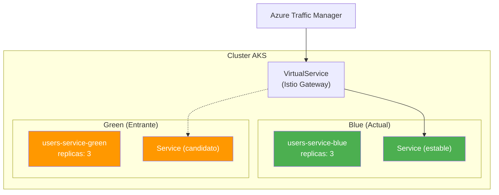

# Runbook de despliegue -- Users Service

**Propietario del documento:** Equipo de Ingenieria de Plataforma  
**Servicio:** `users-service`  
**Ultima actualizacion:** 2026-07-26  
**Contacto principal:** `#platform-eng`  
**Escalamiento:** `#platform-sre`

---

## Tabla de Contenidos

1. [Objetivo](#1-objetivo)
2. [Descripcion general del pipeline CI/CD](#2-descripcion-general-del-pipeline-cicd)
3. [Estrategia de despliegue Blue/Green](#3-estrategia-de-despliegue-bluegreen)
4. [Lista de verificacion previa al despliegue](#4-lista-de-verificacion-previa-al-despliegue)
5. [Pasos del despliegue](#5-pasos-del-despliegue)
6. [Pruebas de humo](#6-pruebas-de-humo)
7. [Monitoreo durante el despliegue](#7-monitoreo-durante-el-despliegue)
8. [Criterios y procedimiento de revertir](#8-criterios-y-procedimiento-de-revertir)
9. [Validacion posterior al despliegue](#9-validacion-posterior-al-despliegue)
10. [Referencias](#10-referencias)

---

## 1. Objetivo

Este runbook define el **proceso repetible y auditable** para desplegar el Users Service en produccion. Cada despliegue sigue el mismo pipeline, las mismas compuertas de verificacion y los mismos criterios de revertir. El runbook es la unica fuente de verdad para la ejecucion del despliegue; las desviaciones requieren una excepcion documentada y la aprobacion de un SRE de guardia.

**Principios clave:**

- **Artefactos inmutables** -- Cada artefacto desplegable se construye una vez y se promociona a traves de los entornos sin recompilacion.
- **Entrega de confianza cero** -- Cada paso se verifica: firma de imagen, escaneo de vulnerabilidades, pruebas de integracion y pruebas de humo.
- **Impulsado por observabilidad** -- El progreso del despliegue se rastrea mediante dashboards, no con suposiciones.
- **Revertir automatizado** -- La revertir debe poder activarse dentro de los 5 minutos posteriores a la deteccion de un despliegue defectuoso.

---

## 2. Descripcion general del pipeline CI/CD

El pipeline es orquestado por **Azure DevOps Pipelines** (ID de definicion `101`). El codigo fuente, el YAML del pipeline y los manifiestos de Kubernetes residen en el mismo repositorio en `dev.azure.com/platform/_git/users-service`.

### Etapas del pipeline

```mermaid
graph LR
    subgraph "Commit y compilacion"
        A[Push a main] --> B[Restaurar + Compilar]
        B --> C[Pruebas unitarias]
        C --> D[Analisis SonarQube]
        D --> E[Compilacion y firma de contenedor]
    end

    subgraph "Validacion"
        E --> F[Escaneo de vulnerabilidades]
        F --> G[Pruebas de integracion]
        G --> H[Push a ACR]
    end

    subgraph "Entornos"
        H --> I[Desplegar dev]
        I --> J[Pruebas de humo dev]
        J --> K[Desplegar qa]
        K --> L[Pruebas de humo qa]
        L --> M[Desplegar staging]
        M --> N[Pruebas de humo staging]
    end

    subgraph "Compuerta de produccion"
        N --> O[Obtener aprobacion]
        O --> P[Desplegar produccion<br/>blue-green]
        P --> Q[Pruebas de humo produccion]
    end
```



### Detalles de las etapas

| Etapa | Disparador | Aprobaciones | Duracion estimada | Accion ante fallo |
|---|---|---|---|---|
| **Compilacion** | Push a `main`, fusion de PR | Ninguna | 4 min | Corregir y reenviar commit |
| **Escaneo de seguridad** | Compilacion completa | Ninguna | 2 min | Bloquear promocion |
| **Pruebas de integracion** | Escaneo aprobado | Ninguna | 6 min | Bloquear promocion |
| **Desplegar: dev** | Pruebas aprobadas | Ninguna | 2 min | Corregir y reenviar commit |
| **Desplegar: qa** | Pruebas de humo dev aprobadas | Ninguna | 2 min | Corregir y reenviar commit |
| **Desplegar: staging** | Pruebas de humo qa aprobadas | Propietario del entorno | 3 min | Corregir y reenviar commit |
| **Desplegar: produccion** | Pruebas de humo staging aprobadas | Lider tecnico + SRE | 5 min | Revertir |
| **Desplegar: DR (NE)** | Pruebas de humo produccion aprobadas | SRE | 3 min | Revertir DR |

### Artefactos de compilacion

Cada compilacion exitosa produce:

| Artefacto | Ubicacion | Retencion |
|---|---|---|
| Imagen de contenedor | `acrplatform.azurecr.io/users-service:{semver}` | 90 dias |
| Digest firmado (Cosign) | Mismo repositorio ACR | 90 dias |
| SBOM (CycloneDX) | ACR + artefacto del pipeline | 90 dias |
| Manifiestos de Kubernetes | Artefacto del pipeline `k8s-manifests` | 90 dias |
| Especificacion OpenAPI | Artefacto del pipeline `openapi-spec` | 90 dias |
| Resultados de pruebas | Artefacto del pipeline `test-results` | 30 dias |

**Convencion de nomenclatura de imagenes:**

```
acrplatform.azurecr.io/users-service:<major>.<minor>.<patch>[-prerelease]
acrplatform.azurecr.io/users-service:2.1.0
acrplatform.azurecr.io/users-service:2.1.1-rc.1
```

La etiqueta `latest` nunca se usa en despliegues de produccion -- cada despliegue referencia una etiqueta semver inmutable.

### YAML del pipeline (simplificado)

```yaml
# azure-pipelines.yml (estructura conceptual)
trigger:
  branches:
    include:
      - main
      - release/*

variables:
  - group: users-service-vars
  - name: dockerRegistry
    value: acrplatform.azurecr.io

stages:
  - stage: Build
    jobs:
      - job: BuildAndTest
        steps:
          - task: DotNetCoreCLI@2
            displayName: Restaurar
            inputs: { command: restore }
          - task: DotNetCoreCLI@2
            displayName: Compilar
            inputs: { command: build }
          - task: DotNetCoreCLI@2
            displayName: Pruebas unitarias
            inputs:
              command: test
              arguments: --configuration Release --collect:"Code Coverage"
  - stage: SecurityScan
    dependsOn: Build
    jobs:
      - job: TrivyScan
        steps:
          - task: CmdLine@2
            displayName: Escaneo Trivy
            inputs:
              script: trivy image --severity CRITICAL,HIGH --exit-code 1 ...
  - stage: BuildImage
    dependsOn: SecurityScan
    jobs:
      - job: DockerBuild
        steps:
          - task: Docker@2
            displayName: Compilar y subir
            inputs:
              command: buildAndPush
              tags: $(Build.BuildNumber)
          - script: cosign sign ...
  - stage: DeployDev
    dependsOn: BuildImage
    # ...
```

---

## 3. Estrategia de despliegue Blue/Green

### Justificacion

El Users Service se ejecuta en **Azure Kubernetes Service (AKS)** con la malla de servicios **Istio**. El despliegue blue/green elimina el tiempo de inactividad y proporciona revertir instantanea al cambiar el trafico entre dos entornos identicos.

### Arquitectura



### Cambio de trafico

| Fase | Blue | Green | Division de trafico |
|---|---|---|---|
| **Estado estable** | Sirviendo `v1` (estable) | Inactivo (version anterior) | 100% Blue |
| **Despliegue inicia** | Sirviendo `v1` (estable) | Desplegando `v2` | 100% Blue |
| **Green listo** | Sirviendo `v1` (estable) | Sirviendo `v2` (candidato) | 100% Blue |
| **Pruebas de humo** | Sirviendo `v1` (estable) | Sirviendo `v2` (candidato) | 100% Blue; pruebas de humo apuntan a Green directamente mediante cabecera |
| **Conmutacion** | Sirviendo `v1` (estable) | Sirviendo `v2` (estable) | 100% Green |
| **Observacion** | Inactivo (conservado para revertir) | Sirviendo `v2` (estable) | 100% Green |
| **Finalizar** | Escalado a 0 | Sirviendo `v2` (estable) | 100% Green |

### Configuracion de Istio VirtualService

```yaml
apiVersion: networking.istio.io/v1beta1
kind: VirtualService
metadata:
  name: users-service-vs
  namespace: platform
spec:
  hosts:
    - users-service
  http:
    - match:
        - headers:
            x-deploy-canary:
              exact: "true"
      route:
        - destination:
            host: users-service-green
            port:
              number: 7201
    - route:
        - destination:
            host: users-service-green   # despues de la conmutacion: primario se convierte en green
            weight: 100
          # el primario anterior (blue) permanece disponible pero recibe peso 0
```

### Decisiones de diseno clave

1. **Enrutamiento por cabecera canary** -- Las pruebas de humo y las sondas de monitoreo usan `x-deploy-canary: true` para alcanzar el entorno green antes de que se desvie cualquier trafico de produccion.
2. **Compatibilidad de base de datos** -- Tanto blue como green apuntan al mismo PostgreSQL primario. Las migraciones de esquema deben ser compatibles hacia atras (ver [Lista de verificacion previa al despliegue](#4-lista-de-verificacion-previa-al-despliegue)).
3. **Limpieza basada en trabajos** -- Despues de la ventana de observacion de 30 minutos, un `CronJob` de Kubernetes o tarea del pipeline escala el despliegue blue a 0 replicas mediante `kubectl scale deployment/users-service-blue --replicas=0`.

---

## 4. Lista de verificacion previa al despliegue

Cada elemento debe verificarse antes de que el despliegue de produccion proceda. Use esta lista como compuerta manual o automatice como paso de validacion del pipeline.

### 4.1 Preparacion del codigo y artefactos

| # | Elemento | Verificacion | Propietario |
|---|---|---|---|
| 1 | Todos los PR fusionados a `main` con las aprobaciones requeridas | El pipeline aplica la politica de rama | Desarrollador |
| 2 | Pipeline de compilacion exitoso en el commit objetivo | Dashboard del pipeline en verde | CI/CD |
| 3 | Imagen de contenedor firmada con Cosign | `cosign verify acrplatform.azurecr.io/users-service:<version>` | CI/CD |
| 4 | Escaneo de vulnerabilidades aprobado (sin CRITICAL o HIGH no aprobados) | Informe Trivy en artefactos del pipeline | Seguridad |
| 5 | SBOM generado y publicado | Artefacto CycloneDX presente | CI/CD |
| 6 | Pruebas de integracion aprobadas en la misma imagen | Informe de pruebas muestra 100% de aprobacion | QA |
| 7 | Pruebas de humo del despliegue en staging aprobadas | Ultima ejecucion de staging en verde | QA |

### 4.2 Preparacion del esquema y datos

| # | Elemento | Verificacion | Propietario |
|---|---|---|---|
| 8 | Script de migracion de base de datos revisado y aprobado | PR aprobado por el lider del equipo | DBA / Desarrollador |
| 9 | Migracion compatible hacia atras (sin DDL destructivo, sin NOT NULL en columnas existentes sin valor predeterminado) | Script revisado | DBA |
| 10 | Migracion de revertir existe y esta probada | Directorio `migrations/rollback/` | Desarrollador |
| 11 | Migracion ejecutada en staging y verificada | Esquema de staging coincide con lo esperado | Desarrollador |
| 12 | Cualquier migracion en modo `EXCLUSIVE` programada durante ventana de mantenimiento | Ver [Ventanas de mantenimiento](#apendice-b-ventanas-de-mantenimiento) | SRE |

### 4.3 Preparacion de infraestructura y operaciones

| # | Elemento | Verificacion | Propietario |
|---|---|---|---|
| 13 | Cluster AKS de produccion saludable (todos los nodos Ready) | `kubectl get nodes` | SRE |
| 14 | PostgreSQL primario y standby sincronizados | Retraso de replicacion < 1 segundo | SRE |
| 15 | Auth Service saludable y accesible | Verificacion de salud gRPC exitosa | SRE |
| 16 | Profundidad de cola de Azure Service Bus normal (sin backlog > 1000) | Azure Monitor | SRE |
| 17 | Dashboard de Grafana visible y alertas configuradas | Dashboard carga correctamente | SRE |
| 18 | Horario de guardia de PagerDuty confirmado | Al menos un respondedor por region | SRE |
| 19 | Notas de version redactadas y aprobadas | `docs/releases/<version>.md` | Desarrollador |
| 20 | catalog-info.yaml de Backstage actualizado (version, enlaces) | PR fusionado | Desarrollador |

### 4.4 Validacion de configuracion especifica del entorno

```bash
# Script de verificacion previa al despliegue (ejecutar desde el pipeline o manualmente)
#!/usr/bin/env bash
set -euo pipefail

IMAGE_TAG="${1:?Usage: $0 <image-tag>}"

echo "=== Validacion previa al despliegue ==="

# 1. Imagen existe en ACR
echo "[1/5] Verificando imagen en ACR..."
az acr repository show-tags \
  --name acrplatform \
  --repository users-service \
  --query "contains(@, '$IMAGE_TAG')" \
  --output tsv | grep -q true || { echo "FAIL: Imagen no encontrada"; exit 1; }

# 2. Imagen firmada
echo "[2/5] Verificando firma Cosign..."
cosign verify \
  --key k8s://platform/cosign-public-key \
  "acrplatform.azurecr.io/users-service:${IMAGE_TAG}" > /dev/null 2>&1 \
  || { echo "FAIL: Verificacion de firma fallida"; exit 1; }

# 3. Cluster AKS accesible
echo "[3/5] Verificando conectividad AKS..."
kubectl cluster-info > /dev/null 2>&1 \
  || { echo "FAIL: No se puede conectar a AKS"; exit 1; }

# 4. PostgreSQL accesible
echo "[4/5] Verificando PostgreSQL..."
kubectl run db-check --rm -it --restart=Never \
  --image postgres:16 \
  -- psql "$(kubectl get secret users-db-connection -o jsonpath='{.data.value}' | base64 -d)" \
  -c "SELECT 1" > /dev/null 2>&1 \
  || { echo "FAIL: Base de datos inaccesible"; exit 1; }

# 5. Auth Service accesible desde el cluster
echo "[5/5] Verificando Auth Service..."
kubectl run auth-check --rm -it --restart=Never \
  --image curlimages/curl:latest \
  -- curl -sf --connect-timeout 5 \
  https://auth-service.platform.svc.cluster.local:5103/api/health/live \
  > /dev/null 2>&1 \
  || { echo "WARN: Verificacion de salud de Auth Service fallida (se usara la cache JWKS)"; }

echo "=== Validacion previa al despliegue completada ==="
```

### 4.5 Compuertas de aprobacion

| Entorno | Aprobador(es) | Metodo | SLA |
|---|---|---|---|
| Dev | (Automatico) | Pipeline | -- |
| QA | (Automatico) | Pipeline | -- |
| Staging | Propietario del entorno (Platform Eng) | Aprobacion de Azure DevOps | < 1 hora |
| Produccion | Lider tecnico + SRE de guardia | Aprobacion de Azure DevOps + confirmacion en Slack | < 2 horas |
| Region DR | SRE de guardia | Automatico despues de pruebas de humo de produccion | -- |

---

## 5. Pasos del despliegue

### 5.1 Paso 1: Migracion de esquema

Las migraciones de base de datos se ejecutan **antes** de que se cree el despliegue green. Esto asegura que tanto blue como green sean compatibles con el mismo esquema.

```bash
# Ejecutar mediante trabajo de Kubernetes (idempotente, se puede re-ejecutar de forma segura)
kubectl apply -f k8s/manifests/jobs/db-migrate.yaml

# Monitorear la migracion
kubectl logs -l job-name=users-db-migrate -n platform --tail=50 -f

# Salida esperada:
# [INFO] Applying migration V2_1_1__add_department_index.sql
# [INFO] Migration successful: V2_1_1
# [INFO] Current schema version: 2.1.1
```

**Si la migracion falla:**

1. Verificar los logs para el error SQL especifico.
2. Si el error es transitorio (timeout de conexion), reintentar el trabajo: `kubectl delete job users-db-migrate -n platform && kubectl apply -f k8s/manifests/jobs/db-migrate.yaml`.
3. Si el error es logico (violacion de restriccion, sintaxis), abortar el despliegue y revertir la migracion inmediatamente usando el script de migracion de revertir.

**La migracion debe ser compatible hacia atras.** El despliegue blue continua sirviendo la version antigua durante toda la migracion.

### 5.2 Paso 2: Desplegar entorno Green

```bash
# Aplicar el manifiesto de despliegue green
kubectl apply -f k8s/manifests/deployments/green.yaml

# Verificar que los pods se inicien
kubectl rollout status deployment/users-service-green -n platform --timeout=180s

# Salida esperada:
# deployment "users-service-green" successfully rolled out
```

El manifiesto de despliegue green referencia la nueva etiqueta de imagen (`2.1.1`) y utiliza solicitudes de recursos, sondas y configuracion de entorno identicas al despliegue blue actual, excepto por la version de la imagen.

**Expectativas de las sondas:**

- **Sonda de readiness** (`/api/health/ready`): Debe devolver 200 dentro de los 15 segundos posteriores al inicio del pod.
- **Sonda de liveness** (`/api/health/live`): Debe devolver 200 dentro de los 30 segundos.

```yaml
# k8s/manifests/deployments/green.yaml (extracto relevante)
apiVersion: apps/v1
kind: Deployment
metadata:
  name: users-service-green
  namespace: platform
spec:
  replicas: 3
  selector:
    matchLabels:
      app: users-service
      release: green
  template:
    metadata:
      labels:
        app: users-service
        release: green
    spec:
      containers:
        - name: users-api
          image: acrplatform.azurecr.io/users-service:2.1.1
          ports:
            - containerPort: 7201
          env:
            - name: ImageTag
              value: "2.1.1"
          # ... sondas y recursos coinciden exactamente con blue
```

### 5.3 Paso 3: Pruebas de humo contra Green

Con los pods green ejecutandose y pasando sus sondas de readiness, dirigir las pruebas de humo contra el servicio green utilizando la cabecera canary. El trafico de produccion no se ve afectado aun.

```bash
# Prueba de humo mediante cabecera canary de Istio (impacta solo a green)
curl -s -H "x-deploy-canary: true" \
  https://users.internal.platform/api/health/ready | jq .
```

Ver la [Seccion 6 -- Pruebas de humo](#6-pruebas-de-humo) para el conjunto completo de pruebas de humo.

### 5.4 Paso 4: Verificacion de la migracion de base de datos

```bash
# Verificar que el nuevo esquema se haya aplicado correctamente
kubectl run schema-check --rm -it --restart=Never \
  --image postgres:16 -- psql "$(kubectl get secret users-db-connection -o jsonpath='{.data.value}' | base64 -d)" \
  -c "
    SELECT version, applied_at
    FROM schema_migrations
    ORDER BY applied_at DESC
    LIMIT 5;
  "
```

Esperado: La migracion mas reciente (correspondiente a la version desplegada) aparece en la parte superior con una marca de tiempo `applied_at` reciente.

### 5.5 Paso 5: Conmutar trafico a Green

Actualizar el Istio VirtualService para enrutar el 100% del trafico de produccion al despliegue green.

```bash
# Aplicar el VirtualService de conmutacion
kubectl apply -f k8s/manifests/istio/virtualservice-green.yaml

# Monitorear el cambio de trafico (ver dashboard de Grafana)
# Esperado: Tasa de error estable, latencia p99 dentro de la linea base
```

La conmutacion es **instantanea** -- Istio actualiza sus reglas de enrutamiento en segundos.

### 5.6 Paso 6: Ventana de observacion (30 minutos)

Durante este periodo:

- **Ambos despliegues blue y green permanecen ejecutandose** con el numero completo de replicas.
- **El 100% del trafico va a green** (la nueva version).
- **Las metricas se monitorean continuamente** (ver [Seccion 7](#7-monitoreo-durante-el-despliegue)).
- **No se inician nuevos despliegues** durante esta ventana.
- **El SRE de guardia** confirma el despliegue en `#platform-eng`.

Si algun [criterio de revertir](#8-criterios-y-procedimiento-de-revertir) se activa durante esta ventana, ejecutar el [Procedimiento de revertir](#82-procedimiento-de-revertir).

### 5.7 Paso 7: Finalizar

Si la ventana de observacion transcurre sin incidentes:

```bash
# 1. Reducir escala del despliegue blue a 0
kubectl scale deployment/users-service-blue -n platform --replicas=0

# 2. Etiquetar la version en git
git tag -a "v2.1.1" -m "Release v2.1.1"
git push origin v2.1.1

# 3. Actualizar el catalogo de Backstage
# (catalog-info.yaml ya actualizado en PR; verificar sincronizacion)

# 4. Publicar notas de version en #platform-eng
echo "Despliegue v2.1.1 completado. Blue escalado a 0. Ventana de observacion superada."
```

---

## 6. Pruebas de humo

Las pruebas de humo se ejecutan contra el despliegue **green** (mediante `x-deploy-canary: true`) antes de que se desvie cualquier trafico de produccion. Validan que la nueva version sea funcional, segura e integrada.

### 6.1 Pruebas de salud y liveness

```bash
#!/usr/bin/env bash
# smoke-tests.sh — devuelve codigo no cero ante cualquier fallo
set -euo pipefail

BASE_URL="${1:?Usage: $0 <base-url>}"
CANARY_HEADER="-H x-deploy-canary: true"

echo "=== Pruebas de humo para users-service ==="

# Prueba 1: Sonda de liveness
echo "[1/9] Sonda de liveness..."
curl -sf ${CANARY_HEADER} "${BASE_URL}/api/health/live" | jq -e '.status == "alive"' > /dev/null
echo "  PASS"

# Prueba 2: Sonda de readiness
echo "[2/9] Sonda de readiness..."
curl -sf ${CANARY_HEADER} "${BASE_URL}/api/health/ready" | jq -e '.status == "ready"' > /dev/null
echo "  PASS"

# Prueba 3: Acceso no autenticado devuelve 401
echo "[3/9] Solicitud no autenticada devuelve 401..."
response_code=$(curl -s -o /dev/null -w "%{http_code}" "${BASE_URL}/api/users")
[ "$response_code" = "401" ]
echo "  PASS (se obtuvo 401)"

# Prueba 4: Solicitud autenticada exitosa con JWT valido
echo "[4/9] Solicitud autenticada (token de administrador)..."
curl -sf ${CANARY_HEADER} \
  -H "Authorization: Bearer ${ADMIN_JWT}" \
  "${BASE_URL}/api/users?pageSize=1" | jq -e '.data != null' > /dev/null
echo "  PASS"

# Prueba 5: Usuario no administrador no puede listar todos los usuarios
echo "[5/9] RBAC: rol de usuario no puede listar todos los usuarios..."
response_code=$(curl -s -o /dev/null -w "%{http_code}" ${CANARY_HEADER} \
  -H "Authorization: Bearer ${USER_JWT}" \
  "${BASE_URL}/api/users")
[ "$response_code" = "403" ]
echo "  PASS (se obtuvo 403)"
```

### 6.2 Verificacion de validacion JWT

Esta es la **prueba de humo de seguridad critica**. Verifica que el despliegue valide correctamente los JWT a nivel de servicio (la capa de confianza cero).

```bash
# Prueba 6: JWT expirado es rechazado
echo "[6/9] JWT expirado..."
curl -sf -o /dev/null -w "%{http_code}" ${CANARY_HEADER} \
  -H "Authorization: Bearer ${EXPIRED_JWT}" \
  "${BASE_URL}/api/users"
# Esperado: 401

# Prueba 7: JWT con firma invalida es rechazado
echo "[7/9] JWT con firma invalida..."
curl -sf -o /dev/null -w "%{http_code}" ${CANARY_HEADER} \
  -H "Authorization: Bearer ${INVALID_SIG_JWT}" \
  "${BASE_URL}/api/users"
# Esperado: 401

# Prueba 8: JWT sin claim tid es rechazado
echo "[8/9] JWT sin ID de inquilino..."
curl -sf -o /dev/null -w "%{http_code}" ${CANARY_HEADER} \
  -H "Authorization: Bearer ${NO_TENANT_JWT}" \
  "${BASE_URL}/api/users"
# Esperado: 401

# Prueba 9: JWT con payload manipulado es rechazado
echo "[9/9] JWT con payload manipulado..."
JWT_TAMPERED=$(echo "${ADMIN_JWT}" | awk -F. '{print $1"."$2".invalidsignature"}')
curl -sf -o /dev/null -w "%{http_code}" ${CANARY_HEADER} \
  -H "Authorization: Bearer ${JWT_TAMPERED}" \
  "${BASE_URL}/api/users"
# Esperado: 401
```

**Generacion de tokens JWT de prueba** (como referencia):

```bash
# Estos tokens son pre-generados por el pipeline y almacenados como secretos del pipeline.
# Se rotan cada 30 dias.
#
# ADMIN_JWT:    Un JWT valido con roles=["admin"] y un tid valido
# USER_JWT:     Un JWT valido con roles=["user"] y un tid valido
# EXPIRED_JWT:  Un JWT firmado por el Auth Service con exp establecido hace 1 hora
# INVALID_SIG_JWT: Un JWT con una firma RSA aleatoria (no del Auth Service)
# NO_TENANT_JWT:    Un JWT valido sin el claim "tid"
```

### 6.3 Validacion del consumidor de eventos

```bash
# Prueba 10: Verificar que el consumidor de eventos esta procesando mensajes
echo "[10/10] Backlog del consumidor de eventos..."
# Consultar el endpoint de metricas del despliegue green
curl -sf ${CANARY_HEADER} \
  "${BASE_URL}/metrics" | grep 'users_events_processed_total' | head -3
echo "  PASS (eventos siendo consumidos)"
```

### 6.4 Condicion de aprobacion de todas las pruebas

El pipeline de despliegue **no debe proceder** al paso de conmutacion de trafico si falla alguna prueba de humo. Adicionalmente, las pruebas de validacion JWT (6.2) deben pasar a nivel de `AKS` (no solo en la puerta de enlace de API), confirmando que el modelo de seguridad de confianza cero esta funcionando.

### 6.5 Automatizacion de pruebas de humo en el pipeline

```yaml
# Fragmento del pipeline
- stage: SmokeTests
  displayName: Pruebas de humo (Green)
  jobs:
    - job: RunSmokeTests
      steps:
        - script: |
            chmod +x scripts/smoke-tests.sh
            ./scripts/smoke-tests.sh "https://users.internal.platform"
          displayName: Ejecutar conjunto de pruebas de humo
          env:
            ADMIN_JWT: $(AdminJwt)
            USER_JWT: $(UserJwt)
            EXPIRED_JWT: $(ExpiredJwt)
            INVALID_SIG_JWT: $(InvalidSigJwt)
            NO_TENANT_JWT: $(NoTenantJwt)
        - task: PublishTestResults@2
          displayName: Publicar resultados de pruebas de humo
          condition: succeededOrFailed()
```

---

## 7. Monitoreo durante el despliegue

### 7.1 Dashboard de Grafana

Abrir el [Dashboard de Users Service](https://grafana.internal/d/users/users-service) antes de iniciar el despliegue. El dashboard esta organizado en cuatro filas:

| Fila | Paneles | Vigilar |
|---|---|---|
| **Salud del despliegue** | Conteo de pods (blue/green), progreso del despliegue, conteo de reinicios | Los pods green alcanzan 3/3 Ready en menos de 3 minutos |
| **Tasa de solicitudes y errores** | RPS, tasa de HTTP 4xx/5xx, latencia p50/p95/p99 | Pico de tasa de error superior al 0.5%, latencia p99 superior a 500ms |
| **Validacion de Auth** | Duracion de gRPC de Auth Service, tasa de aciertos de cache JWKS, obsolescencia de cache | Fallos de gRPC > 5%; tasa de aciertos de cache inferior al 90% en estado estable |
| **Base de datos** | Uso del pool de conexiones, duracion de consultas, retraso de replicacion | Conteo de conexiones acercandose al maximo del pool (200); retraso de replicacion superior a 2s |
| **Eventos** | Retraso del consumidor, tasa de eventos procesados, conteo de mensajes en cola de mensajes fallidos | Conteo de mensajes fallidos aumentando; retraso superior a 60 segundos |

### 7.2 Metricas clave a observar

```promql
# Tasa de error de solicitudes (debe mantenerse por debajo del 0.5%)
sum(rate(users_requests_total{status_code=~"5.."}[5m]))
  / sum(rate(users_requests_total[5m]))
  * 100

# Latencia p99 (linea base ~50ms; alerta en 500ms)
histogram_quantile(
  0.99,
  sum(rate(users_operation_duration_seconds_bucket[5m])) by (le)
)

# Duracion de validacion de Auth (linea base ~10ms gRPC, ~1ms cache)
histogram_quantile(
  0.99,
  rate(users_auth_validation_duration_seconds_bucket[5m])
)

# Reinicios de pods (alertar si > 0 despues del inicio inicial)
sum(kube_pod_container_status_restarts_total{namespace="platform", pod=~"users-service-green-.*"})

# TTL restante de cache JWKS (debe ser siempre > 0 cuando Auth Service esta saludable)
users_jwks_cache_ttl_seconds
```

### 7.3 Alertas silenciadas automaticamente durante el despliegue

Las siguientes alertas se silencian automaticamente durante la ventana de observacion (mediante la integracion de Azure DevOps + Azure Monitor) para evitar ruido de artefactos transitorios del despliegue:

| Alerta | Duracion del silencio | Justificacion |
|---|---|---|
| `UsersService-HighErrorRate` | 30 min | Posible pico breve durante el calentamiento de sondas |
| `UsersService-HighLatency` | 30 min | La compilacion JIT en nuevos pods puede aumentar brevemente la latencia |
| `UsersService-ReplicaMismatch` | 30 min | La coexistencia blue/green crea un cambio intencional en el conteo de replicas |
| `UsersService-AuthGrcpFailures` | 15 min | El calentamiento de cache JWKS puede causar breves fallos de gRPC en las primeras solicitudes |

Todas las demas alertas (pool de conexiones de BD, cola de mensajes fallidos de Service Bus, vencimiento de certificados) **permanecen activas**.

### 7.4 Comandos clave para monitoreo ad-hoc

```bash
# Observar el inicio de pods
kubectl get pods -n platform -l app=users-service -w

# Verificar el estado del despliegue green
kubectl rollout status deployment/users-service-green -n platform

# Transmitir logs del despliegue green
kubectl logs -n platform -l app=users-service,release=green --tail=20 -f

# Verificar el pool de conexiones de base de datos en pods green
kubectl exec -n platform deployment/users-service-green -- \
  curl -sf localhost:7201/metrics | grep 'npgsql_connection_pool'

# Verificar el enrutamiento de Istio
kubectl get virtualservice users-service-vs -n platform -o yaml

# Verificar el estado de mTLS
istioctl authz check deployment/users-service-green -n platform
```

---

## 8. Criterios y procedimiento de revertir

### 8.1 Disparadores de revertir

El despliegue **debe revertirse inmediatamente** si se cumple alguna de las siguientes condiciones durante la ventana de observacion:

| # | Condicion | Umbral | Severidad | Metodo de deteccion |
|---|---|---|---|---|
| R1 | Tasa de error HTTP 5xx | > 1% de solicitudes en ventana de 2 minutos | **Critica** | Alerta de Grafana / `users_requests_total` |
| R2 | Latencia p99 | > 500ms en ventana de 5 minutos | **Alta** | Alerta de Grafana / `users_operation_duration_seconds` |
| R3 | Bucle de fallo de pod | > 2 reinicios en 3 minutos para cualquier pod | **Critica** | `kubectl get pods -w` |
| R4 | Agotamiento del pool de conexiones de BD | Uso del pool > 90% durante 1 minuto | **Critica** | Metrica `users_db_connection_pool_usage` |
| R5 | Fallos de validacion de Auth Service | > 10% de solicitudes fallan validacion gRPC (cache tambien fallando) | **Critica** | `users_auth_validation_duration_seconds` / Grafana |
| R6 | Retraso de replicacion de base de datos | > 5 segundos sostenido | **Alta** | `postgres_replication_lag` |
| R7 | Falla de cualquier prueba de humo al re-ejecutar | Suite completa re-ejecutada en green despues de la conmutacion falla | **Critica** | Disparador manual |
| R8 | Conteo de mensajes fallidos de Service Bus aumentando | > 10 eventos en cola de mensajes fallidos en 5 minutos para green | **Alta** | Azure Monitor / `users_events_deadletter_total` |
| R9 | Incidente de seguridad reportado | Cualquier vulnerabilidad confirmada en la version desplegada | **Critica** | Notificacion del equipo de seguridad |

### 8.2 Procedimiento de revertir

**Revertir automatizado** (preferido) -- ejecutar mediante el boton "Rollback" del pipeline de Azure DevOps:

```bash
# El pipeline de revertir:
# 1. Revierte el Istio VirtualService para enrutar el 100% del trafico a blue
# 2. Verifica que los pods blue esten saludables y sirviendo trafico
# 3. Escala green a 0
```

**Revertir manual** (si el pipeline no esta disponible):

```bash
# Paso 1: Cambiar el trafico de vuelta a blue
kubectl apply -f k8s/manifests/istio/virtualservice-blue.yaml

# Paso 2: Verificar que blue esta sirviendo
curl -sf https://users.internal.platform/api/health/ready | jq .status
# Esperado: "ready"

# Paso 3: Reducir escala de green
kubectl scale deployment/users-service-green -n platform --replicas=0

# Paso 4: Notificar al equipo
# Slack: #platform-eng
# Asunto: "[ROLLBACK] users-service v2.1.1 revertido a v2.1.0"
```

### 8.3 Revertir de base de datos

Si el despliegue incluyo una migracion de esquema, la base de datos tambien debe revertirse:

```bash
# Ejecutar la migracion de revertir
kubectl apply -f k8s/manifests/jobs/db-migrate-rollback.yaml

# Verificar la revertir
kubectl logs -l job-name=users-db-rollback -n platform --tail=20
```

**Importante:** La revertir de base de datos solo es posible si:

- Una migracion solo hacia adelante tiene un script de migracion de revertir correspondiente.
- No ocurrieron cambios de datos irreversibles (ej., eliminacion de columnas, cambios de tipo de datos).
- La migracion de revertir fue probada en staging antes del despliegue.

Si la migracion es irreversible, la estrategia de revertir cambia a **recuperacion a un punto en el tiempo (PITR)** de la base de datos PostgreSQL:

```bash
# Revertir PITR (ultimo recurso, coordinado con DBA)
az postgres flexible-server restore \
  --restore-time "2026-07-26T14:30:00Z" \
  --source-server users-db-primary \
  --name users-db-pitr-restore
```

### 8.4 Acciones posteriores a la revertir

| Accion | Propietario | Plazo |
|---|---|---|
| Documentar causa raiz en informe de incidente | Ingeniero de guardia | 1 hora despues de la revertir |
| Revertir los commits de git que introdujeron el defecto | Desarrollador | 2 horas |
| Agregar prueba de regresion al conjunto de pruebas de humo | Desarrollador | 1 dia habil |
| Crear ADR de seguimiento si la revertir fue por problema arquitectonico | Lider tecnico | 1 semana |
| Restaurar el despliegue blue al numero completo de replicas | SRE | Inmediato |
| Re-silenciar alertas | SRE | Inmediato |

### 8.5 Matriz RACI de revertir

| Actividad | Desarrollador | Lider tecnico | SRE | Product Owner |
|---|---|---|---|---|
| Detectar disparador de revertir | R | R | A | I |
| Decidir revertir | C | A | R | I |
| Ejecutar revertir (automatizado) | I | I | R | I |
| Ejecutar revertir (manual) | I | C | R | I |
| Revertir base de datos | C | C | R | I |
| Comunicar revertir | I | R | A | I |
| Investigar causa raiz | R | A | C | I |
| Corregir y redesplegar | R | A | I | C |
| Confirmar correccion | R | A | R | I |

*(R = Responsable, A = A cargo, C = Consultado, I = Informado)*

---

## 9. Validacion posterior al despliegue

Despues de que la ventana de observacion se cierre y blue se escale a cero, realizar una pasada final de validacion:

### 9.1 Verificaciones 24 horas posteriores al despliegue

| Verificacion | Metodo | Esperado |
|---|---|---|
| Tasa de error estable | Dashboard de Grafana | < 0.5% 5xx |
| Latencia estable | Dashboard de Grafana | p99 < 100ms |
| Pods estables, sin reinicios | `kubectl get pods` | 0 reinicios desde el despliegue |
| Pool de conexiones de base de datos | Dashboard de Grafana | Uso del pool < 50% |
| Validacion de Auth Service | Dashboard de Grafana | gRPC p99 < 15ms |
| Procesamiento del consumidor de eventos | Dashboard de Grafana | Retraso < 10 segundos |
| Copia de seguridad completada exitosamente | Informe de Azure Backup | Ultima copia: < 24 horas atras |

### 9.2 Archivo de artefactos de version

- [Notas de version](../releases/2.1.1.md)
- [Ejecucion del pipeline](https://dev.azure.com/platform/_build/results?buildId=...) -- disponible en Azure DevOps
- Imagen de contenedor: `acrplatform.azurecr.io/users-service:2.1.1`
- SBOM: Adjunto a los artefactos del pipeline

---

## 10. Referencias

### Documentacion interna

| Documento | Ubicacion |
|---|---|
| Vision general de arquitectura | `docs/architecture/overview.md` |
| Vista de despliegue | `docs/architecture/deployment-view.md` |
| Arquitectura de seguridad | `docs/architecture/security.md` |
| Vista de contenedores | `docs/architecture/containers.md` |
| Runbook de revertir | `docs/runbooks/rollback.md` |
| Runbook de respuesta a incidentes | `docs/runbooks/incident-response.md` |
| Runbook de operaciones | `docs/runbooks/operations.md` |
| Manual de operaciones | `docs/decisions/operations.md` |
| Monitoreo y alertas | `docs/decisions/monitoring.md` |

### Pipeline e infraestructura

| Recurso | Ubicacion |
|---|---|
| Definicion de pipeline de Azure ID 101 | `https://dev.azure.com/platform/_build?definitionId=101` |
| Cluster AKS (WE) | Grupo de recursos `platform-aks-we` |
| Cluster AKS (NE) | Grupo de recursos `platform-aks-ne` |
| Registro de contenedores | `acrplatform.azurecr.io` |
| Dashboard de Grafana | `https://grafana.internal/d/users/users-service` |
| PagerDuty | `https://pagerduty.internal/services/users-service` |

### Referencias externas

- [Istio Virtual Service](https://istio.io/latest/docs/reference/config/networking/virtual-service/)
- [Cosign Signing](https://docs.sigstore.dev/cosign/overview/)
- [Azure DevOps Pipelines](https://learn.microsoft.com/en-us/azure/devops/pipelines/)
- [Azure Database for PostgreSQL -- PITR](https://learn.microsoft.com/en-us/azure/postgresql/flexible-server/concepts-backup-restore)

---

## Apendice A: Variables del pipeline

| Nombre de variable | Origen | Sensibilidad | Usado en |
|---|---|---|---|
| `AdminJwt` | Libreria de Azure DevOps | Secreto | Pruebas de humo |
| `UserJwt` | Libreria de Azure DevOps | Secreto | Pruebas de humo |
| `ExpiredJwt` | Libreria de Azure DevOps | Secreto | Pruebas de humo |
| `InvalidSigJwt` | Libreria de Azure DevOps | Secreto | Pruebas de humo |
| `NoTenantJwt` | Libreria de Azure DevOps | Secreto | Pruebas de humo |
| `CosignPrivateKey` | Azure Key Vault | Secreto | Firma de imagen |
| `DockerRegistryServiceConnection` | Azure DevOps | Conexion de servicio | Push a ACR |

## Apendice B: Ventanas de mantenimiento

| Tipo de migracion | Ventana | Duracion | Comunicacion |
|---|---|---|---|
| **NO RUPTURA** (agregar columna, agregar indice, agregar tabla) | Cualquier momento | Sin tiempo de inactividad | Solo comentario en pipeline |
| **RUPTURA** (renombrar columna, agregar NOT NULL, dividir tabla) | Miercoles 02:00-04:00 UTC | < 15 min | Aviso con 48 horas de anticipacion en `#platform-eng` |
| **EXCLUSIVA** (reconstruir tabla, migracion de datos, relleno) | Sabado 04:00-06:00 UTC | < 60 min | Aviso con 1 semana de anticipacion; modo de solo lectura |

---

## Registro de cambios del documento

| Fecha | Version | Autor | Cambio |
|---|---|---|---|
| 2026-07-26 | 1.0 | Ingenieria de Plataforma | Runbook de despliegue inicial |
