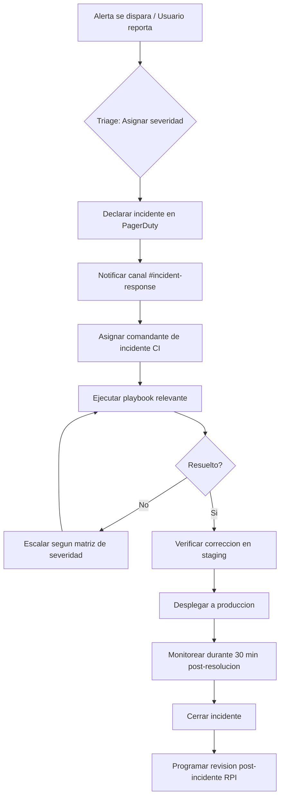
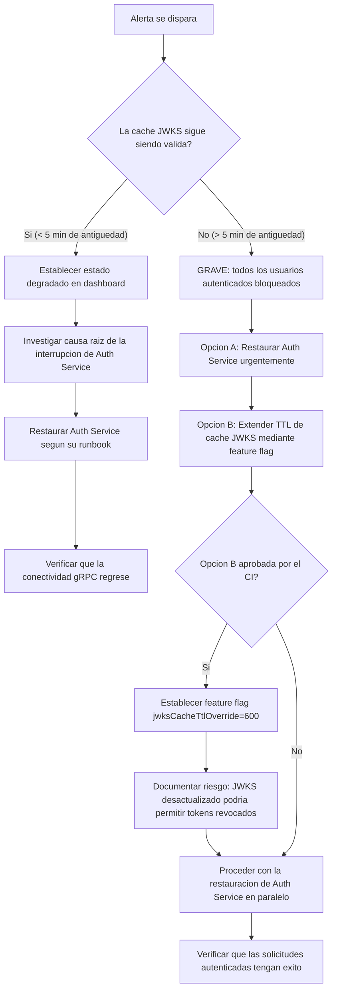
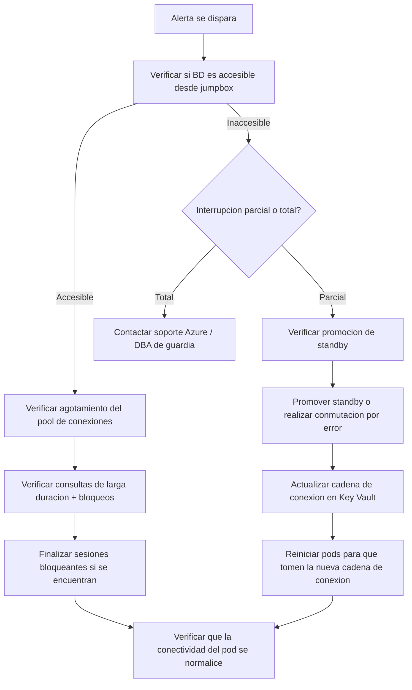
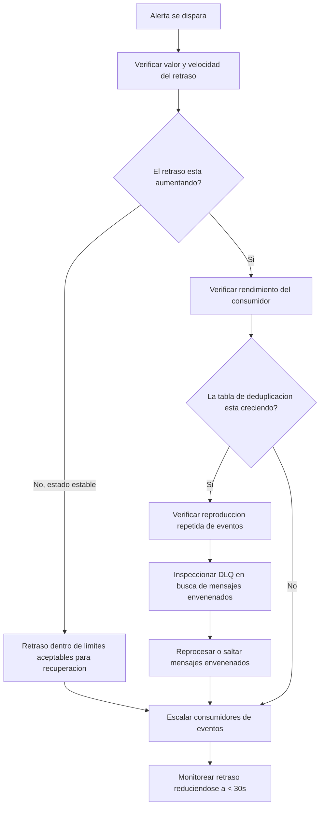
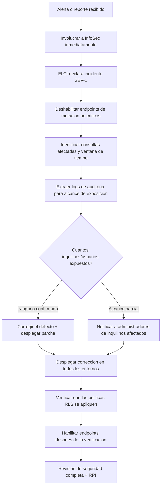

# Runbook de respuesta a incidentes -- Users Service

**Servicio:** `users-service` | **Dominio:** `identity` | **Propietario:** Equipo de Ingenieria de Plataforma | **Ultima actualizacion:** 2026-07-26

## Tabla de Contenidos

1. [Definiciones de severidad](#1-definiciones-de-severidad)
2. [Ciclo de vida del incidente](#2-ciclo-de-vida-del-incidente)
3. [Plantillas de comunicacion](#3-plantillas-de-comunicacion)
4. [Rutas de escalamiento](#4-rutas-de-escalamiento)
5. [Playbooks de respuesta](#5-playbooks-de-respuesta)
    - [5.1 Auth Service no disponible](#51-auth-service-no-disponible)
    - [5.2 Fallo de conexion de base de datos](#52-fallo-de-conexion-de-base-de-datos)
    - [5.3 Acumulacion de procesamiento de eventos](#53-acumulacion-de-procesamiento-de-eventos)
    - [5.4 Fuga de datos entre inquilinos](#54-fuga-de-datos-entre-inquilinos)
6. [Revision post-incidente](#6-revision-post-incidente)

---

## 1. Definiciones de severidad

| Severidad | Etiqueta | Descripcion | Tiempo de respuesta | Ejemplos |
|---|---|---|---|---|
| **SEV-1** | Critica | Interrupcion total del servicio o compromiso de datos. Todas las solicitudes autenticadas fallan o fuga de datos entre inquilinos confirmada. | < 5 min | Auth Service caido > 5 min; base de datos inaccesible; PII expuesta entre inquilinos |
| **SEV-2** | Alta | Degradacion parcial que afecta a un subconjunto de usuarios u operaciones. Sin compromiso de datos. | < 15 min | Acumulacion de eventos > 5 min; latencia p99 > 1s; interrupcion limitada a un inquilino |
| **SEV-3** | Baja | Deterioro menor con solucion alternativa disponible. Sin impacto visible para el usuario. | < 60 min (siguiente dia habil) | Cache JWKS desactualizada; alertas de metricas no criticas; un solo pod en bucle de fallos |
| **SEV-4** | Informativa | Observacion que no requiere accion inmediata. | Registrada, sin SLA | Advertencia en log de auditoria; umbral de limite de tasa proximo; aviso de obsolescencia |

**Nota:** Cualquier incidente donde la PII del cliente pueda haber sido expuesta cruza los umbrales de compromiso de datos. Escalar inmediatamente a SEV-1 e involucrar a InfoSec segun la politica de notificacion de violacion de datos.

---

## 2. Ciclo de vida del incidente



### Roles clave durante un incidente

| Rol | Responsabilidad | Asignado por |
|---|---|---|
| **Comandante de incidente (CI)** | Coordina la respuesta, comunica el estado, impulsa la toma de decisiones | Primer respondedor o SRE de guardia |
| **Experto en la materia (EEM)** | Diagnostico tecnico y remediacion | El CI delega al propietario del servicio o desarrollador |
| **Escriba** | Documenta la linea de tiempo, acciones tomadas, decisiones tomadas | El CI asigna cualquier ingeniero disponible |
| **Enlace con el cliente** | Actualiza a las partes interesadas y usuarios afectados | El CI coordina con Comunicaciones de Plataforma |

---

## 3. Plantillas de comunicacion

### 3.1 Alerta inicial (Slack -- `#incident-response`)

```
:rotating_light: *INCIDENTE DECLARADO* — SEV-[1|2|3]
*Servicio:* users-service
*Resumen:* [una oracion describiendo el problema]
*Impacto:* [endpoints, inquilinos o base de usuarios afectados]
*Hora de deteccion:* [marca de tiempo UTC]
*CI asignado:* @handle
*Playbook:* [enlace a la seccion relevante a continuacion]
:rotating_light:
```

### 3.2 Actualizacion de estado (Cada 30 min para SEV-1, 60 min para SEV-2)

```
*ACTUALIZACION DE INCIDENTE* — SEV-[1|2|3] | [ID del incidente]
*Duracion:* [X] min
*Estado actual:* [Investigando / Mitigando / Monitoreando / Resuelto]
*Acciones tomadas:*
  - [accion 1]
  - [accion 2]
*Siguiente paso:* [accion planificada]
*Proxima actualizacion:* [hora]
```

### 3.3 Aviso de resolucion

```
:white_check_mark: *INCIDENTE RESUELTO* — SEV-[1|2|3] | [ID del incidente]
*Duracion:* [X] min
*Causa raiz:* [una oracion]
*Mitigacion:* [lo que se hizo para restaurar el servicio]
*Ventana de monitoreo:* 30 min post-resolucion
*RPI programada:* [fecha o por definir]
```

### 3.4 Notificacion a partes interesadas (Correo electronico -- SEV-1 / Violacion de datos)

```
Asunto: [SEV-1] Informe de incidente — Users Service — [fecha]

Clasificacion: Interno — Confidencial

Resumen:
[descripcion de 2-3 oraciones de lo que sucedio]

Impacto:
- Inquilinos afectados: [lista o "todos"]
- Usuarios afectados: [cantidad o rango]
- Exposicion de datos: [ninguna / describir alcance]
- Duracion: [inicio] UTC a [fin] UTC

Causa raiz:
[un parrafo]

Acciones tomadas:
- [paso de contencion inmediato]
- [paso de remediacion]
- [paso de verificacion]

Proximos pasos:
- Revision post-incidente programada: [fecha]
- Tarea de seguimiento de ingenieria: [enlace]
- Comunicaciones especificas del cliente: [propietario]

Contacto:
Comandante de incidente: [nombre] — [handle de Slack] — [telefono]
```

---

## 4. Rutas de escalamiento

### 4.1 Escalamiento estandar

```
Nivel 1  SRE de guardia primario        ─── Rotacion de PagerDuty
         ↑
Nivel 2  Equipo de Ingenieria de Plataforma  ─── #platform-eng (Slack)
         ↑
Nivel 3  Gerente de Ingenieria         ─── #platform-leads (Slack) + Telefono
         ↑
Nivel 4  Director de Plataforma       ─── Telefono (via OpsGenie)
```

### 4.2 Contactos de escalamiento especializado

| Area | Contacto | Canal | Horario |
|---|---|---|---|
| **Seguridad / InfoSec** | `infosec@internal.platform` | `#infosec` | 24/7 (SEV-1 violacion de datos) |
| **Base de datos (DBA)** | `dba@internal.platform` | `#database-admin` | Horario laboral + guardia |
| **Auth Service** | Propietario de Auth Service | `#auth-service` | 24/7 |
| **Infraestructura Azure** | `#cloud-infra` | Rotacion de PagerDuty | 24/7 |
| **Notification Service** | `#notification-service` | Slack | Horario laboral |

### 4.3 Cuando escalar

- **SEV-1:** Escalar inmediatamente a Nivel 2 si no hay progreso en 15 min. Nivel 3 si no se resuelve en 30 min.
- **SEV-2:** Escalar a Nivel 2 si no hay progreso en 60 min. Nivel 3 si no se resuelve en 4 horas.
- **SEV-3:** Escalar a Nivel 2 el siguiente dia habil si no se resuelve.

**En caso de duda, escalar.** Siempre es mejor despertar a alguien temprano que descubrir el problema mas tarde.

---

## 5. Playbooks de respuesta

### 5.1 Auth Service no disponible

**Descripcion:** El Users Service no puede alcanzar el Authentication Service para la validacion de JWT. Despues de que la cache local de JWKS expire (TTL de 5 min), todas las solicitudes autenticadas fallan con HTTP 503.

**Sintomas:**
- `users_jwt_validation_errors_total` aumentando
- `users_http_5xx_total` aumentando en todos los endpoints autenticados
- `users_auth_service_grpc_latency` mostrando timeouts o conexion rechazada
- Alerta: `AuthServiceUnreachable`
- Los endpoints no autenticados (`/api/health/live`, `/api/health/ready`) aun responden normalmente

**Metricas a verificar:**

| Metrica | Umbral | Origen |
|---|---|---|
| `users_auth_service_grpc_latency` | > 1s | Prometheus |
| `users_auth_service_grpc_errors_total` | > 0 | Prometheus |
| `users_jwks_cache_age_seconds` | > 300 (vencimiento de cache) | Prometheus |
| Estado de pods de Auth Service | `CrashLoopBackOff` o `0/3 Ready` | `kubectl` |

**Pasos de respuesta:**



**Pasos detallados:**

1. **Confirmar la alerta** -- verificar el dashboard de Grafana `Users Service -- Auth Dependency`
2. **Verificar el estado de la cache** -- consultar `users_jwks_cache_age_seconds` en Prometheus. Si es < 300s, el servicio aun es funcional. Proceder a la investigacion de causa raiz sin escalamiento urgente.
3. **Verificar la salud de Auth Service** -- desde un pod de depuracion:

   ```bash
   grpcurl -insecure auth-service.platform.svc.cluster.local:5103 \
     health.Health/Check
   ```

4. **Si Auth Service esta caido:**
   - Notificar al equipo de guardia de Auth Service via PagerDuty (`#auth-service`)
   - Notificar a `#incident-response` con el impacto entre servicios
   - Si la interrupcion se extiende mas alla de 5 min y la cache ha expirado, evaluar la Opcion B

5. **Opcion B -- Extender TTL de cache JWKS (solo anulacion de emergencia):**
   - Establecer mediante feature flag de Azure App Configuration:
     ```bash
     az appconfig kv set \
       --name platform-feature-flags \
       --key users-service:jwksCacheTtlOverride \
       --value "600" \
       --label emergency-$(date +%Y%m%d)
     ```
   - Esto NO requiere un despliegue; el servicio consulta App Configuration cada 60s
   - **Riesgo:** Los tokens revocados seran aceptados hasta que la cache se actualice. Usar solo cuando la alternativa sea una interrupcion total del servicio.
   - **Revertir** una vez que Auth Service sea restaurado: eliminar la clave o establecerla de nuevo a vacio.

6. **Verificar la correccion:**
   ```bash
   curl -s -o /dev/null -w "%{http_code}" \
     -H "Authorization: Bearer $(valid-test-jwt)" \
     https://users-service.platform/api/users
   # Esperado: 200
   ```

7. **Post-resolucion:** Monitorear `users_jwks_cache_age_seconds` regresando a la normalidad (< 300), todas las metricas de error tendiendo a cero. Mantener la ventana de monitoreo abierta durante 30 min.

**Revertir:** Si se uso la anulacion de feature flag, eliminar el flag inmediatamente despues de la restauracion de Auth Service para volver al comportamiento predeterminado.

---

### 5.2 Fallo de conexion de base de datos

**Descripcion:** El Users Service no puede establecer o mantener conexiones con PostgreSQL. La sonda de readiness falla, los pods se eliminan del balanceador de carga y todas las solicitudes fallan con HTTP 503.

**Sintomas:**
- `users_db_connection_errors_total` aumentando
- Sonda de readiness (`/api/health/ready`) devolviendo 503
- Pods siendo reiniciados o eliminados por Kubernetes
- Alerta: `DatabaseConnectionFailure`
- Logs de aplicacion conteniendo `NpgsqlException`, `connection failed` o `timeout`

**Metricas a verificar:**

| Metrica | Umbral | Origen |
|---|---|---|
| `users_db_connection_errors_total` | > 0 en los ultimos 5 min | Prometheus |
| `users_db_connection_pool_size` | 0 o estancado en el maximo (30) | Prometheus |
| `users_db_command_duration_seconds` | > 5s | Prometheus |
| `users_readiness_probe_failures_total` | > 3 consecutivos | Prometheus |

**Pasos de respuesta:**



**Pasos detallados:**

1. **Confirmar accesibilidad** -- desde un pod jumpbox:
   ```bash
   psql "host=users-db.postgres.database.azure.com \
         port=5432 dbname=usersdb \
         sslmode=require" -c "SELECT 1;"
   ```

2. **Investigar el pool de conexiones -- verificar contadores de Npgsql:**
   - `users_db_connection_pool_size` en el maximo (30) + `users_db_connection_errors_total` > 0 sugiere agotamiento del pool
   - Causas comunes: consultas lentas reteniendo conexiones, fugas de conexion, transaccion no liberada

3. **Identificar consultas bloqueantes:**
   ```sql
   -- Ejecutar en el PostgreSQL primario
   SELECT pid, wait_event_type, wait_event, state, query_start, 
          LEFT(query, 120) AS query_short
   FROM pg_stat_activity
   WHERE state != 'idle'
     AND query_start < NOW() - INTERVAL '30 seconds'
   ORDER BY query_start;
   ```

4. **Finalizar sesiones bloqueadas o descontroladas:**
   ```sql
   SELECT pg_terminate_backend(pid)
   FROM pg_stat_activity
   WHERE pid != pg_backend_pid()
     AND state != 'idle'
     AND query_start < NOW() - INTERVAL '5 minutes';
   ```

5. **Si la base de datos es inaccesible:**
   - Verificar el estado de Azure PostgreSQL en https://status.azure.com
   - Si el standby esta saludable, iniciar conmutacion por error:
     ```bash
     az postgres flexible-server failover \
       --resource-group platform-rg \
       --name users-db-primary
     ```
   - Actualizar la cadena de conexion en Key Vault si la conmutacion cambio el endpoint
   - Reiniciar los pods del Users Service para que tomen la nueva conexion:
     ```bash
     kubectl rollout restart deployment/users-service -n platform
     ```

6. **Verificar recuperacion:**
   - Verificar que la sonda de readiness devuelva 200:
     ```bash
     curl -s -o /dev/null -w "%{http_code}" \
       https://users-service.platform/api/health/ready
     # Esperado: 200
     ```
   - Confirmar que el pool de conexiones se normalice: `users_db_connection_pool_size` debe estar entre 5 y 15 bajo carga normal

7. **Acciones post-resolucion:**
   - Revisar el log de consultas lentas de PostgreSQL para identificar la consulta que causo el problema
   - Verificar si falta un indice o si un plan de consulta ha retrocedido
   - Crear una tarea de seguimiento para optimizacion de consultas si es necesario

---

### 5.3 Acumulacion de procesamiento de eventos

**Descripcion:** Eventos de autenticacion acumulandose en Azure Service Bus mas rapido de lo que el Users Service puede consumirlos. Las lecturas del perfil de usuario pueden estar desactualizadas y los sistemas posteriores que dependen del estado del usuario pueden tener datos incompletos.

**Sintomas:**
- `users_event_processing_lag_seconds` > 60 (umbral de alerta)
- `users_event_processing_lag_seconds` > 300 (umbral SEV-2)
- Cola de mensajes fallidos (DLQ) recibiendo mensajes
- `users_events_processed_total` sin cambios a pesar de la actividad del topico `auth-events`
- Usuarios reportando marcas de tiempo `last_login_at` o `last_logout_at` desactualizadas

**Metricas a verificar:**

| Metrica | Umbral | Origen |
|---|---|---|
| `users_event_processing_lag_seconds` | > 60 (advertencia), > 300 (critico) | Prometheus |
| `users_event_processing_duration_seconds` | > 5s por evento | Prometheus |
| `users_event_dlq_count` | > 0 | Prometheus + Azure Monitor |
| `users_event_deduplication_cache_size` | > 10,000 entradas | Prometheus |

**Pasos de respuesta:**



**Pasos detallados:**

1. **Evaluar la magnitud del backlog:**
   ```bash
   # Consultar metricas de suscripcion de Azure Service Bus
   az monitor metrics list \
     --resource /subscriptions/.../servicebus/.../topics/auth-events \
     --metric "ActiveMessages" \
     --interval 5m
   ```

2. **Verificar la cola de mensajes fallidos:**
   ```bash
   az servicebus topic subscription show \
     --resource-group platform-rg \
     --namespace-name platform-sb \
     --topic-name auth-events \
     --subscription-name users-service \
     --query "deadLetteringOnMessageExpiration"
   ```
   - Ver mensajes DLQ mediante Azure Portal o:
     ```bash
     az servicebus topic subscription message peek \
       --resource-group platform-rg \
       --namespace-name platform-sb \
       --topic-name auth-events \
       --subscription-name users-service/$DeadLetterQueueName
     ```

3. **Identificar mensajes envenenados** -- un mensaje que falla el procesamiento repetidamente (error de esquema, payload malformado, fallo de integridad referencial):
   - Verificar logs de aplicacion en busca de `EventProcessingException` o `DeadLetterException`
   - Causas comunes: payload de evento con campos requeridos faltantes, ID de usuario referenciando un usuario eliminado, violacion de clave foranea
   - Si un mensaje especifico esta envenenado:
     ```bash
     # Recibir y completar el mensaje de la DLQ para eliminarlo
     az servicebus topic subscription message receive \
       --resource-group platform-rg \
       --namespace-name platform-sb \
       --topic-name auth-events \
       --subscription-name users-service/$DeadLetterQueueName \
       --count 1
     ```

4. **Escalar consumidores** (dos enfoques):

   **A. Escalado horizontal de pods (si la capacidad del cluster lo permite):**
   ```bash
   kubectl scale deployment/users-service --replicas=6 -n platform
   ```
   Esperar 2 min para que los nuevos pods registren sus receptores de Service Bus.

   **B. Aumentar manejadores de mensajes concurrentes (sin necesidad de despliegue):**
   ```bash
   az appconfig kv set \
     --name platform-feature-flags \
     --key users-service:maxConcurrentEventHandlers \
     --value "20" \
     --label scaling-$(date +%Y%m%d)
   ```
   El valor predeterminado es 10. El maximo seguro es 30 por pod, limitado por la CPU disponible.

5. **Verificar la reduccion del backlog:**
   - Monitorear `users_event_processing_lag_seconds` disminuyendo
   - Dashboard: `Event Processing Lag` debe tender a la baja en minutos
   - Objetivo: retraso < 30s

6. **Reducir escala despues de la recuperacion** -- una vez que el backlog se haya limpiado, volver a la linea base:
   ```bash
   kubectl scale deployment/users-service --replicas=3 -n platform
   ```
   Eliminar el feature flag `maxConcurrentEventHandlers` para volver al valor predeterminado.

7. **Revisar la tabla de deduplicacion** -- si el backlog fue causado por una tormenta de reproduccion (mismos eventos re-entregados):
   ```sql
   -- Verificar tasa de crecimiento de event_deduplication
   SELECT COUNT(*), MIN(consumed_at), MAX(consumed_at)
   FROM event_deduplication
   WHERE consumed_at > NOW() - INTERVAL '1 hour';
   ```
   Si la tabla es demasiado grande (> 100k entradas), el trabajo de limpieza de retencion puede necesitar ajuste.

---

### 5.4 Fuga de datos entre inquilinos

**IMPORTANTE:** Este es un **incidente de seguridad SEV-1**. Siga estos pasos exactamente. No discuta detalles en canales publicos. Involucre a InfoSec desde el paso 1.

**Descripcion:** Un defecto en el Users Service provoco que los datos de un inquilino fueran visibles para los usuarios de otro inquilino. Esto viola la garantia central de aislamiento de multi-inquilino y puede exponer PII.

**Sintomas:**
- Usuario reporta ver datos de otro inquilino en su respuesta de API
- El log de auditoria muestra una consulta que falta el filtro `tenant_id`
- La metrica `users_cross_tenant_access_attempts_total` se dispara (si la deteccion de violacion de RLS esta activa)
- Hallazgo de escaneo de seguridad o prueba de penetracion
- Alerta: `PossibleCrossTenantDataLeak`

**Metricas a verificar:**

| Metrica | Umbral | Origen |
|---|---|---|
| `users_cross_tenant_access_attempts_total` | > 0 (activa investigacion) | Prometheus |
| `users_http_4xx_total` por endpoint por inquilino | Patron anomalo | Prometheus |

**Pasos de respuesta:**



**Pasos detallados:**

1. **Contencion inmediata -- congelar y aislar:**
   - El Comandante de Incidente declara un **SEV-1** en PagerDuty
   - Notificar a InfoSec via `#infosec` y `infosec@internal.platform`
   - **No** discutir hallazgos especificos en canales publicos
   - Si la fuga esta ocurriendo activamente, el CI puede decidir deshabilitar endpoints de mutacion:
     ```bash
     az appconfig kv set \
       --name platform-feature-flags \
       --key users-service:disableWriteOperations \
       --value "true" \
       --label security-freeze-$(date +%Y%m%d%H%M)
     ```
     Esto mantiene los endpoints de lectura (GET) operativos para operaciones criticas mientras previene cualquier mutacion de datos.

2. **Identificar la causa raiz:**
   - Verificar despliegues recientes o cambios de codigo que tocaron la logica de consultas
   - Causas comunes:
     - Falta `WHERE tenant_id = @tenantId` en una consulta nueva o modificada
     - Mala configuracion de politica RLS despues de una migracion de esquema
     - Problema de mapeo de ORM / Dapper que elimino el parametro de inquilino
     - Endpoint de API que acepta `tenant_id` del cliente en lugar del JWT
   - Revisar los logs de aplicacion en busca de consultas ejecutadas sin filtro de inquilino:
     ```bash
     # Buscar consultas que no contengan tenant_id
     # Esto es heuristico — combinar con revision de codigo
     ```

3. **Determinar el alcance de la exposicion:**
   - Exportar logs de auditoria para la ventana de tiempo afectada:
     ```sql
     -- Exportar desde la tabla audit_logs (solo consultas con ambito de inquilino)
     COPY (
       SELECT timestamp, actor_id, tenant_id, action, request_path, 
              response_status
       FROM audit_logs
       WHERE timestamp BETWEEN '<inicio>' AND '<fin>'
         AND action IN ('query_users', 'get_user')
     ) TO '/tmp/exposure_audit.csv' CSV HEADER;
     ```
   - Referencia cruzada de patrones de acceso: que inquilinos accedieron a que datos?
   - Determinar si se devolvio PII en las respuestas vs. solo metadatos

4. **Desplegar la correccion:**
   - Confirmar la correccion (falta de filtro `tenant_id`, politica RLS o mapeo de parametros)
   - Ejecutar pruebas de integracion con escenarios multi-inquilino:
     ```bash
     dotnet test tests/UsersService.IntegrationTests/ \
       --filter "Category=MultiTenantIsolation"
     ```
   - Desplegar a traves del pipeline: `dev` -> `qa` -> `staging` -> `production`
   - No saltar entornos -- el paso de verificacion de seguridad es critico

5. **Verificar la correccion:**
   - Ejecutar el conjunto de pruebas de acceso entre inquilinos:
     ```bash
     # Probar que el Inquilino A no puede acceder a los datos del Inquilino B
     curl -H "Authorization: Bearer $(jwt-for-tenant-a)" \
       https://users-service.platform/api/users/tenant-b-user-id
     # Esperado: 404 (no encontrado) o 403 (prohibido)
     # No debe devolver 200 con datos
     ```
   - Verificar que las politicas RLS esten activas:
     ```sql
     SELECT relname, relrowsecurity 
     FROM pg_class 
     WHERE relname IN ('users', 'audit_logs', 'roles');
     -- relrowsecurity debe ser true para todas
     ```

6. **Post-resolucion:**
   - Eliminar el feature flag `disableWriteOperations`
   - Registrar un informe detallado de incidente de seguridad segun los requisitos de InfoSec
   - Programar una RPI dentro de las 48 horas

---

## 6. Revision post-incidente

Cada incidente SEV-1 y SEV-2 requiere una Revision Post-Incidente (RPI) dentro de los 5 dias habiles.

### Plantilla de RPI

```markdown
## Revision Post-Incidente — [ID del incidente]

**Fecha:** YYYY-MM-DD
**Comandante de incidente:** [nombre]
**Participantes:** [lista]

### Resumen
[descripcion de 2-3 oraciones]

### Linea de tiempo
| Marca de tiempo (UTC) | Evento |
|---|---|
| HH:MM | Alerta se disparo |
| HH:MM | Incidente declarado |
| HH:MM | CI asignado |
| HH:MM | Mitigacion iniciada |
| HH:MM | Servicio restaurado |
| HH:MM | Incidente cerrado |

### Impacto
- Duracion: [X] min
- Usuarios/inquilinos afectados: [cantidad]
- Exposicion de datos: [ninguna / alcance]
- Presupuesto de errores consumido: [X]%

### Causa raiz
[un parrafo describiendo el porque, no solo el que]

### Factores contribuyentes
- [Factor 1, ej., falta de cobertura de pruebas unitarias]
- [Factor 2, ej., brecha de monitoreo]

### Elementos de accion
| # | Accion | Propietario | Tarea de seguimiento | Severidad |
|---|---|---|---|---|
| 1 | [descripcion] | @handle | [enlace] | P0/P1/P2 |
| 2 | [descripcion] | @handle | [enlace] | P0/P1/P2 |

### Lecciones aprendidas
- Que salio bien:
- Que salio mal:
- Que haremos diferente:

### Apendice
- [Enlace a capturas de dashboard de Grafana]
- [Enlace a incidente de PagerDuty]
- [Enlace a hilo de Slack]
```

### Cultura sin culpa

La RPI es un proceso **sin culpa**. Su proposito es identificar mejoras sistemicas, no errores individuales. Cada incidente es una oportunidad para hacer la plataforma mas resiliente.

---

## Documentos relacionados

- [Vision general de arquitectura](../architecture/overview.md)
- [Arquitectura de seguridad](../architecture/security.md) — modelo de amenazas y flujo JWT
- [Vista de despliegue](../architecture/deployment-view.md) — topologia y sondas de salud
- [API de eventos](../api/events.md) — garantias de procesamiento de eventos y monitoreo
- [Contexto del sistema](../architecture/context.md) — dependencias externas
- [Runbook de despliegue](./deployment.md)
- [Runbook de revertir](./rollback.md)
