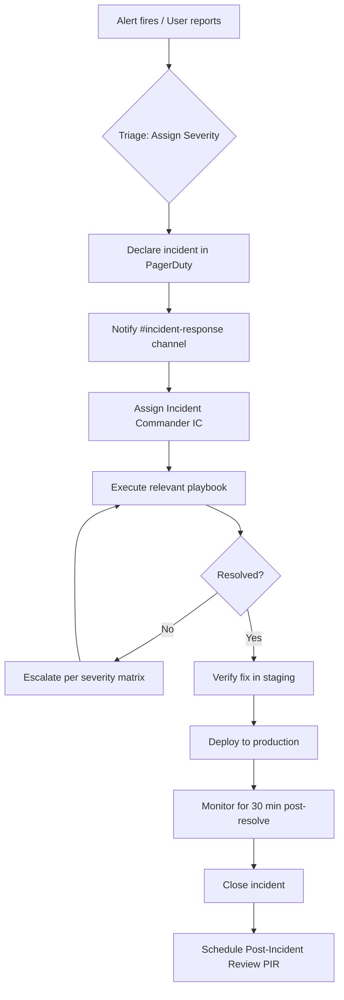
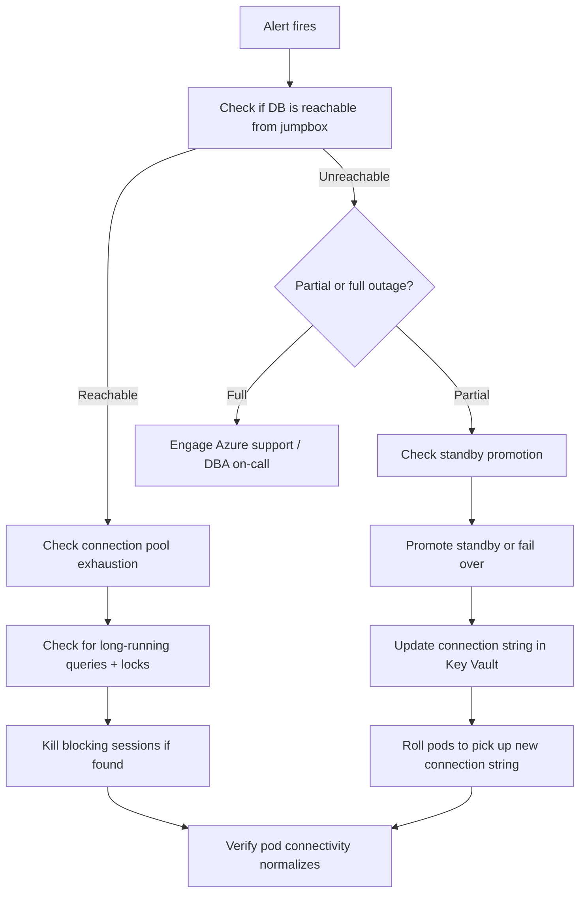
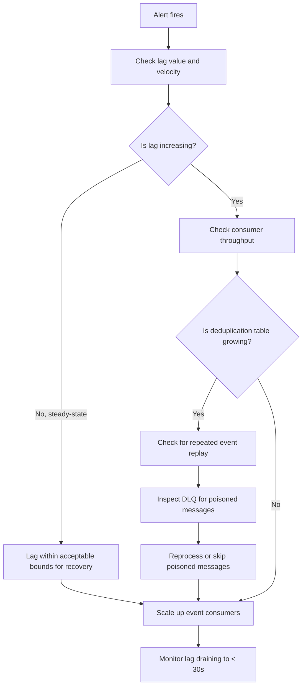
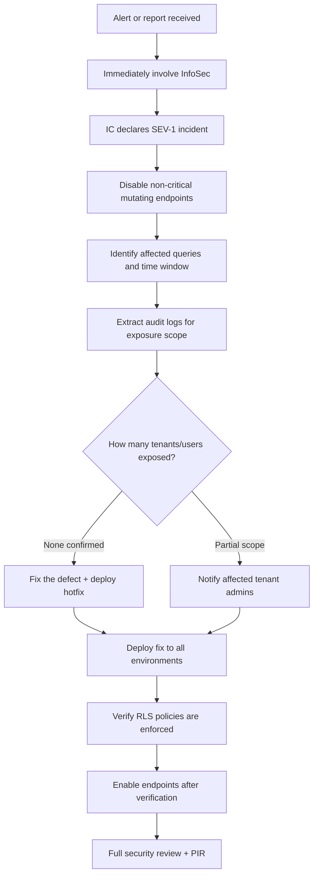

# Incident Response Runbook — Users Service

**Service:** `users-service` | **Domain:** `identity` | **Owner:** Platform Engineering Team | **Last Updated:** 2026-07-26

## Table of Contents

1. [Severity Definitions](#1-severity-definitions)
2. [Incident Lifecycle](#2-incident-lifecycle)
3. [Communication Templates](#3-communication-templates)
4. [Escalation Paths](#4-escalation-paths)
5. [Response Playbooks](#5-response-playbooks)
    - [5.1 Auth Service Unavailable](#51-auth-service-unavailable)
    - [5.2 Database Connection Failure](#52-database-connection-failure)
    - [5.3 Event Processing Backlog](#53-event-processing-backlog)
    - [5.4 Cross-Tenant Data Leak](#54-cross-tenant-data-leak)
6. [Post-Incident Review](#6-post-incident-review)

---

## 1. Severity Definitions

| Severity | Label | Description | Response Time | Examples |
|---|---|---|---|---|
| **SEV-1** | Critical | Complete service outage or data compromise. All authenticated requests failing or confirmed cross-tenant data leak. | < 5 min | Auth Service down > 5 min; database unreachable; PII exposed across tenants |
| **SEV-2** | High | Partial degradation that affects a subset of users or operations. No data compromise. | < 15 min | Event backlog > 5 min; p99 latency > 1s; tenant-scoped outage |
| **SEV-3** | Low | Minor impairment with workaround available. No user-facing impact. | < 60 min (next business day) | Stale JWKS cache; non-critical metric alerts; single pod crash-looping |
| **SEV-4** | Informational | Observation that does not require immediate action. | Logged, no SLA | Audit log warning; rate-limit threshold approaching; deprecation notice |

**Note:** Any incident where customer PII may have been exposed crosses data-compromise thresholds. Escalate immediately to SEV-1 and involve InfoSec per the data-breach notification policy.

---

## 2. Incident Lifecycle



### Key Roles During an Incident

| Role | Responsibility | Assigned By |
|---|---|---|
| **Incident Commander (IC)** | Coordinates response, communicates status, drives decision-making | First responder or SRE on-call |
| **Subject Matter Expert (SME)** | Technical diagnosis and remediation | IC delegates to service owner or developer |
| **Scribe** | Documents timeline, actions taken, decisions made | IC assigns any available engineer |
| **Customer Liaison** | Updates stakeholders and affected users | IC coordinates with Platform Communications |

---

## 3. Communication Templates

### 3.1 Initial Alert (Slack — `#incident-response`)

```
:rotating_light: *INCIDENT DECLARED* — SEV-[1|2|3]
*Service:* users-service
*Summary:* [one sentence describing the problem]
*Impact:* [affected endpoints, tenants, or user base]
*Time detected:* [UTC timestamp]
*Assigned IC:* @handle
*Playbook:* [link to relevant section below]
:rotating_light:
```

### 3.2 Status Update (Every 30 min for SEV-1, 60 min for SEV-2)

```
*INCIDENT UPDATE* — SEV-[1|2|3] | [incident ID]
*Duration:* [X] min
*Current status:* [Investigating / Mitigating / Monitoring / Resolved]
*Actions taken:*
  - [action 1]
  - [action 2]
*Next step:* [planned action]
*Next update:* [time]
```

### 3.3 Resolution Notice

```
:white_check_mark: *INCIDENT RESOLVED* — SEV-[1|2|3] | [incident ID]
*Duration:* [X] min
*Root cause:* [one sentence]
*Mitigation:* [what was done to restore service]
*Monitoring window:* 30 min post-resolve
*PIR scheduled:* [date or TBD]
```

### 3.4 Stakeholder Notification (Email — SEV-1 / Data Breach)

```
Subject: [SEV-1] Incident Report — Users Service — [date]

Classification: Internal — Confidential

Summary:
[2-3 sentence description of what happened]

Impact:
- Affected tenants: [list or "all"]
- Users affected: [count or range]
- Data exposure: [none / describe scope]
- Duration: [start] UTC to [end] UTC

Root Cause:
[one paragraph]

Actions Taken:
- [immediate containment step]
- [remediation step]
- [verification step]

Next Steps:
- Post-Incident Review scheduled: [date]
- Engineering tracking issue: [link]
- Customer-specific comms: [owner]

Contact:
Incident Commander: [name] — [slack handle] — [phone]
```

---

## 4. Escalation Paths

### 4.1 Standard Escalation

```
Level 1  Primary On-Call SRE        ─── PagerDuty rotation
         ↑
Level 2  Platform Engineering Team  ─── #platform-eng (Slack)
         ↑
Level 3  Engineering Manager        ─── #platform-leads (Slack) + Phone
         ↑
Level 4  Director of Platform       ─── Phone (via OpsGenie)
```

### 4.2 Specialized Escalation Contacts

| Area | Contact | Channel | Hours |
|---|---|---|---|
| **Security / InfoSec** | `infosec@internal.platform` | `#infosec` | 24/7 (SEV-1 data breach) |
| **Database (DBA)** | `dba@internal.platform` | `#database-admin` | Business hours + on-call |
| **Auth Service** | Auth Service owner | `#auth-service` | 24/7 |
| **Azure Infrastructure** | `#cloud-infra` | PagerDuty rotation | 24/7 |
| **Notification Service** | `#notification-service` | Slack | Business hours |

### 4.3 When to Escalate

- **SEV-1:** Escalate immediately to Level 2 if no progress in 15 min. Level 3 if unresolved at 30 min.
- **SEV-2:** Escalate to Level 2 if no progress in 60 min. Level 3 if unresolved at 4 hours.
- **SEV-3:** Escalate to Level 2 next business day if not resolved.

**If in doubt, escalate.** It is always better to wake someone early than to discover the problem later.

---

## 5. Response Playbooks

### 5.1 Auth Service Unavailable

**Description:** The Users Service cannot reach the Authentication Service for JWT validation. After the local JWKS cache expires (5 min TTL), all authenticated requests fail with HTTP 503.

**Symptoms:**
- `users_jwt_validation_errors_total` spiking
- `users_http_5xx_total` rising on all authenticated endpoints
- `users_auth_service_grpc_latency` showing timeouts or connection refused
- Alert: `AuthServiceUnreachable`
- Unauthenticated endpoints (`/api/health/live`, `/api/health/ready`) still respond normally

**Metrics to Check:**

| Metric | Threshold | Source |
|---|---|---|
| `users_auth_service_grpc_latency` | > 1s | Prometheus |
| `users_auth_service_grpc_errors_total` | > 0 | Prometheus |
| `users_jwks_cache_age_seconds` | > 300 (cache expiry) | Prometheus |
| Auth Service pod status | `CrashLoopBackOff` or `0/3 Ready` | `kubectl` |

**Response Steps:**

```mermaid
flowchart TD
    A[Alert fires] --> B{Is JWKS cache still valid?}
    B -- Yes (< 5 min old --> C[Set degraded status in dashboard]
    C --> D[Investigate root cause of Auth Service outage)
    D --> E[Restore Auth Service per its runbook]
    E --> F[Verify gRPC connectivity returns]
    B -- No (> 5 min old --> G[SERIOUS: all authenticated users blocked]
    G --> H[Option A: Restore Auth Service urgently]
    H --> I[Option B: Extend JWKS cache TTL via feature flag]
    I --> J{Option B approved by IC?}
    J -- Yes --> K[Set feature flag jwksCacheTtlOverride=600]
    K --> L[Document risk: stale JWKS could allow revoked tokens]
    L --> M[Proceed with Auth Service restoration in parallel]
    J -- No --> M
    M --> N[Verify authenticated requests succeed]
```

**Detailed Steps:**

1. **Confirm the alert** — check Grafana dashboard `Users Service — Auth Dependency`
2. **Verify cache status** — query `users_jwks_cache_age_seconds` in Prometheus. If < 300s, service is still functional. Proceed to root-cause investigation without urgent escalation.
3. **Check Auth Service health** — from a debug pod:

   ```bash
   grpcurl -insecure auth-service.platform.svc.cluster.local:5103 \
     health.Health/Check
   ```

4. **If Auth Service is down:**
   - Page the Auth Service on-call via PagerDuty (`#auth-service`)
   - Notify `#incident-response` with the cross-service impact
   - If the outage extends past 5 min and the cache has expired, assess Option B

5. **Option B — Extend JWKS cache TTL (emergency override only):**
   - Set via Azure App Configuration feature flag:
     ```bash
     az appconfig kv set \
       --name platform-feature-flags \
       --key users-service:jwksCacheTtlOverride \
       --value "600" \
       --label emergency-$(date +%Y%m%d)
     ```
   - This does NOT require a deployment; the service polls App Configuration every 60s
   - **Risk:** Revoked tokens will be accepted until the cache refreshes. Only use when the alternative is a total service outage.
   - **Revert** once Auth Service is restored: delete the key or set it back to empty.

6. **Verify fix:**
   ```bash
   curl -s -o /dev/null -w "%{http_code}" \
     -H "Authorization: Bearer $(valid-test-jwt)" \
     https://users-service.platform/api/users
   # Expected: 200
   ```

7. **Post-resolution:** Monitor `users_jwks_cache_age_seconds` returning to normal (< 300), all error metrics trending to zero. Keep the monitoring window open for 30 min.

**Rollback:** If using the feature-flag override, delete the flag immediately after Auth Service restoration to return to default behavior.

---

### 5.2 Database Connection Failure

**Description:** The Users Service cannot establish or maintain connections to PostgreSQL. The readiness probe fails, pods are removed from the load balancer, and all requests fail with HTTP 503.

**Symptoms:**
- `users_db_connection_errors_total` spiking
- Readiness probe (`/api/health/ready`) returning 503
- Pods being restarted or removed by Kubernetes
- Alert: `DatabaseConnectionFailure`
- Application logs containing `NpgsqlException`, `connection failed`, or `timeout`

**Metrics to Check:**

| Metric | Threshold | Source |
|---|---|---|
| `users_db_connection_errors_total` | > 0 in last 5 min | Prometheus |
| `users_db_connection_pool_size` | 0 or stuck at max (30) | Prometheus |
| `users_db_command_duration_seconds` | > 5s | Prometheus |
| `users_readiness_probe_failures_total` | > 3 consecutive | Prometheus |

**Response Steps:**



**Detailed Steps:**

1. **Confirm reachability** — from a jumpbox pod:
   ```bash
   psql "host=users-db.postgres.database.azure.com \
         port=5432 dbname=usersdb \
         sslmode=require" -c "SELECT 1;"
   ```

2. **Investigate connection pool — check Npgsql counters:**
   - `users_db_connection_pool_size` at max (30) + `users_db_connection_errors_total` > 0 suggests pool exhaustion
   - Common causes: slow queries holding connections, connection leaks, transaction not disposed

3. **Identify blocking queries:**
   ```sql
   -- Run on the PostgreSQL primary
   SELECT pid, wait_event_type, wait_event, state, query_start, 
          LEFT(query, 120) AS query_short
   FROM pg_stat_activity
   WHERE state != 'idle'
     AND query_start < NOW() - INTERVAL '30 seconds'
   ORDER BY query_start;
   ```

4. **Kill blocked or runaway sessions:**
   ```sql
   SELECT pg_terminate_backend(pid)
   FROM pg_stat_activity
   WHERE pid != pg_backend_pid()
     AND state != 'idle'
     AND query_start < NOW() - INTERVAL '5 minutes';
   ```

5. **If database is unreachable:**
   - Check Azure PostgreSQL status at https://status.azure.com
   - If standby is healthy, initiate failover:
     ```bash
     az postgres flexible-server failover \
       --resource-group platform-rg \
       --name users-db-primary
     ```
   - Update the connection string in Key Vault if the failover changed the endpoint
   - Roll the Users Service pods to pick up the new connection:
     ```bash
     kubectl rollout restart deployment/users-service -n platform
     ```

6. **Verify recovery:**
   - Check readiness probe returns 200:
     ```bash
     curl -s -o /dev/null -w "%{http_code}" \
       https://users-service.platform/api/health/ready
     # Expected: 200
     ```
   - Confirm connection pool normalizes: `users_db_connection_pool_size` should be between 5 and 15 under normal load

7. **Post-resolution actions:**
   - Review PostgreSQL slow-query log to identify the query that caused the issue
   - Check if an index is missing or a query plan regressed
   - File a follow-up task for query optimization if needed

---

### 5.3 Event Processing Backlog

**Description:** Auth events accumulating on Azure Service Bus faster than the Users Service can consume them. Reads from the user profile may be stale, and downstream systems relying on user state may have incomplete data.

**Symptoms:**
- `users_event_processing_lag_seconds` > 60 (alert threshold)
- `users_event_processing_lag_seconds` > 300 (SEV-2 threshold)
- Dead-letter queue (DLQ) receiving messages
- `users_events_processed_total` flatlining despite `auth-events` topic activity
- Users reporting stale `last_login_at` or `last_logout_at` timestamps

**Metrics to Check:**

| Metric | Threshold | Source |
|---|---|---|
| `users_event_processing_lag_seconds` | > 60 (warning), > 300 (critical) | Prometheus |
| `users_event_processing_duration_seconds` | > 5s per event | Prometheus |
| `users_event_dlq_count` | > 0 | Prometheus + Azure Monitor |
| `users_event_deduplication_cache_size` | > 10,000 entries | Prometheus |

**Response Steps:**



**Detailed Steps:**

1. **Assess the backlog magnitude:**
   ```bash
   # Query Azure Service Bus subscription metrics
   az monitor metrics list \
     --resource /subscriptions/.../servicebus/.../topics/auth-events \
     --metric "ActiveMessages" \
     --interval 5m
   ```

2. **Check the dead-letter queue:**
   ```bash
   az servicebus topic subscription show \
     --resource-group platform-rg \
     --namespace-name platform-sb \
     --topic-name auth-events \
     --subscription-name users-service \
     --query "deadLetteringOnMessageExpiration"
   ```
   - View DLQ messages via Azure Portal or:
     ```bash
     az servicebus topic subscription message peek \
       --resource-group platform-rg \
       --namespace-name platform-sb \
       --topic-name auth-events \
       --subscription-name users-service/$DeadLetterQueueName
     ```

3. **Identify poisoned messages** — a message that fails processing repeatedly (schema error, malformed payload, referential integrity failure):
   - Check application logs for `EventProcessingException` or `DeadLetterException`
   - Common causes: event payload missing required fields, user ID referencing a deleted user, foreign-key violation
   - If a specific message is poisoned:
     ```bash
     # Receive and complete the message from DLQ to remove it
     az servicebus topic subscription message receive \
       --resource-group platform-rg \
       --namespace-name platform-sb \
       --topic-name auth-events \
       --subscription-name users-service/$DeadLetterQueueName \
       --count 1
     ```

4. **Scale up consumers** (two approaches):

   **A. Horizontal pod scaling (if cluster capacity permits):**
   ```bash
   kubectl scale deployment/users-service --replicas=6 -n platform
   ```
   Wait 2 min for the new pods to register their Service Bus receivers.

   **B. Increase concurrent message handlers (no deployment needed):**
   ```bash
   az appconfig kv set \
     --name platform-feature-flags \
     --key users-service:maxConcurrentEventHandlers \
     --value "20" \
     --label scaling-$(date +%Y%m%d)
   ```
   Default is 10. Max safe value is 30 per pod, bounded by available CPU.

5. **Verify backlog draining:**
   - Monitor `users_event_processing_lag_seconds` decreasing
   - Dashboard: `Event Processing Lag` should trend down within minutes
   - Target: lag < 30s

6. **Scale back down post-recovery** — after the backlog clears, return to baseline:
   ```bash
   kubectl scale deployment/users-service --replicas=3 -n platform
   ```
   Delete the `maxConcurrentEventHandlers` feature flag to return to default.

7. **Review deduplication table** — if the backlog was caused by a replay storm (same events re-delivered):
   ```sql
   -- Check event_deduplication growth rate
   SELECT COUNT(*), MIN(consumed_at), MAX(consumed_at)
   FROM event_deduplication
   WHERE consumed_at > NOW() - INTERVAL '1 hour';
   ```
   If the table is oversized (> 100k entries), the retention cleanup job may need tuning.

---

### 5.4 Cross-Tenant Data Leak

**IMPORTANT:** This is a **SEV-1 security incident**. Follow these steps exactly. Do not discuss details in public channels. Involve InfoSec from step 1.

**Description:** A defect in the Users Service caused data from one tenant to be visible to another tenant's users. This violates the core multi-tenancy isolation guarantee and may expose PII.

**Symptoms:**
- User reports seeing another tenant's data in their API response
- Audit log shows a query missing the `tenant_id` filter
- `users_cross_tenant_access_attempts_total` metric fires (if RLS violation-detection is active)
- Security scan or penetration test finding
- Alert: `PossibleCrossTenantDataLeak`

**Metrics to Check:**

| Metric | Threshold | Source |
|---|---|---|
| `users_cross_tenant_access_attempts_total` | > 0 (triggers investigation) | Prometheus |
| `users_http_4xx_total` by endpoint by tenant | Anomalous pattern | Prometheus |

**Response Steps:**



**Detailed Steps:**

1. **Immediate containment — freeze and isolate:**
   - The Incident Commander declares a **SEV-1** in PagerDuty
   - Notify InfoSec via `#infosec` and `infosec@internal.platform`
   - **Do not** discuss specific findings in public channels
   - If the leak is actively occurring, the IC may decide to disable mutating endpoints:
     ```bash
     az appconfig kv set \
       --name platform-feature-flags \
       --key users-service:disableWriteOperations \
       --value "true" \
       --label security-freeze-$(date +%Y%m%d%H%M)
     ```
     This keeps read (GET) endpoints operating for critical ops while preventing any data mutation.

2. **Identify the root cause:**
   - Check recent deployments or code changes that touched query logic
   - Common causes:
     - Missing `WHERE tenant_id = @tenantId` in a new or modified query
     - RLS policy misconfiguration after a schema migration
     - ORM / Dapper mapping issue that stripped the tenant parameter
     - API endpoint that accepts `tenant_id` from the client instead of the JWT
   - Review the application logs for queries executed without a tenant filter:
     ```bash
     # Search for queries not containing tenant_id
     # This is a heuristic — combine with code review
     ```

3. **Determine exposure scope:**
   - Export audit logs for the affected time window:
     ```sql
     -- Export from audit_logs table (tenant-scoped queries only)
     COPY (
       SELECT timestamp, actor_id, tenant_id, action, request_path, 
              response_status
       FROM audit_logs
       WHERE timestamp BETWEEN '<start>' AND '<end>'
         AND action IN ('query_users', 'get_user')
     ) TO '/tmp/exposure_audit.csv' CSV HEADER;
     ```
   - Cross-reference access patterns: which tenants accessed which data?
   - Determine if PII was returned in responses vs. just metadata

4. **Deploy the fix:**
   - Commit the fix (missing `tenant_id` filter, RLS policy, or parameter mapping)
   - Run integration tests with multi-tenant scenarios:
     ```bash
     dotnet test tests/UsersService.IntegrationTests/ \
       --filter "Category=MultiTenantIsolation"
     ```
   - Deploy through the pipeline: `dev` -> `qa` -> `staging` -> `production`
   - Do not skip environments — the security verification step is critical

5. **Verify the fix:**
   - Run the cross-tenant access test suite:
     ```bash
     # Test that Tenant A cannot access Tenant B's data
     curl -H "Authorization: Bearer $(jwt-for-tenant-a)" \
       https://users-service.platform/api/users/tenant-b-user-id
     # Expected: 404 (not found) or 403 (forbidden)
     # Must NOT return 200 with data
     ```
   - Verify RLS policies are active:
     ```sql
     SELECT relname, relrowsecurity 
     FROM pg_class 
     WHERE relname IN ('users', 'audit_logs', 'roles');
     -- relrowsecurity must be true for all
     ```

6. **Post-resolution:**
   - Remove the `disableWriteOperations` feature flag
   - File a detailed security incident report per InfoSec requirements
   - Schedule a PIR within 48 hours

---

## 6. Post-Incident Review

Every SEV-1 and SEV-2 incident requires a Post-Incident Review (PIR) within 5 business days.

### PIR Template

```markdown
## Post-Incident Review — [Incident ID]

**Date:** YYYY-MM-DD
**Incident Commander:** [name]
**Participants:** [list]

### Summary
[2-3 sentence description]

### Timeline
| Timestamp (UTC) | Event |
|---|---|
| HH:MM | Alert fired |
| HH:MM | Incident declared |
| HH:MM | IC assigned |
| HH:MM | Mitigation started |
| HH:MM | Service restored |
| HH:MM | Incident closed |

### Impact
- Duration: [X] min
- Affected users/tenants: [count]
- Data exposure: [none / scope]
- Error budget consumed: [X]%

### Root Cause
[one paragraph describing the why, not just the what]

### Contributing Factors
- [Factor 1, e.g., missing unit test coverage]
- [Factor 2, e.g., monitoring gap]

### Action Items
| # | Action | Owner | Tracking Issue | Severity |
|---|---|---|---|---|
| 1 | [description] | @handle | [link] | P0/P1/P2 |
| 2 | [description] | @handle | [link] | P0/P1/P2 |

### Lessons Learned
- What went well:
- What went wrong:
- What will we do differently:

### Appendix
- [Link to Grafana dashboard snapshots]
- [Link to PagerDuty incident]
- [Link to Slack thread]
```

### Blameless Culture

The PIR is a **blameless** process. Its purpose is to identify systemic improvements, not individual mistakes. Every incident is an opportunity to make the platform more resilient.

---

## Related Documents

- [Architecture Overview](../architecture/overview.md)
- [Security Architecture](../architecture/security.md) — threat model and JWT flow
- [Deployment View](../architecture/deployment-view.md) — topology and health probes
- [Events API](../api/events.md) — event processing guarantees and monitoring
- [System Context](../architecture/context.md) — external dependencies
- [Deployment Runbook](./deployment.md)
- [Rollback Runbook](./rollback.md)
