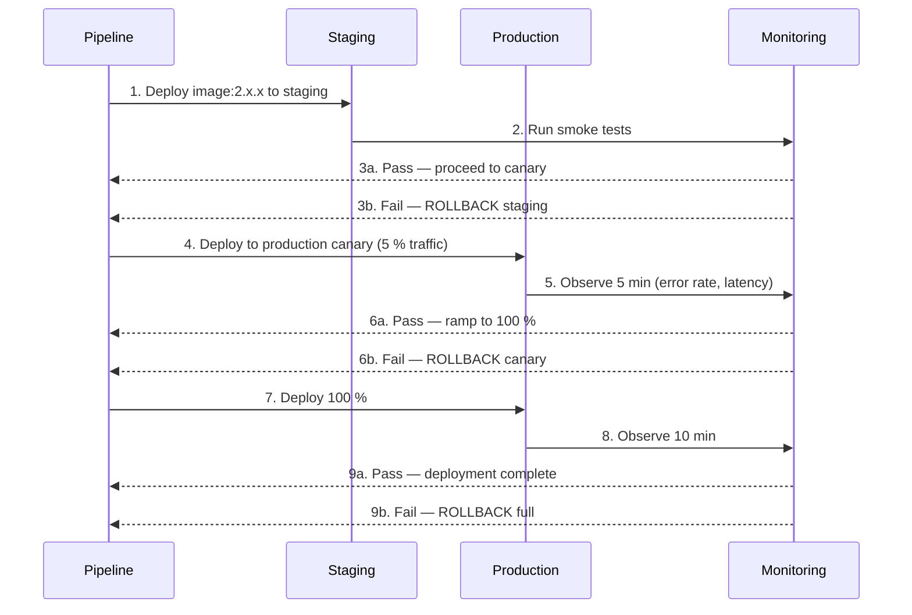
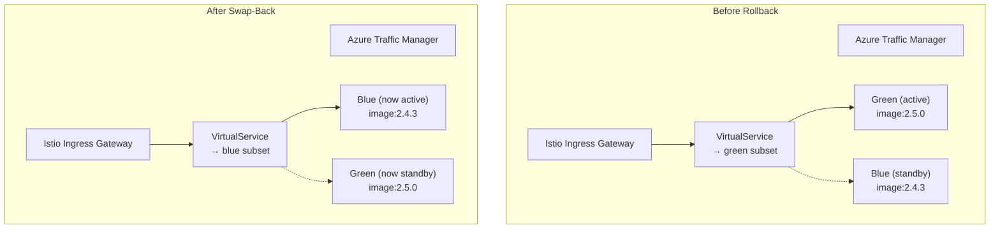

# Rollback Runbook — Users Service

**Owner:** Platform Engineering Team
**On-Call:** `#platform-sre`
**Version:** 1.0.0
**Last Updated:** 2026-07-26

## Purpose

This runbook describes the procedures for rolling back a failed deployment of the Users Service. Rollbacks restore a known-good state and minimise the impact window for service consumers. Two paths are covered:

- **Automated rollback** — triggered by the CI/CD pipeline when health checks or smoke tests fail.
- **Manual rollback** — initiated by an on-call engineer when a defect escapes pipeline detection.

---

## Table of Contents

1. [Rollback Triggers](#1-rollback-triggers)
2. [Automated Rollback](#2-automated-rollback)
3. [Manual Rollback via Blue/Green Swap-Back](#3-manual-rollback-via-bluegreen-swap-back)
4. [Database Migration Rollback Considerations](#4-database-migration-rollback-considerations)
5. [Verification Steps](#5-verification-steps)
6. [Post-Rollback Tasks](#6-post-rollback-tasks)
7. [Escalation](#7-escalation)
8. [Appendix: Blue/Green Architecture Reference](#8-appendix-bluegreen-architecture-reference)

---

## 1. Rollback Triggers

### 1.1 Automated Triggers (Pipeline-Initiated)

The Azure DevOps pipeline initiates an automatic rollback when **any** of the following conditions are met during a deployment:

| Trigger | Source | Description |
|---|---|---|
| `readiness-failure` | Kubernetes readiness probe (`/api/health/ready`) | New pods fail to become ready within 5 minutes of deployment rollout |
| `smoke-test-failure` | Post-deployment smoke test suite | End-to-end health, list, and create operations fail in the canary or staging environment |
| `error-rate-breach` | Grafana / Prometheus | HTTP 5xx rate exceeds 1 % over a 2-minute window for the new revision |
| `latency-breach` | Grafana / Prometheus | p99 latency exceeds 1 000 ms (baseline + 3 sigma) for the new revision |
| `istio-error-rate` | Istio telemetry | Destination rule error rate exceeds 2 % for canary subset |
| `db-migration-failure` | Pipeline job (custom step) | Database migration step exits with a non-zero code or reports a failed migration |

### 1.2 Manual Triggers (Engineer-Initiated)

The on-call engineer should initiate a manual rollback when:

| Trigger | Detection Method | Example |
|---|---|---|
| Functional defect | User-reported, automated test gap | `POST /api/users` creates records with missing required fields |
| Data corruption | Monitoring, support ticket | Batch update sets incorrect `tenant_id` on existing users |
| Silent failure | Metrics drop, no errors surfaced | Events not consumed, last_login_at not updating |
| Security incident | Vulnerability report, audit finding | New code exposes PII in response bodies |
| Dependency regression | Downstream service alert | Service fails to communicate with Auth Service after a dependency version change |
| Performance regression | Latency or throughput monitoring | Gradual degradation over minutes to hours post-deploy |
| Partial rollout failure | Istio canary metrics | Canary subset passes smoke tests but shows elevated error rate at 5 % traffic |

Rollback is always preferred over a forward fix when the defect has a high blast radius, blocks automated pipelines, or involves data integrity. Forward fixes are acceptable only for low-severity, non-functional defects (e.g. incorrect log level, cosmetics).

### 1.3 Decision Matrix

| Severity | Rollback Window | Action |
|---|---|---|
| **Critical** (P0) — data loss, complete outage, security breach | Immediate | Roll back both application and database. Notify incident commander. |
| **High** (P1) — majority of users affected, core feature broken | < 30 minutes | Roll back application. Assess database migration rollback. |
| **Medium** (P2) — subset affected, non-critical path | < 2 hours | Roll back. May forward-fix instead if confidence is high. |
| **Low** (P3) — cosmetic, observability gaps | Next business day | Forward-fix. No rollback required. |

---

## 2. Automated Rollback

### 2.1 Pipeline Rollback Flow

The deployment pipeline (defined in `azure-pipelines.yml`) follows a **progressive delivery** model: staging canary, staging full, production canary, production full. Each phase runs automated validation; failure at any phase triggers an automated rollback of that phase.



### 2.2 Automated Rollback Procedure

The pipeline handles rollback automatically. The on-call engineer should **verify** the rollback completed successfully and perform the [verification steps](#5-verification-steps).

**Pipeline-initiated rollback steps:**

1. Pipeline detects failure condition (smoke test, health check, or metric breach).
2. Pipeline records the failing revision and the reason in the deployment log.
3. Pipeline reverts the Kubernetes `Deployment` image tag to the previous known-good version.
4. If a database migration was applied in the same pipeline run, the pipeline executes the rollback migration (if one was provided) **unless** the rollback is automatic without engineer review — see section 4.
5. Pipeline waits up to 5 minutes for all pods to stabilise on the previous revision.
6. Pipeline re-runs the smoke test suite against the rolled-back revision.
7. Pipeline notifies `#platform-sre` with the rollback summary.
8. Pipeline leaves the deployment in a blocked state so a new deployment requires explicit approval.

### 2.3 Viewing the Rollback Status

```bash
# Check current deployment revision
kubectl rollout status deployment/users-service -n platform

# View rollout history
kubectl rollout history deployment/users-service -n platform

# Check which pods are on which revision
kubectl get pods -n platform -l app=users-service -o wide \
  --sort-by=.metadata.annotations['deployment\.kubernetes\.io/revision']

# Verify the deployed image tag
kubectl get deployment users-service -n platform -o jsonpath='{.spec.template.spec.containers[0].image}'

# Check event log for rollback events
kubectl describe deployment users-service -n platform | grep -A10 Events
```

---

## 3. Manual Rollback via Blue/Green Swap-Back

The Users Service deploys on AKS with an **Istio-based blue/green deployment model**. At any time two revisions coexist:

- **Green (active)** — serving production traffic.
- **Blue (standby)** — running the previous stable revision, idle but ready.

This architecture enables instant swap-back without re-pulling images or restarting pods.



### 3.1 Prerequisites

- Access to the Kubernetes cluster (`kubectl` with `platform` context).
- The **blue** (standby) subset must be healthy and running the previous stable revision.
- Confirm blue subset readiness before switching:

```bash
kubectl get pods -n platform -l app=users-service,subset=blue
kubectl wait --for=condition=Ready pods \
  -n platform -l app=users-service,subset=blue --timeout=120s
```

### 3.2 Swap-Back Procedure

**Step 1: Identify the current active subset.**

```bash
kubectl get virtualservice users-service -n platform \
  -o jsonpath='{.spec.http[0].route[0].destination.subset}'
```

Output indicates `green` or `blue`.

**Step 2: Record the current state.**

```bash
ROLLBACK_TIME=$(date -u +"%Y-%m-%dT%H:%M:%SZ")
echo "Rollback initiated at: ${ROLLBACK_TIME}"
kubectl get virtualservice users-service -n platform -o yaml > /tmp/vs-backup.yaml
```

**Step 3: Perform the swap.**

Patch the VirtualService to route 100 % traffic to the standby subset:

```bash
# If green is active, route to blue:
kubectl patch virtualservice users-service -n platform --type=json \
  -p='[{"op": "replace", "path": "/spec/http/0/route/0/destination/subset", "value": "blue"}]'

# If blue is active, route to green:
kubectl patch virtualservice users-service -n platform --type=json \
  -p='[{"op": "replace", "path": "/spec/http/0/route/0/destination/subset", "value": "green"}]'
```

**Step 4: Verify the swap.**

```bash
# Confirm the active subset changed
kubectl get virtualservice users-service -n platform \
  -o jsonpath='{.spec.http[0].route[0].destination.subset}'

# Confirm pods on the now-active subset are ready
kubectl get pods -n platform -l app=users-service,subset=blue \
  -o jsonpath='{.items[*].status.conditions[?(@.type=="Ready")].status}'
```

**Step 5: Run verification checks.**

Follow the [verification steps](#5-verification-steps) below.

**Step 6: Log the rollback.**

```bash
echo "Rollback ${ROLLBACK_TIME}: Switched from active-subset to standby-subset" \
  | kubectl annotate deployment users-service -n platform \
    rollback-history="$(date -u +%Y%m%dT%H%M%SZ)-manual"
```

### 3.3 Emergency Rollback (Direct) via Kubernetes Rollout Undo

If the blue subset is unavailable or was also overwritten in the deployment (e.g. image tag was applied to both subsets), use `kubectl rollout undo` instead:

```bash
# Rollback to the previous revision
kubectl rollout undo deployment/users-service -n platform

# Rollback to a specific revision
kubectl rollout undo deployment/users-service -n platform --to-revision=<N>
```

Wait for pods to stabilise:

```bash
kubectl rollout status deployment/users-service -n platform --timeout=300s
```

This method triggers a rolling update and is slower than a blue/green swap-back. It is the **fallback** when the blue/green model is compromised.

---

## 4. Database Migration Rollback Considerations

### 4.1 Migration Strategy

Database migrations for the Users Service follow **expand-contract (expand-migrate-contract)** pattern. Every migration must be backward-compatible for at least two deployment cycles.

| Phase | Action | Backward Compatible | Rollback Required |
|---|---|---|---|
| **Expand** | Add new columns/tables, mark as nullable or use defaults | Yes | No (just leave) |
| **Migrate** | Backfill data, populate new columns | Yes | Re-run old code (no-op) |
| **Contract** | Remove old columns/indexes | No | YES — must rollback migration |

Migrations that involve data transformation (backfill, normalisation, deduplication) **must** ship with an explicit down-migration. The pipeline enforces this via:

```yaml
# azure-pipelines.yml (standard migration step)
- task: DbMigration@1
  inputs:
    connectionString: $(DbConnectionString)
    migrationPath: 'src/UsersService/Migrations'
    rollbackScriptPath: 'src/UsersService/Migrations/Rollback'
  condition: succeeded()
```

### 4.2 When to Roll Back a Database Migration

| Condition | Rollback Database? | Rationale |
|---|---|---|
| Application rolled back within 10 minutes of deploy | Yes | Changes are recent; no data has been written using new schema in production |
| Application rolled back > 1 hour after deploy | Assess | Production data may already exist in new columns; a blind rollback could delete data |
| Application rolled back but schema change is additive (new column, nullable) | No | Additive changes are harmless; leave schema in place |
| Migration is in **contract** phase (removing a column or table) | YES — always | The old application code references the removed schema; it will fail |
| Data was backfilled as part of the migration | Assess | Backfill data may be consumed by the old application during rollback; verify function first |

### 4.3 Database Rollback Procedure

**Step 1: Identify which migrations were applied in the current deployment.**

```sql
SELECT version_name, applied_at
FROM public.schema_migrations
WHERE applied_at > NOW() - INTERVAL '2 hours'
ORDER BY applied_at DESC;
```

**Step 2: Run the down-migration.**

```bash
# Using the EF Core / custom migration tool
dotnet ef migrations remove --project src/UsersService --context UsersDbContext

# OR run the hand-written rollback script (preferred for production):
PGPASSWORD=$(kubectl get secret users-db-connection -n platform \
  -o jsonpath='{.data.value}' | base64 -d)

psql "$PGPASSWORD" -f src/UsersService/Migrations/Rollback/$(VERSION)_down.sql
```

**Step 3: Verify schema integrity.**

```sql
-- Confirm the schema matches the previous known-good state
SELECT table_name, column_name, is_nullable, data_type
FROM information_schema.columns
WHERE table_schema = 'public'
ORDER BY table_name, ordinal_position;
```

**Step 4: Verify application connectivity.**

```bash
# Check readiness probe passes
curl -sf https://users.internal.platform/api/health/ready | jq .
```

### 4.4 Migrations That CANNOT Be Rolled Back

Certain irreversible operations require a **forward fix** rather than a rollback:

| Operation | Reason | Mitigation |
|---|---|---|
| `DROP COLUMN` (data already purged by Azure Backup retention) | Data no longer exists to restore | Restore from point-in-time backup before rolling back the application |
| `ALTER COLUMN ... SET NOT NULL` (with data loss) | Existing NULLs have been replaced | Forward fix: alter back to nullable, restore cleared values from audit log |
| Data encryption / PII hashing | Irreversible transform | Maintain a mapping table; reverse-transform via support script |
| Large table re-indexing | Cannot revert index rebuild | Forward fix or drop/recreate old index |

If a migration is irreversible, the rollback plan **must** be assessed by the Platform Engineering lead before proceeding. Contact `#platform-eng` immediately.

### 4.5 Point-in-Time Recovery (PiTR) as Last Resort

If a migration has corrupted data and cannot be rolled back cleanly, restore the database from Azure Point-in-Time Backup:

```bash
# 1. Trigger PiTR via Azure CLI
az postgres flexible-server restore \
  --source-server users-db-platform \
  --restore-time "$(date -u -d '30 minutes ago' +%Y-%m-%dT%H:%M:%SZ)" \
  --name users-db-platform-pitr \
  --resource-group platform-rg

# 2. Update the connection string in Key Vault to point at the restored instance
az keyvault secret set \
  --vault-name platform-kv \
  --name users-db-connection \
  --value "Host=users-db-platform-pitr.postgres.database.azure.com;..."

# 3. Roll back the application (restore old image or blue/green swap)
kubectl set image deployment/users-service -n platform \
  users-api=acrplatform.azurecr.io/users-service:2.4.3

# 4. Verify and re-point to original DB after confirmation
```

**PiTR is a P0 procedure.** Notify `#platform-sre` and the incident commander before proceeding.

---

## 5. Verification Steps

After any rollback (automated or manual), verify the service is healthy and fully functional.

### 5.1 Health Probe Verification

```bash
# Liveness — service process is alive
curl -sf https://users.internal.platform/api/health/live | jq .

# Readiness — all dependencies reachable
curl -sf https://users.internal.platform/api/health/ready | jq .
```

Expected output for `/api/health/ready`:

```json
{
  "status": "Healthy",
  "checks": [
    { "name": "database",     "status": "Healthy", "latencyMs": 3 },
    { "name": "auth-service", "status": "Healthy", "latencyMs": 7 },
    { "name": "service-bus",  "status": "Healthy", "latencyMs": 12 }
  ],
  "timestamp": "2026-07-26T14:30:00Z"
}
```

### 5.2 Functional Verification

Execute the smoke test suite:

```bash
# Run the smoke tests targeting the production endpoint
dotnet test tests/SmokeTests/SmokeTests.csproj \
  --filter "Category=Smoke" \
  --environment SMOKE_TEST_BASE_URL=https://users.internal.platform

# Or via the pipeline smoke-test job
az pipelines run --definition-id 101 \
  --parameters smokeOnly=true targetEnv=production
```

Minimum smoke test coverage:

| Test | What It Validates |
|---|---|
| `GET /api/health/ready` returns 200 | Service is ready to serve traffic |
| `GET /api/users` returns 200 + paginated results | API is functional, auth is working |
| `GET /api/users/{id}` returns a valid user | Read path works for a known user |
| `POST /api/users` returns 201 | Write path works |
| `PUT /api/users/{id}` returns 200 | Update path works |
| `DELETE /api/users/{id}` returns 204 | Soft-delete path works |
| Auth Service fallback: rate-limit JWKS calls | Resilience path functions |
| Event consumer: service bus messages processed | Async processing is operational |

### 5.3 Monitoring Verification

Check dashboards for stability over a 5-to-15-minute observation window:

| Dashboard | Metric | Acceptable Threshold |
|---|---|---|
| [Grafana: users-service](https://grafana.internal/d/users/users-service) | HTTP 5xx rate | < 0.1 % |
| [Grafana: users-service](https://grafana.internal/d/users/users-service) | p99 latency | < 500 ms |
| [Grafana: users-service](https://grafana.internal/d/users/users-service) | Event consumer lag | < 100 messages |
| [Grafana: users-service](https://grafana.internal/d/users/users-service) | Pod CPU / memory | Within requests/limits |
| Istio dashboard | Error rate per subset | < 0.5 % |
| Azure Monitor | PostgreSQL connections | < 80 % of max |
| Azure Monitor | Service Bus dead-letter queue | 0 messages |

### 5.4 Data Integrity Verification

If the rollback involved a database change, run the integrity checks:

```sql
-- Verify no orphaned records
SELECT COUNT(*) FROM users WHERE tenant_id IS NULL;

-- Verify audit log is continuous (no gaps after rollback)
SELECT date_trunc('hour', performed_at) AS hour, COUNT(*)
FROM audit_log
WHERE performed_at > NOW() - INTERVAL '2 hours'
GROUP BY hour ORDER BY hour;

-- Verify event deduplication table is populated for recent events
SELECT COUNT(*) FROM event_deduplication
WHERE processed_at > NOW() - INTERVAL '30 minutes';
```

---

## 6. Post-Rollback Tasks

### 6.1 Communicate the Rollback

| Channel | Recipient | Message |
|---|---|---|
| `#platform-sre` | On-call team | Rollback completed: revision, time, reason, verification status |
| `#platform-eng` | Engineering team | Rollback summary and link to the pipeline run |
| PagerDuty incident | Incident timeline | Update incident log with rollback actions taken |
| Backstage | Catalog | Update deployment status if applicable |

### 6.2 Preserve Forensic Evidence

```bash
# Save the failed revision logs for root-cause analysis
kubectl logs -n platform -l app=users-service \
  --tail=5000 --prefix > /tmp/users-service-failed-logs-$(date +%Y%m%d).txt

# Capture the deployment history
kubectl rollout history deployment/users-service -n platform \
  -o yaml > /tmp/users-service-rollout-history-$(date +%Y%m%d).yaml

# Save the failed image tag and manifest
kubectl get deployment users-service -n platform -o yaml \
  > /tmp/users-service-deployment-$(date +%Y%m%d).yaml
```

### 6.3 Root Cause Analysis

Create a blameless post-mortem ticket:

- Link to the failed pipeline run and rollback log.
- Document what triggered the rollback.
- Attach relevant monitoring screenshots or log extracts.
- Propose a preventive action (additional smoke test, stricter pipeline gate, monitoring enhancement).
- Schedule a review in the next Platform Engineering sprint.

### 6.4 Restore Normal Deployment Flow

- If the pipeline is in a blocked state, unblock it after the root cause is addressed.
- The next deployment must include a fix and pass all gates from scratch. Incremental or partial retries are not permitted.
- Update the changelog and release notes to reflect the rollback.

---

## 7. Escalation

| Scenario | Contact | SLA |
|---|---|---|
| Blue/green swap fails | `#platform-sre` | 15 min |
| Database rollback fails | `#platform-eng` + `#dba` | 15 min |
| Irreversible migration detected | `#platform-eng` lead | Immediate |
| PiTR required | `#platform-sre` + Incident Commander | Immediate |
| Rollback introduces a new issue | `#platform-sre` (re-rollback) | Immediate |
| Unsure whether to roll back | `#platform-sre` + escalate to `#platform-eng` lead | 10 min |

---

## 8. Appendix: Blue/Green Architecture Reference

### 8.1 Istio VirtualService Excerpt

```yaml
apiVersion: networking.istio.io/v1beta1
kind: VirtualService
metadata:
  name: users-service
  namespace: platform
spec:
  hosts:
    - users.internal.platform
  http:
    - match:
        - uri:
            prefix: /api
      route:
        - destination:
            host: users-service.platform.svc.cluster.local
            subset: green   # active traffic subset
          weight: 100
      retries:
        attempts: 3
        perTryTimeout: 2s
      fault:
        abort:
          percentage:
            value: 0
          httpStatus: 503
```

### 8.2 DestinationRule Excerpt

```yaml
apiVersion: networking.istio.io/v1beta1
kind: DestinationRule
metadata:
  name: users-service
  namespace: platform
spec:
  host: users-service.platform.svc.cluster.local
  trafficPolicy:
    loadBalancer:
      simple: ROUND_ROBIN
    connectionPool:
      http:
        http1MaxPendingRequests: 1024
        maxRequestsPerConnection: 10
    outlierDetection:
      consecutive5xxErrors: 5
      interval: 30s
      baseEjectionTime: 60s
  subsets:
    - name: green
      labels:
        app: users-service
        version: green
    - name: blue
      labels:
        app: users-service
        version: blue
```

### 8.3 Key Labels

| Label | Value | Purpose |
|---|---|---|
| `app` | `users-service` | Selector for the service |
| `version` | `green` / `blue` | Istio subset routing |
| `subset` | `green` / `blue` | Aligned with `version` for operational clarity |

### 8.4 Related Documents

- [Deployment View](../architecture/deployment-view.md)
- [Deployment Runbook](deployment.md)
- [Incident Response Runbook](incident-response.md)
- [Observability Standards](../decisions/observability.md)
- [Monitoring & SLOs](../decisions/monitoring.md)
