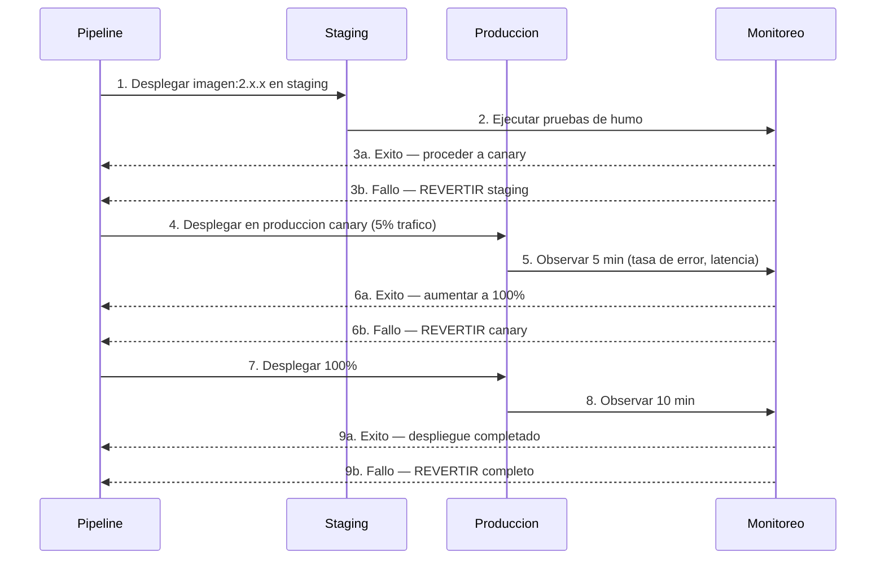
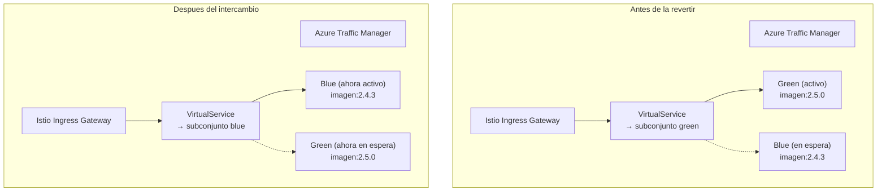

# Runbook de revertir -- Users Service

**Propietario:** Equipo de Ingenieria de Plataforma
**Guardia:** `#platform-sre`
**Version:** 1.0.0
**Ultima actualizacion:** 2026-07-26

## Proposito

Este runbook describe los procedimientos para revertir un despliegue fallido del Users Service. Las reversiones restauran un estado conocido como bueno y minimizan la ventana de impacto para los consumidores del servicio. Se cubren dos caminos:

- **Revertir automatizado** — activado por el pipeline CI/CD cuando fallan las verificaciones de salud o las pruebas de humo.
- **Revertir manual** — iniciado por un ingeniero de guardia cuando un defecto escapa a la deteccion del pipeline.

---

## Tabla de Contenidos

1. [Disparadores de revertir](#1-disparadores-de-revertir)
2. [Revertir automatizado](#2-revertir-automatizado)
3. [Revertir manual mediante intercambio Blue/Green](#3-revertir-manual-mediante-intercambio-bluegreen)
4. [Consideraciones de revertir de migracion de base de datos](#4-consideraciones-de-revertir-de-migracion-de-base-de-datos)
5. [Pasos de verificacion](#5-pasos-de-verificacion)
6. [Tareas posteriores a la revertir](#6-tareas-posteriores-a-la-revertir)
7. [Escalamiento](#7-escalamiento)
8. [Apendice: Referencia de arquitectura Blue/Green](#8-apendice-referencia-de-arquitectura-bluegreen)

---

## 1. Disparadores de revertir

### 1.1 Disparadores automatizados (iniciados por el pipeline)

El pipeline de Azure DevOps inicia una revertir automatica cuando se cumple **cualquiera** de las siguientes condiciones durante un despliegue:

| Disparador | Origen | Descripcion |
|---|---|---|
| `readiness-failure` | Sonda de readiness de Kubernetes (`/api/health/ready`) | Los nuevos pods no logran estar listos dentro de los 5 minutos posteriores al despliegue |
| `smoke-test-failure` | Suite de pruebas de humo posteriores al despliegue | Las operaciones de salud, listado y creacion de extremo a extremo fallan en el entorno canary o staging |
| `error-rate-breach` | Grafana / Prometheus | La tasa de HTTP 5xx supera el 1% en una ventana de 2 minutos para la nueva revision |
| `latency-breach` | Grafana / Prometheus | La latencia p99 supera los 1,000 ms (linea base + 3 sigma) para la nueva revision |
| `istio-error-rate` | Telemetria de Istio | La tasa de error de la regla de destino supera el 2% para el subconjunto canary |
| `db-migration-failure` | Trabajo del pipeline (paso personalizado) | El paso de migracion de base de datos sale con codigo no cero o reporta una migracion fallida |

### 1.2 Disparadores manuales (iniciados por el ingeniero)

El ingeniero de guardia debe iniciar una revertir manual cuando:

| Disparador | Metodo de deteccion | Ejemplo |
|---|---|---|
| Defecto funcional | Reportado por usuario, brecha en prueba automatizada | `POST /api/users` crea registros con campos requeridos faltantes |
| Corrupcion de datos | Monitoreo, ticket de soporte | Actualizacion por lotes establece `tenant_id` incorrecto en usuarios existentes |
| Falla silenciosa | Caida de metricas, sin errores superficiales | Eventos no consumidos, `last_login_at` no se actualiza |
| Incidente de seguridad | Informe de vulnerabilidad, hallazgo de auditoria | Nuevo codigo expone PII en cuerpos de respuesta |
| Regression de dependencia | Alerta de servicio posterior | El servicio falla al comunicarse con Auth Service despues de un cambio de version de dependencia |
| Regression de rendimiento | Monitoreo de latencia o rendimiento | Degradacion gradual durante minutos a horas post-despliegue |
| Falla de despliegue parcial | Metricas canary de Istio | El subconjunto canary pasa pruebas de humo pero muestra tasa de error elevada con 5% de trafico |

La revertir siempre se prefiere sobre una correccion directa cuando el defecto tiene un alto radio de explosion, bloquea pipelines automatizados o involucra integridad de datos. Las correcciones directas son aceptables solo para defectos no funcionales de baja severidad (ej., nivel de log incorrecto, cosmeticos).

### 1.3 Matriz de decision

| Severidad | Ventana de revertir | Accion |
|---|---|---|
| **Critica** (P0) — perdida de datos, interrupcion total, brecha de seguridad | Inmediata | Revertir tanto la aplicacion como la base de datos. Notificar al comandante de incidente. |
| **Alta** (P1) — mayoria de usuarios afectados, funcionalidad principal rota | < 30 minutos | Revertir la aplicacion. Evaluar revertir de migracion de base de datos. |
| **Media** (P2) — subconjunto afectado, ruta no critica | < 2 horas | Revertir. Puede corregir directamente si la confianza es alta. |
| **Baja** (P3) — cosmetico, brechas de observabilidad | Siguiente dia habil | Corregir directamente. No se requiere revertir. |

---

## 2. Revertir automatizado

### 2.1 Flujo de revertir del pipeline

El pipeline de despliegue (definido en `azure-pipelines.yml`) sigue un modelo de **entrega progresiva**: staging canary, staging completo, produccion canary, produccion completo. Cada fase ejecuta validacion automatizada; el fallo en cualquier fase activa una revertir automatizada de esa fase.



### 2.2 Procedimiento de revertir automatizado

El pipeline maneja la revertir automaticamente. El ingeniero de guardia debe **verificar** que la revertir se completo exitosamente y realizar los [pasos de verificacion](#5-pasos-de-verificacion).

**Pasos de revertir iniciados por el pipeline:**

1. El pipeline detecta la condicion de fallo (prueba de humo, verificacion de salud o violacion de metrica).
2. El pipeline registra la revision fallida y el motivo en el log de despliegue.
3. El pipeline revierte la etiqueta de imagen del `Deployment` de Kubernetes a la version buena conocida anterior.
4. Si se aplico una migracion de base de datos en la misma ejecucion del pipeline, el pipeline ejecuta la migracion de revertir (si se proporciono una) **a menos** que la revertir sea automatica sin revision del ingeniero — ver seccion 4.
5. El pipeline espera hasta 5 minutos para que todos los pods se estabilicen en la revision anterior.
6. El pipeline vuelve a ejecutar la suite de pruebas de humo contra la revision revertida.
7. El pipeline notifica a `#platform-sre` con el resumen de la revertir.
8. El pipeline deja el despliegue en un estado bloqueado para que un nuevo despliegue requiera aprobacion explicita.

### 2.3 Visualizar el estado de la revertir

```bash
# Verificar la revision actual del despliegue
kubectl rollout status deployment/users-service -n platform

# Ver el historial de despliegues
kubectl rollout history deployment/users-service -n platform

# Verificar que pods estan en que revision
kubectl get pods -n platform -l app=users-service -o wide \
  --sort-by=.metadata.annotations['deployment\.kubernetes\.io/revision']

# Verificar la etiqueta de imagen desplegada
kubectl get deployment users-service -n platform -o jsonpath='{.spec.template.spec.containers[0].image}'

# Verificar el log de eventos para eventos de revertir
kubectl describe deployment users-service -n platform | grep -A10 Events
```

---

## 3. Revertir manual mediante intercambio Blue/Green

El Users Service se despliega en AKS con un **modelo de despliegue blue/green basado en Istio**. En cualquier momento coexisten dos revisiones:

- **Green (activo)** — sirviendo trafico de produccion.
- **Blue (en espera)** — ejecutando la revision estable anterior, inactivo pero listo.

Esta arquitectura permite el intercambio instantaneo sin necesidad de volver a extraer imagenes o reiniciar pods.



### 3.1 Requisitos previos

- Acceso al cluster de Kubernetes (`kubectl` con contexto `platform`).
- El subconjunto **blue** (en espera) debe estar saludable y ejecutando la revision estable anterior.
- Confirmar la preparacion del subconjunto blue antes de cambiar:

```bash
kubectl get pods -n platform -l app=users-service,subset=blue
kubectl wait --for=condition=Ready pods \
  -n platform -l app=users-service,subset=blue --timeout=120s
```

### 3.2 Procedimiento de intercambio

**Paso 1: Identificar el subconjunto activo actual.**

```bash
kubectl get virtualservice users-service -n platform \
  -o jsonpath='{.spec.http[0].route[0].destination.subset}'
```

La salida indica `green` o `blue`.

**Paso 2: Registrar el estado actual.**

```bash
ROLLBACK_TIME=$(date -u +"%Y-%m-%dT%H:%M:%SZ")
echo "Revertir iniciada en: ${ROLLBACK_TIME}"
kubectl get virtualservice users-service -n platform -o yaml > /tmp/vs-backup.yaml
```

**Paso 3: Realizar el intercambio.**

Modificar el VirtualService para enrutar el 100% del trafico al subconjunto en espera:

```bash
# Si green esta activo, enrutar a blue:
kubectl patch virtualservice users-service -n platform --type=json \
  -p='[{"op": "replace", "path": "/spec/http/0/route/0/destination/subset", "value": "blue"}]'

# Si blue esta activo, enrutar a green:
kubectl patch virtualservice users-service -n platform --type=json \
  -p='[{"op": "replace", "path": "/spec/http/0/route/0/destination/subset", "value": "green"}]'
```

**Paso 4: Verificar el intercambio.**

```bash
# Confirmar que el subconjunto activo cambio
kubectl get virtualservice users-service -n platform \
  -o jsonpath='{.spec.http[0].route[0].destination.subset}'

# Confirmar que los pods en el subconjunto ahora activo estan listos
kubectl get pods -n platform -l app=users-service,subset=blue \
  -o jsonpath='{.items[*].status.conditions[?(@.type=="Ready")].status}'
```

**Paso 5: Ejecutar verificaciones.**

Seguir los [pasos de verificacion](#5-pasos-de-verificacion) a continuacion.

**Paso 6: Registrar la revertir.**

```bash
echo "Revertir ${ROLLBACK_TIME}: Cambiado de subconjunto activo a subconjunto en espera" \
  | kubectl annotate deployment users-service -n platform \
    rollback-history="$(date -u +%Y%m%dT%H%M%SZ)-manual"
```

### 3.3 Revertir de emergencia (directa) mediante Kubernetes Rollout Undo

Si el subconjunto blue no esta disponible o tambien fue sobrescrito en el despliegue (ej., la etiqueta de imagen se aplico a ambos subconjuntos), usar `kubectl rollout undo` en su lugar:

```bash
# Revertir a la revision anterior
kubectl rollout undo deployment/users-service -n platform

# Revertir a una revision especifica
kubectl rollout undo deployment/users-service -n platform --to-revision=<N>
```

Esperar a que los pods se estabilicen:

```bash
kubectl rollout status deployment/users-service -n platform --timeout=300s
```

Este metodo activa una actualizacion gradual y es mas lento que un intercambio blue/green. Es el **plan de respaldo** cuando el modelo blue/green esta comprometido.

---

## 4. Consideraciones de revertir de migracion de base de datos

### 4.1 Estrategia de migracion

Las migraciones de base de datos para el Users Service siguen el patron de **expandir-contratar (expandir-migrar-contratar)**. Cada migracion debe ser compatible hacia atras durante al menos dos ciclos de despliegue.

| Fase | Accion | Compatible hacia atras | Revertir requerida |
|---|---|---|---|
| **Expandir** | Agregar nuevas columnas/tablas, marcar como anulables o usar valores predeterminados | Si | No (solo dejar) |
| **Migrar** | Rellenar datos, poblar nuevas columnas | Si | Re-ejecutar codigo antiguo (sin operacion) |
| **Contratar** | Eliminar columnas/indices antiguos | No | SI — debe revertir migracion |

Las migraciones que involucran transformacion de datos (relleno, normalizacion, deduplicacion) **deben** incluir una migracion de descenso explicita. El pipeline aplica esto mediante:

```yaml
# azure-pipelines.yml (paso de migracion estandar)
- task: DbMigration@1
  inputs:
    connectionString: $(DbConnectionString)
    migrationPath: 'src/UsersService/Migrations'
    rollbackScriptPath: 'src/UsersService/Migrations/Rollback'
  condition: succeeded()
```

### 4.2 Cuando revertir una migracion de base de datos

| Condicion | Revertir base de datos? | Justificacion |
|---|---|---|
| Aplicacion revertida dentro de los 10 minutos posteriores al despliegue | Si | Los cambios son recientes; no se han escrito datos usando el nuevo esquema en produccion |
| Aplicacion revertida > 1 hora despues del despliegue | Evaluar | Los datos de produccion ya pueden existir en nuevas columnas; una revertir ciega podria eliminar datos |
| Aplicacion revertida pero el cambio de esquema es aditivo (nueva columna, anulable) | No | Los cambios aditivos son inofensivos; dejar el esquema en su lugar |
| La migracion esta en fase de **contratar** (eliminando una columna o tabla) | SI — siempre | El codigo de aplicacion antiguo referencia el esquema eliminado; fallara |
| Los datos fueron rellenados como parte de la migracion | Evaluar | Los datos rellenados pueden ser consumidos por la aplicacion antigua durante la revertir; verificar funcion primero |

### 4.3 Procedimiento de revertir de base de datos

**Paso 1: Identificar que migraciones se aplicaron en el despliegue actual.**

```sql
SELECT version_name, applied_at
FROM public.schema_migrations
WHERE applied_at > NOW() - INTERVAL '2 hours'
ORDER BY applied_at DESC;
```

**Paso 2: Ejecutar la migracion de descenso.**

```bash
# Usando EF Core / herramienta de migracion personalizada
dotnet ef migrations remove --project src/UsersService --context UsersDbContext

# O ejecutar el script de revertir escrito a mano (preferido para produccion):
PGPASSWORD=$(kubectl get secret users-db-connection -n platform \
  -o jsonpath='{.data.value}' | base64 -d)

psql "$PGPASSWORD" -f src/UsersService/Migrations/Rollback/$(VERSION)_down.sql
```

**Paso 3: Verificar la integridad del esquema.**

```sql
-- Confirmar que el esquema coincide con el estado bueno conocido anterior
SELECT table_name, column_name, is_nullable, data_type
FROM information_schema.columns
WHERE table_schema = 'public'
ORDER BY table_name, ordinal_position;
```

**Paso 4: Verificar la conectividad de la aplicacion.**

```bash
# Verificar que la sonda de readiness pase
curl -sf https://users.internal.platform/api/health/ready | jq .
```

### 4.4 Migraciones que NO se pueden revertir

Ciertas operaciones irreversibles requieren una **correccion directa** en lugar de una revertir:

| Operacion | Motivo | Mitigacion |
|---|---|---|
| `DROP COLUMN` (datos ya purgados por retencion de Azure Backup) | Los datos ya no existen para restaurar | Restaurar desde copia de seguridad de punto en el tiempo antes de revertir la aplicacion |
| `ALTER COLUMN ... SET NOT NULL` (con perdida de datos) | Los NULL existentes han sido reemplazados | Correccion directa: alterar de vuelta a anulable, restaurar valores eliminados del log de auditoria |
| Cifrado de datos / hash de PII | Transformacion irreversible | Mantener una tabla de mapeo; revertir transformacion mediante script de soporte |
| Re-indexacion de tabla grande | No se puede revertir la reconstruccion de indice | Correccion directa o eliminar/volver a crear el indice antiguo |

Si una migracion es irreversible, el plan de revertir **debe** ser evaluado por el lider de Ingenieria de Plataforma antes de proceder. Contactar a `#platform-eng` inmediatamente.

### 4.5 Recuperacion a un punto en el tiempo (PiTR) como ultimo recurso

Si una migracion ha corrompido datos y no se puede revertir limpiamente, restaurar la base de datos desde la copia de seguridad de punto en el tiempo de Azure:

```bash
# 1. Activar PiTR mediante CLI de Azure
az postgres flexible-server restore \
  --source-server users-db-platform \
  --restore-time "$(date -u -d '30 minutes ago' +%Y-%m-%dT%H:%M:%SZ)" \
  --name users-db-platform-pitr \
  --resource-group platform-rg

# 2. Actualizar la cadena de conexion en Key Vault para apuntar a la instancia restaurada
az keyvault secret set \
  --vault-name platform-kv \
  --name users-db-connection \
  --value "Host=users-db-platform-pitr.postgres.database.azure.com;..."

# 3. Revertir la aplicacion (restaurar imagen antigua o intercambio blue/green)
kubectl set image deployment/users-service -n platform \
  users-api=acrplatform.azurecr.io/users-service:2.4.3

# 4. Verificar y volver a apuntar a la BD original despues de la confirmacion
```

**PiTR es un procedimiento P0.** Notificar a `#platform-sre` y al comandante de incidente antes de proceder.

---

## 5. Pasos de verificacion

Despues de cualquier revertir (automatizada o manual), verificar que el servicio este saludable y completamente funcional.

### 5.1 Verificacion de sondas de salud

```bash
# Liveness — el proceso del servicio esta vivo
curl -sf https://users.internal.platform/api/health/live | jq .

# Readiness — todas las dependencias accesibles
curl -sf https://users.internal.platform/api/health/ready | jq .
```

Salida esperada para `/api/health/ready`:

```json
{
  "status": "Healthy",
  "checks": [
    { "name": "database",     "status": "Healthy", "latencyMs": 3 },
    { "name": "auth-service", "status": "Healthy", "latencyMs": 7 },
    { "name": "service-bus",  "status": "Healthy", "latencyMs": 12 }
  ],
  "timestamp": "2026-07-26T14:30:00Z"
}
```

### 5.2 Verificacion funcional

Ejecutar la suite de pruebas de humo:

```bash
# Ejecutar las pruebas de humo apuntando al endpoint de produccion
dotnet test tests/SmokeTests/SmokeTests.csproj \
  --filter "Category=Smoke" \
  --environment SMOKE_TEST_BASE_URL=https://users.internal.platform

# O mediante el trabajo de pruebas de humo del pipeline
az pipelines run --definition-id 101 \
  --parameters smokeOnly=true targetEnv=production
```

Cobertura minima de pruebas de humo:

| Prueba | Que valida |
|---|---|
| `GET /api/health/ready` devuelve 200 | El servicio esta listo para servir trafico |
| `GET /api/users` devuelve 200 + resultados paginados | La API es funcional, la autenticacion funciona |
| `GET /api/users/{id}` devuelve un usuario valido | La ruta de lectura funciona para un usuario conocido |
| `POST /api/users` devuelve 201 | La ruta de escritura funciona |
| `PUT /api/users/{id}` devuelve 200 | La ruta de actualizacion funciona |
| `DELETE /api/users/{id}` devuelve 204 | La ruta de eliminacion suave funciona |
| Respaldo de Auth Service: limitar llamadas JWKS | La ruta de resiliencia funciona |
| Consumidor de eventos: mensajes de service bus procesados | El procesamiento asincrono esta operativo |

### 5.3 Verificacion de monitoreo

Verificar dashboards para estabilidad durante una ventana de observacion de 5 a 15 minutos:

| Dashboard | Metrica | Umbral aceptable |
|---|---|---|
| [Grafana: users-service](https://grafana.internal/d/users/users-service) | Tasa de HTTP 5xx | < 0.1% |
| [Grafana: users-service](https://grafana.internal/d/users/users-service) | Latencia p99 | < 500 ms |
| [Grafana: users-service](https://grafana.internal/d/users/users-service) | Retraso del consumidor de eventos | < 100 mensajes |
| [Grafana: users-service](https://grafana.internal/d/users/users-service) | CPU / memoria del pod | Dentro de solicitudes/limites |
| Dashboard de Istio | Tasa de error por subconjunto | < 0.5% |
| Azure Monitor | Conexiones PostgreSQL | < 80% del maximo |
| Azure Monitor | Cola de mensajes fallidos de Service Bus | 0 mensajes |

### 5.4 Verificacion de integridad de datos

Si la revertir involucro un cambio de base de datos, ejecutar las verificaciones de integridad:

```sql
-- Verificar que no hay registros huerfanos
SELECT COUNT(*) FROM users WHERE tenant_id IS NULL;

-- Verificar que el log de auditoria es continuo (sin lagunas despues de la revertir)
SELECT date_trunc('hour', performed_at) AS hora, COUNT(*)
FROM audit_log
WHERE performed_at > NOW() - INTERVAL '2 hours'
GROUP BY hora ORDER BY hora;

-- Verificar que la tabla de deduplicacion de eventos esta poblada para eventos recientes
SELECT COUNT(*) FROM event_deduplication
WHERE processed_at > NOW() - INTERVAL '30 minutes';
```

---

## 6. Tareas posteriores a la revertir

### 6.1 Comunicar la revertir

| Canal | Destinatario | Mensaje |
|---|---|---|
| `#platform-sre` | Equipo de guardia | Revertir completada: revision, hora, motivo, estado de verificacion |
| `#platform-eng` | Equipo de ingenieria | Resumen de revertir y enlace a la ejecucion del pipeline |
| Incidente de PagerDuty | Linea de tiempo del incidente | Actualizar el log del incidente con las acciones de revertir tomadas |
| Backstage | Catalogo | Actualizar estado del despliegue si aplica |

### 6.2 Preservar evidencia forense

```bash
# Guardar los logs de la revision fallida para analisis de causa raiz
kubectl logs -n platform -l app=users-service \
  --tail=5000 --prefix > /tmp/users-service-failed-logs-$(date +%Y%m%d).txt

# Capturar el historial de despliegue
kubectl rollout history deployment/users-service -n platform \
  -o yaml > /tmp/users-service-rollout-history-$(date +%Y%m%d).yaml

# Guardar la etiqueta de imagen fallida y el manifiesto
kubectl get deployment users-service -n platform -o yaml \
  > /tmp/users-service-deployment-$(date +%Y%m%d).yaml
```

### 6.3 Analisis de causa raiz

Crear un ticket de autopsia sin culpa:

- Enlace a la ejecucion del pipeline fallida y el log de revertir.
- Documentar que desencadeno la revertir.
- Adjuntar capturas de pantalla de monitoreo relevantes o extractos de logs.
- Proponer una accion preventiva (prueba de humo adicional, compuerta de pipeline mas estricta, mejora de monitoreo).
- Programar una revision en el proximo sprint de Ingenieria de Plataforma.

### 6.4 Restaurar el flujo de despliegue normal

- Si el pipeline esta en estado bloqueado, desbloquearlo despues de que se aborde la causa raiz.
- El proximo despliegue debe incluir una correccion y pasar todas las compuertas desde cero. No se permiten reintentos incrementales o parciales.
- Actualizar el changelog y las notas de version para reflejar la revertir.

---

## 7. Escalamiento

| Escenario | Contacto | SLA |
|---|---|---|
| El intercambio blue/green falla | `#platform-sre` | 15 min |
| La revertir de base de datos falla | `#platform-eng` + `#dba` | 15 min |
| Migracion irreversible detectada | Lider de `#platform-eng` | Inmediato |
| PiTR requerido | `#platform-sre` + Comandante de incidente | Inmediato |
| La revertir introduce un nuevo problema | `#platform-sre` (re-revertir) | Inmediato |
| No esta seguro de si revertir | `#platform-sre` + escalar a lider de `#platform-eng` | 10 min |

---

## 8. Apendice: Referencia de arquitectura Blue/Green

### 8.1 Extracto de Istio VirtualService

```yaml
apiVersion: networking.istio.io/v1beta1
kind: VirtualService
metadata:
  name: users-service
  namespace: platform
spec:
  hosts:
    - users.internal.platform
  http:
    - match:
        - uri:
            prefix: /api
      route:
        - destination:
            host: users-service.platform.svc.cluster.local
            subset: green   # subconjunto de trafico activo
          weight: 100
      retries:
        attempts: 3
        perTryTimeout: 2s
      fault:
        abort:
          percentage:
            value: 0
          httpStatus: 503
```

### 8.2 Extracto de DestinationRule

```yaml
apiVersion: networking.istio.io/v1beta1
kind: DestinationRule
metadata:
  name: users-service
  namespace: platform
spec:
  host: users-service.platform.svc.cluster.local
  trafficPolicy:
    loadBalancer:
      simple: ROUND_ROBIN
    connectionPool:
      http:
        http1MaxPendingRequests: 1024
        maxRequestsPerConnection: 10
    outlierDetection:
      consecutive5xxErrors: 5
      interval: 30s
      baseEjectionTime: 60s
  subsets:
    - name: green
      labels:
        app: users-service
        version: green
    - name: blue
      labels:
        app: users-service
        version: blue
```

### 8.3 Etiquetas clave

| Etiqueta | Valor | Proposito |
|---|---|---|
| `app` | `users-service` | Selector para el servicio |
| `version` | `green` / `blue` | Enrutamiento de subconjuntos de Istio |
| `subset` | `green` / `blue` | Alineado con `version` para claridad operativa |

### 8.4 Documentos relacionados

- [Vista de despliegue](../architecture/deployment-view.md)
- [Runbook de despliegue](deployment.md)
- [Runbook de respuesta a incidentes](incident-response.md)
- [Estandares de observabilidad](../decisions/observability.md)
- [Monitoreo y SLOs](../decisions/monitoring.md)
