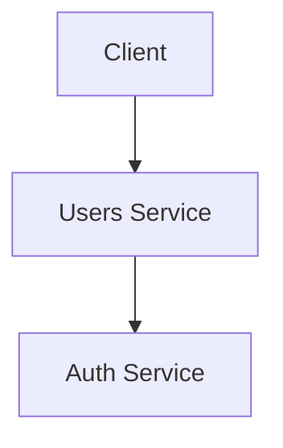

# Chunking Strategy

## Overview

Documents are split into semantically meaningful chunks for embedding and retrieval. The chunking strategy balances **context completeness** with **retrieval precision**.

## Chunk Parameters

| Parameter | Value | Rationale |
|---|---|---|
| **Max chunk size** | 1,024 tokens | Fits within embedding model context window with margin for query |
| **Overlap** | 128 tokens | Ensures context continuity across chunk boundaries |
| **Min chunk size** | 64 tokens | Prevents tiny fragments (e.g., single-sentence chunks) |

## Chunking by Document Type

| Document Type | Strategy | Chunk Boundary |
|---|---|---|
| Architecture docs | Section-based (`##` headers) | Each `##` section is a chunk |
| API Reference | Endpoint-based (`###` headers) | Each endpoint definition is a chunk |
| Runbooks | Procedure-based (`##` headers) | Each procedure step group is a chunk |
| ADRs | Document-level | Each ADR is one chunk (they are already concise) |
| Onboarding | Section-based (`##` headers) | Each section is a chunk |
| Decisions | Section-based (`##` headers) | Each section is a chunk |
| `openapi.yaml` | Path-based | Each path (endpoint) + its schema references is a chunk |
| `README.md` | Section-based | Each `##` section is a chunk |

## Chunk Metadata

Every chunk is tagged with metadata extracted from the document:

```json
{
  "chunk_id": "users-service-docs-architecture-security-003",
  "source_file": "docs/architecture/security.md",
  "source_repo": "users-service",
  "section_title": "Tenant Isolation",
  "document_type": "architecture",
  "subcategory": "security",
  "priority": "high",
  "audience": ["developers", "sre", "operators"],
  "tags": ["jwt", "rbac", "tenant-isolation", "multi-tenancy", "row-level-security"],
  "last_updated": "2026-07-26T10:00:00Z",
  "chunk_index": 3,
  "total_chunks": 12,
  "prev_chunk_id": "users-service-docs-architecture-security-002",
  "next_chunk_id": "users-service-docs-architecture-security-004"
}
```

## Code Block Handling

Code blocks within markdown are embedded as-is in the chunk. Code-heavy sections (>50% code) may be split differently — the code is extracted and referenced by surrounding explanatory text.

## Mermaid Diagram Handling

Mermaid diagrams are converted to accessible text descriptions during chunking:

```markdown
<!-- Source -->


<!-- Indexed text: "Diagram: Client sends request to Users Service which validates JWT with Auth Service" -->
```

## Related Documents

- [Metadata](metadata.md)
- [Embeddings](embeddings.md)
- [Indexing Strategy](indexing-strategy.md)
