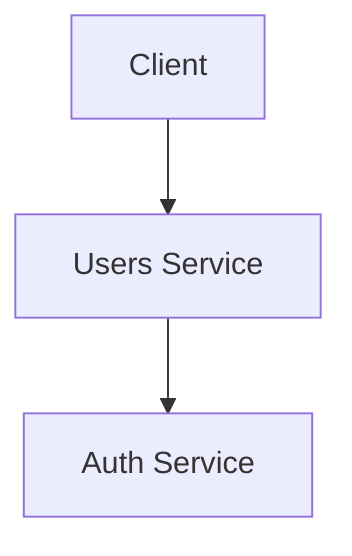

# Estrategia de Fragmentacion

## Descripcion General

Los documentos se dividen en fragmentos语义amente significativos para su incrustacion y recuperacion. La estrategia de fragmentacion equilibra la **integralidad del contexto** con la **precision de recuperacion**.

## Parametros de Fragmentacion

| Parametro | Valor | Justificacion |
|---|---|---|
| **Tamano maximo de fragmento** | 1,024 tokens | Cabe dentro de la ventana de contexto del modelo de incrustacion con margen para la consulta |
| **Superposicion** | 128 tokens | Garantiza continuidad de contexto entre limites de fragmentos |
| **Tamano minimo de fragmento** | 64 tokens | Evita fragmentos muy pequenos (ej., fragmentos de una sola oracion) |

## Fragmentacion por Tipo de Documento

| Tipo de Documento | Estrategia | Limite de Fragmento |
|---|---|---|
| Documentos de arquitectura | Basado en secciones (encabezados `##`) | Cada seccion `##` es un fragmento |
| Referencia de API | Basado en endpoints (encabezados `###`) | Cada definicion de endpoint es un fragmento |
| Runbooks | Basado en procedimientos (encabezados `##`) | Cada grupo de pasos de procedimiento es un fragmento |
| ADRs | A nivel de documento | Cada ADR es un fragmento (ya son concisos) |
| Incorporacion | Basado en secciones (encabezados `##`) | Cada seccion es un fragmento |
| Decisiones | Basado en secciones (encabezados `##`) | Cada seccion es un fragmento |
| `openapi.yaml` | Basado en rutas | Cada ruta (endpoint) + sus referencias de esquema es un fragmento |
| `README.md` | Basado en secciones | Cada seccion `##` es un fragmento |

## Metadatos del Fragmento

Cada fragmento se etiqueta con metadatos extraidos del documento:

```json
{
  "chunk_id": "users-service-docs-architecture-security-003",
  "source_file": "docs/architecture/security.md",
  "source_repo": "users-service",
  "section_title": "Tenant Isolation",
  "document_type": "architecture",
  "subcategory": "security",
  "priority": "high",
  "audience": ["developers", "sre", "operators"],
  "tags": ["jwt", "rbac", "tenant-isolation", "multi-tenancy", "row-level-security"],
  "last_updated": "2026-07-26T10:00:00Z",
  "chunk_index": 3,
  "total_chunks": 12,
  "prev_chunk_id": "users-service-docs-architecture-security-002",
  "next_chunk_id": "users-service-docs-architecture-security-004"
}
```

## Manejo de Bloques de Codigo

Los bloques de codigo dentro del markdown se incrustan tal cual en el fragmento. Las secciones con mucho codigo (>50% codigo) pueden dividirse de manera diferente -- el codigo se extrae y se referencia mediante el texto explicativo circundante.

## Manejo de Diagramas Mermaid

Los diagramas Mermaid se convierten a descripciones de texto accesibles durante la fragmentacion:

```markdown
<!-- Fuente -->


<!-- Texto indexado: "Diagram: Client sends request to Users Service which validates JWT with Auth Service" -->
```

## Documentos Relacionados

- [Metadata](metadata.md)
- [Embeddings](embeddings.md)
- [Indexing Strategy](indexing-strategy.md)
